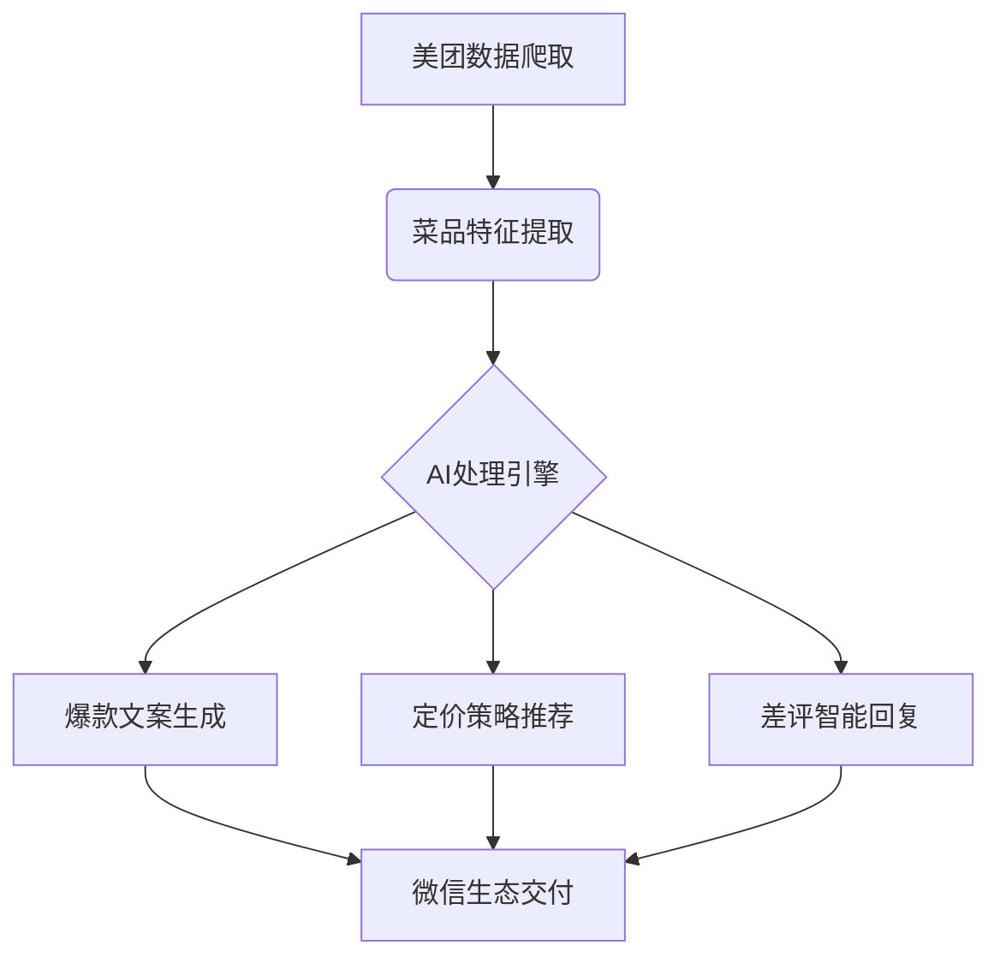

---

tags:
  - cb
创建时间: 2025-02-16 16:02:53
三观: Happy
title: "[[test6]]"
---


```dataviewjs
dv.taskList(dv.current().file.tasks.where(t => t.text.includes("")))
```


根据全面评估，以下是经过风险过滤与资源适配的3个最优方案：

---

### **方案一：区域化餐饮AI营销系统（推荐首选）**
**核心价值**：
- 解决2800万中小餐饮商户的短视频运营痛点
- 论文可构建"产业数字化转型"完整研究框架

**技术架构**：


**执行策略**：
1. **零成本冷启动**：
   - 手工录入3公里内商户数据（Excel+问卷星）
   - 用GPT-4生成差异化营销案例（1天产出100条）

2. **技术降级方案**：
   - 视频生成改用剪映网页版自动化操作
   - 定价模型采用Excel线性回归替代代码开发

3. **论文数据获取**：
   - 设计商户数字化水平评估量表（李克特五级）
   - 系统自动记录功能使用频次与效果数据

**变现闭环**：
- **初级版**：9.9元/月（基础功能）
- **数据包**：区域餐饮趋势报告（299元/份）
- **隐藏利润**：餐具供应商精准推荐（CPC计费）

**风险防御**：
- 政策风险：规避敏感数据采集，仅用公开信息
- 技术风险：核心功能依赖微信生态现成工具
- 竞争壁垒：建立区域商户关系网替代技术优势

---

### **方案二：垂类AI短视频工厂**
**创新定位**：
- 专注"技术+生活"交叉领域（如程序员养生/极客育儿）
- 建立人设公式：「技术背书+反常识洞察+解决方案」

**技术方案**：
4. 开发脚本生成器（Python+百度文心API）
5. 自动化视频流水线（FFmpeg+剪映云剪辑）
6. 搭建选题数据库（Notion+爬虫）

**数据变现**：
- 细分领域关键词包（如"程序员护腰"199元/套）
- 企业定制内容服务（5000元/专题）

**论文结合**：
- 选题：《多模态内容生成在垂直领域传播效果研究》
- 数据源：对比AI生成与人工制作视频的完播率差异

**执行要点**：
- 首周产出100条视频测试平台规则
- 建立5个矩阵号分散风险
- 开发原创度检测工具防限流

---

### **方案三：微信生态技能变现工具**
**产品设计**：
- 小程序矩阵：「简历优化器」「副业匹配测试」「接单能力评估」
- 技术内核：LSTM模型+职业数据库

**增长策略**：
7. 在大学生社群传播裂变（邀请码机制）
8. 与职前教育机构联合推广
9. 开发企业版人才评估系统

**变现设计**：
- 基础功能免费（获取用户数据）
- 进阶报告9.9元（微信支付即用）
- B端按员工数收费（20元/人/年）

**论文价值**：
- 构建就业市场供需匹配模型
- 分析灵活就业者技能特征

---

### **方案对比决策矩阵**

| 维度        | 餐饮系统       | 短视频工厂     | 微信工具       |
|-------------|----------------|----------------|----------------|
| **启动速度** | 3天出demo      | 1周出内容      | 2天上线小程序  |
| **现金流**   | 首月可收现     | 需流量积累期   | 即时付费       |
| **政策风险** | 低（B端服务）  | 中（内容审核） | 低（功能工具） |
| **技术难度** | ★★☆            | ★★★            | ★★☆            |
| **论文深度** | 产业转型研究   | 传播机制分析   | 供需模型构建   |
| **扩展空间** | 县域商业升级   | 多领域复制     | 职业数据服务   |

---

### **最终实施建议**
10. **启动顺序**：餐饮系统 → 微信工具 → 短视频工厂
11. **关键动作**：
   - 首日完成周边3公里商户数据普查
   - 第3天产出首批10个营销案例
   - 第7天签约首个付费商户
12. **资源复用**：
   - 商户数据直接用于论文第三章
   - 系统架构图转化为论文技术路线图
13. **风险预警**：
   - 准备纸质合同模板规避电子协议纠纷
   - 每周备份商户数据防云服务故障

选择餐饮系统作为突破口，可在30天内同时完成：
- 10家以上付费商户签约
- 论文需求分析章节素材
- 基础技术能力验证
实现真正的"零成本启动，多维度收益"闭环。