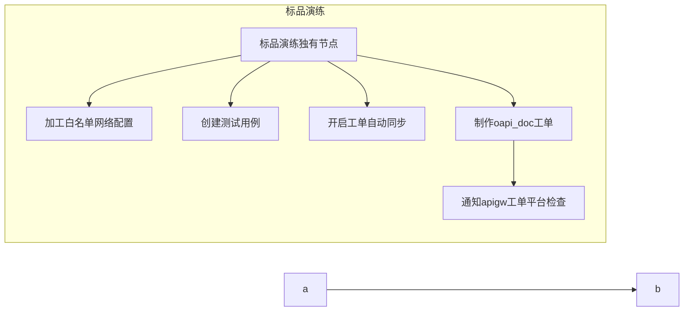
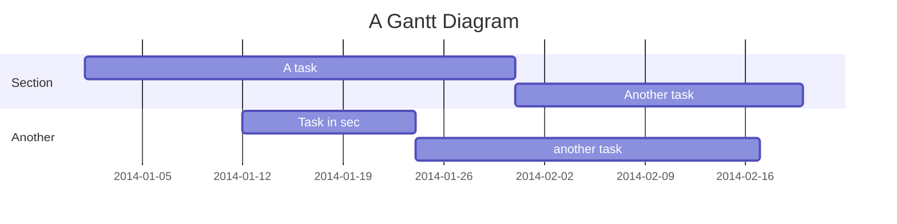
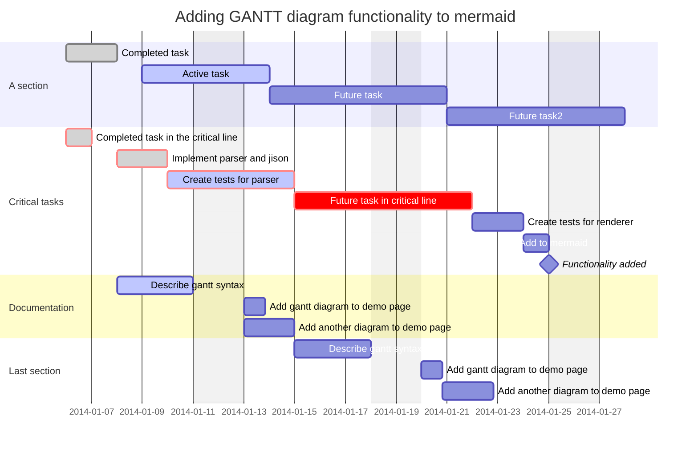
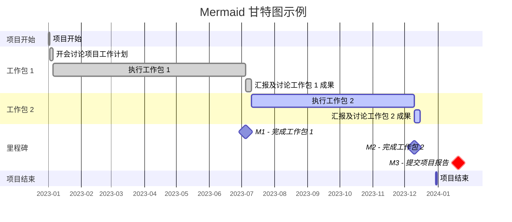

[Mermaid Tools](Mermaid%20Tools.md)

官方网站：​ ​<https://mermaid-js.github.io/​>

在线调试： Mermaidv10.9.0 Live Editor

[Obsidian 针对项目文件的自动任务甘特图](https://forum-zh.obsidian.md/t/topic/36500)

[流程图教程](https://pkmer.cn/Pkmer-Docs/02-%E7%9F%A5%E8%AF%86%E7%AE%A1%E7%90%86%E5%9F%BA%E7%A1%80/mermaid/mermaid%E8%AF%AD%E6%B3%95-%E6%B5%81%E7%A8%8B%E5%9B%BE/)
[时序图教程](https://pkmer.cn/Pkmer-Docs/02-%E7%9F%A5%E8%AF%86%E7%AE%A1%E7%90%86%E5%9F%BA%E7%A1%80/mermaid/mermaid%E8%AF%AD%E6%B3%95-%E6%97%B6%E5%BA%8F%E5%9B%BE/)

## 甘特图
甘特图是一种柱状图，说明了项目进度表以及任何一个项目完成所需的时间。
甘特图显示了项目的终端元素和摘要元素的开始日期和完成日期之间的天数。
最初由 Karol Adamiecki 于 1896 年开发，并由 Henry Gantt 在 1910 年代独立开发

[甘特图教程](https://pkmer.cn/Pkmer-Docs/30-%E7%9F%A5%E8%AF%86%E7%AE%A1%E7%90%86%E5%BA%94%E7%94%A8/%E9%A1%B9%E7%9B%AE%E7%AE%A1%E7%90%86/%E5%88%A9%E7%94%A8-mermaid-%E7%94%98%E7%89%B9%E5%9B%BE%E5%9C%A8-obsidian-%E4%B8%AD%E7%AE%A1%E7%90%86%E9%A1%B9%E7%9B%AE%E8%BF%9B%E5%BA%A6/)

[甘特图nodejs中文](https://mermaid.nodejs.cn/syntax/gantt.html)

```mermaid
gantt
        dateFormat HH:mm
        axisFormat %H:%M
        Initial milestone : milestone, m1, 17:49,2min
        taska2 : 10min
        taska3 : 5min
        Final milestone : milestone, m2, 18:14, 2min
```

