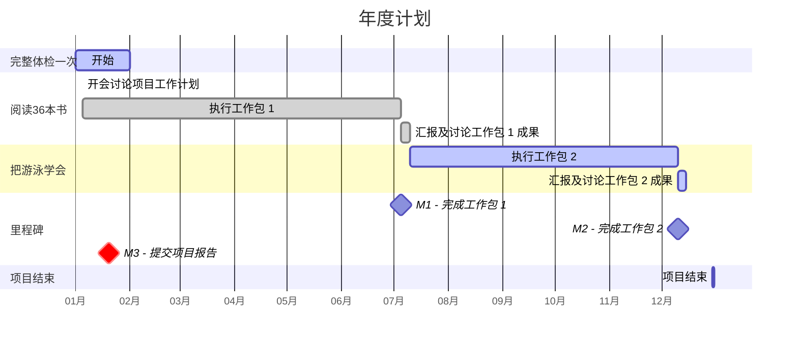
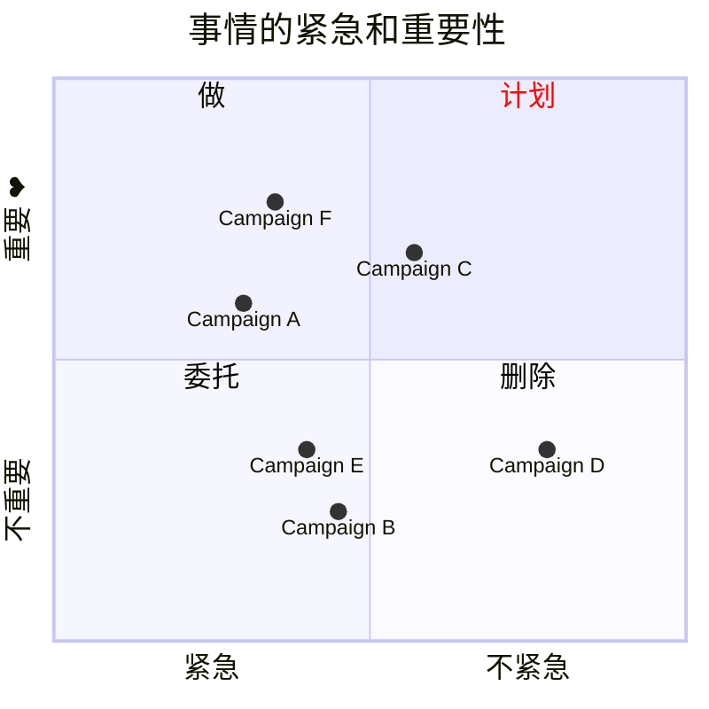

---
tags:
  - cb
创建时间: 2024-11-10 23:23:50
三观: Happy
title: "[[具体的计划]]"
---

```dataviewjs
dv.taskList(dv.current().file.tasks.where(t => t.text.includes("")))
```


> [!tip] 
> 具体
> 可衡量的目标
> 可达到
> 时间想花在哪? 
> 结合正反馈


> 存钱的目标
> 理财的计划
> 额外的赚钱计划, 扩大赚钱能力
## 身体健康
长期相关性? 有啥用? 合哪个目标? 
提高耐力、力量、柔韧性等
定期[[体检]]
[[一定要做的事#视觉上的变化 打扮,穿搭, 每隔一段视觉, 有点微小的变化|身体list]]


1. 保持良好的作息习惯，晚上 12 点前上床睡觉，早上 8 点前起床，保证每天 7 - 8 小时的睡眠时间，提高睡眠质量。避免熬夜
2. 学习营养知识，了解食物的营养成分和搭配原则，制定个人的饮食计划
	1. 保证每天摄入足够的蛋白质、碳水化合物、脂肪、维生素和矿物质, 多吃蔬菜水果、全谷物、瘦肉、鱼类等健康食品。
	2. 减少高热量、高脂肪、高糖食品的摄入，如油炸食品、甜品等
3. 运动康复, 运动损伤的相关知识, 确保长期保持良好的运动状态。
3. 定期体检一下, 全面体检，包括身体各项指标（如血压、血糖、血脂、肝功能、肾功能等）的检查，了解自己的身体状况，及时发现潜在的健康问题，并根据医生的建议调整饮食、运动和生活方式。
体检:   一年? 几次? 几号? 


> 目标: 提高心肺功能和耐力。
> 通过不同的运动方式刺激身体，提高运动效果。
> 优先增肌, 提高力量, 其次塑形
> 核心稳定性
> 后续 -> 参加运动项目(马拉松? 登山? )

**健身**:  周几次? 多长? 多数? 
每周至少进行 3 - 4 次运动，每次运动 30 分钟以上。
每周2个小时:  17min/7  24min/5 , 40min/3
组合1 : 仰卧起坐, 骑车, 俯卧撑or哑铃
组合2 : 仰卧起坐, 深蹲, 俯卧撑or哑铃

执行细节: 

|            | 反馈  | 优先级 | 7      | 5      | 3      |     |
| ---------- | --- | --- | ------ | ------ | ------ | --- |
| 骑车(心肺, 下肢) |     | 高   | 20min  | 30min  | 30min  |     |
| 仰卧起坐(腹肌)   |     | 高   | 20/140 | 30/150 | 50/150 |     |
| 俯卧撑(手臂, 胸) |     | 中   | 20/140 | 30/150 | 50/150 |     |
| 哑铃(手臂, 胸 ) |     | 低   | 20/140 | 30/150 | 50/150 |     |
| 深蹲(核心, 下肢) |     | 高   | 20/140 | 30/150 | 50/150 |     |
| 背?         |     |     |        |        |        |     |
| 肩          |     |     |        |        |        |     |
|            |     |     |        |        |        |     |
每个动作进行 2 - 3 组，每组 8 - 12 次，
每周进行 2 次力量训练，包括全身主要肌肉群（如胸、背、肩、手臂、腿）的锻炼


短期目标: 3个月? 衡量
俯卧撑: 50 一次性
仰卧起坐: 50一次性
深蹲: 50一次性
骑车: 30min/ 9 一次性
哑铃: 弯举: 20一次性

长期相关性 ✅

记录落地
使用运动手环或手机应用记录运动数据，
如运动距离、速度、心率等，根据数据调整运动强度和计划。
组数, 重量之类的?

## 人际社群
长期相关性? 有啥用? 合哪个目标? 

认同
真挚的朋友
附近? 


建立自己的社交品牌，通过社交媒体平台（如微信公众号、抖音、领英等）
1. 分享自己的专业知识、兴趣爱好、生活感悟等内容
2. 吸引志同道合的人关注和交流
3. 定期更新内容，与粉丝保持良好的互动关系
4. 将线上社交影响力转化为线下实际的社交资源和合作机会。
 

主动与自己的上司、同事或合作伙伴建立更深入的关系
1. 每月至少与 2 位进行一次一对一的交流，了解他们的工作目标和需求
2. 分享自己的想法和经验，寻求合作机会
3. 通过良好的职场人际关系提升工作效率和职业发展机会。

加入 1 - 2 个线上社交群组
1. 专业领域的论坛
2. 兴趣爱好的微信群等
3. 积极参与群组讨论
4. 每周至少发表 2 条有价值的观点或分享
5. 与群组成员建立良好的互动关系，通过线上交流拓展社交圈子，了解不同人的思维方式和生活经验。

定期参加社交活动 (每月1次? )
* 行业聚会、兴趣小组活动、志愿者服务
* 每次交流至少与 3 位不同的人建立初步联系，了解他们的职业、兴趣爱好等信息，交换联系方式
* 对交流过程进行复盘，总结自己在沟通中的优点和不足，如语言表达是否清晰、是否善于倾听等。

学习沟通技巧
1. 阅读相关书籍如《关键对话》《沟通的艺术》，
2. 学习如何进行有效的沟通，包括
	1. 非语言沟通技巧（如眼神交流、肢体语言）
	2. 语言表达技巧（如清晰简洁、有逻辑）
	3. 倾听技巧（如专注理解、反馈确认）
	4. 将所学技巧应用到日常工作和生活中的沟通场景中，观察沟通效果的变化。


## 学习成长, [[一定要做的事|提升自己]]?
[[拖延心理学]]
[[认知觉醒]]

心态
1. 回顾一天中值得感恩的人和事，记录在感恩日记中，培养积极乐观的心态。
2. 当遇到挫折或困难时，采用积极的自我对话方式，如 “我可以从这次经历中学到什么”“这是一个成长的机会”，而不是自责或抱怨，记录每次挫折后的反思和成长收获。
3. 学习心理学知识，参加心理学培训课程或自学心理学专业教材，如《普通心理学》《发展心理学》等，了解人类心理发展规律和常见心理问题的成因及应对方法，不仅提升自己的心理健康水平，还能够更好地理解他人，提升人际关系质量。
4. 每月阅读 1 本关于心理健康或心态调整的书籍，如《情绪急救》《心流：最优体验心理学》，学习应对压力、焦虑、挫折等负面情绪的方法和技巧，将书中的方法应用到生活中，观察自己的情绪变化和应对效果。
5. 参加心态成长工作坊或线下课程，如积极心理学工作坊、情绪管理课程等，与专业导师和其他学员互动交流，深入学习心态塑造的理论和实践方法，通过角色扮演、小组讨论等方式进行实际演练，提高自己的心理韧性和应对复杂情绪的能力。
6. 建立自己的支持系统，与亲朋好友保持密切的沟通和联系，分享自己的喜怒哀乐，当遇到困难时主动寻求他们的帮助和支持，同时也积极支持他人，在互助中共同成长，感受人际关系的温暖和力量。
7. 培养成长型思维模式，将失败和挫折视为成长的必经之路，不断挑战自己的舒适区，勇于尝试新事物和接受新的挑战，每年设定 1 - 2 个具有挑战性的长期目标，如完成一次长途徒步旅行、学习一门新的乐器等，并将目标分解为具体的行动计划，在实现目标的过程中不断塑造坚韧不拔、积极向上的心态。
	1. 如高空跳伞、潜水等），在挑战过程中克服恐惧和自我怀疑，增强自信心和勇气，每次挑战后进行总结和反思，分析自己在心态和行为上的变化。

提升心态主要是培养积极乐观的情绪、增强心理韧性和自我认知。比如，学会在面对挫折和压力时保持冷静，能够正确地认识自己的优点和不足，并且有信心去改变和成长。


技能
1. 生活技能: 
	1. 时间管理:  日, 周, 月计划 -> 为了合理分配时间
	2. 理财技能: 个人预算, 股票, 基金基础知识 -> 进行财务分析和总结
	3. 做饭: 家常菜 -> 
	4. 家居整理, 装饰, 空间规划, 物品收纳, 家居布置技巧
	5. 开车
	6. 摄影
2. 职业技能: 
	1. 确定发展所需的核心技能 -> 学习 -> 创作 -> 找人反馈 -> 改进
	2. 项目管理能力: 项目计划, 分配任务, 跟踪进度, 控制风险
	3. 考取职业发展相关的证书, 如注册金融分析师（CFA）、注册会计师（CPA）-> 提升行业认可度

学会时间管理、沟通技巧、理财能力


**知识**
1. 看书:  一个月1,2本(历史, 自我成长, 文学,哲学,心理, 社会), 写读书笔记(精彩观点, 个人感悟, 如何应用于生活), -> 发布在平台上? 
2. 课程学习: 
	1. 语言: 英语?日语? -> 对话实力
	2. 兴趣课程(插画)  -> 完成作业或者考核
	3. 专业技能课程(软考,ai, pm)  -> 应用在工作,和兴趣中
看什么书? /book中的选, 或者加入
1个月 1本  ?
收获怎么输出?  写记录和读后感
输出在哪?  obsidian中


## 休闲娱乐
长期相关性? 未知身体(精神平衡)
每周? 2x5 14x2

一部分可以结合健身同时(骑车)

电视? 几部? 
游戏几个? 什么成就? 
其他? 玩? 去哪? 什么时候? 


## 家庭生活


## 财务管理


## 工作事业
[[正在做的事]]
根源上不满意的点:         发展停滞, 钱不变, 能力不变,  自我创造, 自我肯定,自我满足, 别人认可

想做的事业: 
**喜欢的事**: 想知道他的一切
1. 好像暂时没有........
2. 


**擅长的事**: 无意识就能做好的事, 天赋, 和才能, 先天的?  
重视别人的感受? 观察别人?


**平时自然而然就在做的事**: 或者感到充实, 开心
不由自主思考现象背后的事情
洞察,分析, 系统化思考


**对别人感到烦躁**: 为什么这么简单的事都做不到

**有价值的事**:
1. 给别人提供价值, 并且得到认可和反馈(社会的[[正反馈]]?)


## 工作? 

- [ ] 整合一下体验, 工作的具体内容


什么时候准备? 
现在? 
什么程度开始面试? 
准备2周后? 累计8小时后?

咋样算结束? 满意的offer? 
或者面试次数达到100次算短期结束? 
一周2次面试? 少?  100次一年.......
软考? 要?

## 赚钱? ?????

收入(被动最好)多少, 1000/月? 
副业??  
技术副业?  同时远离技术人(卷)
自媒体?   -> (前期: 输出)
电商之类的?  -> ()
小产品? (发现需求, 小而美, 一次性收入)
咨询 
边学边分享     

兼职? ? 干啥去? 
一般工: 好找, 工资低, 大概率无其他价值
特殊工: 有体检? 有其他价值?  不好找
自己创建: ? 
如何实现? 

其他? 
股票? 币? 


## 愿望清单, 体验突破? 
不枉此生, 
每月/ 每周
买: 促进智能化

[[一定要做的事#改变周围的环境 旅游之类的, 体验|体验list]]


---


| ~~学习成~~长        | 体验突破    | 休闲娱乐     |
| ----------- | ------- | -------- |
| 阅读?         | 游泳?     | 游戏<br>看剧 |
| 工作事业        |         | 家庭生活     |
| 跳槽? <br>尝试? |         | 旅游?      |
| ~~身体健康~~    | 财务理财    | ~~人际社群~~ |
| 体检?<br>变壮?  | 扩大赚钱能力? | 朋友生日?    |

|     | 热情  | 痛苦  | 时机  | 总分  |     |
| --- | --- | --- | --- | --- | --- |
| 锻炼  | 4   | 8   | 8   | 20  |     |
| 学英语 | 4   | 4   | 10  | 18  |     |
| 读书  | 10  | 10  | 10  | 30  |     |

![[Pasted image 20241016001653.png]]








[做计划](https://www.bilibili.com/video/BV1ra4y1m7H8/?vd_source=351ae22481963e1732be800e8bc59c8a)

困难 -> 具体| 简单
一天中效率最好的时间
工作日志
番茄钟
珍惜时间

