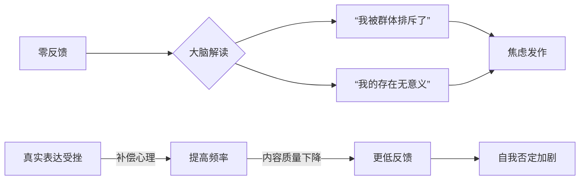
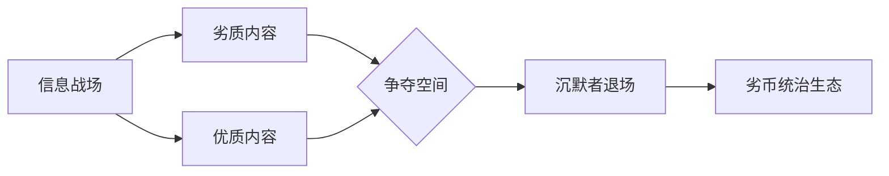

---
tags:
  - cb
创建时间: 2024-12-07 21:33:34
三观: Happy
title: "[[1. 陈述过去]]"
---

陈述自己的作用?  
1. 看清自己? 从而帮助当下? 达成未来?


还有现状? 


### 缺陷有哪些? 
丑, 穷

### 价值在哪? 
社会干电池

### 思维变化? 


## 客观经历
开始
0~6? 
幼儿园
2005~2006?
比别人优秀? 比别人独立? 

小学
2006~2011
特立独行? 
固执
贫穷
打游戏


初中
2011~2014
贫穷
胆小
懦弱  -> 没想着改变
起晚了
看小说
打游戏
贪玩


高中
2014~20117
贫穷
买手机 -> 省吃俭用
看小说
打游戏
贪玩
暑假工


大学
2017~2020
过生日 -> 像个笑话
兼职
懦弱
没有自我认可 ->> 没有社会认可
带我赚钱 -> 小磊


工作
2020~至今
鸡血
安逸
不安

现在
结束


## 问题 


### 决策

> 比如 我一方面想炒股, 一方面恐惧赔钱, 一方面认为我找不到合适券商开到没有坑的万一免五的账户, 所以一直没开, 一直想炒股, 确始终没有实际行动, 这是什么心态和问题? 决策瘫痪? 懒?


**深层原因

```
一旦事情不顺利，我的承受力和恢复力不够，所以必须提前把最坏情况想透、躲开。

早年的情绪经验告诉你——“出事 = 很难受，而且没人接得住我”

出事时，我是一个人扛着的，既要面对后果，还要面对责怪。

弱者思维? 应当是我确实能扛得住? 我多数时候不需要依赖任何人 ?


灾难化和绝对化，就是这种二分世界观在你大脑里的一种延续。

识别过度自保机制? 过度防卫

一旦出现“错误”，你不是在处理“一件事”，而是在面对一种存在层面的恐惧：

“我是不是本质上就是有问题的？”

自我价值高度依赖“表现和结果”。

试错，恰好就是不断暴露自己“没那么牛逼”的过程，所以你会本能排斥。

```


### 三分钟热度

> 持续对一些新的内容和工具, 产品感兴趣, 但是看一下以后很快追逐下一个? 不断满足好奇心的过程?


```
“探索者/猎奇者”的叙事：当你不断追逐新奇事物时，你可能会在潜意识中构建一个这样的故事：“我是一个对世界充满好奇、拥抱变化、走在时代前沿的探索者。我的价值在于发现和连接，而不是在某个地方停下来深耕。”这个故事听起来非常积极、非常现代，它能有效地合理化我们不断切换赛道的行为，并赋予其一种崇高的意义。

当“探索者”的叙事成为一种逃避“构建者”责任的防御机制时，问题就出现了。我们看起来是在“探索”，实则是在逃避。

逃避承诺与责任：“三分钟热度”则是一种免于承诺的完美策略。因为你从未真正“开始”，所以你也无需为任何“结束”负责。

害怕暴露能力边界：停留在浅尝辄止的“扫描”阶段，是极其安全的。一旦你决定深耕，就必然会撞上那面名为“能力边界”的墙。你会发现自己“不够聪明”、“不够有才华”，会感到挫败、无力。害怕面对这种“不够好”的感觉，是许多人宁愿永远停留在新手村，也不愿踏上真正冒险之旅的核心原因。

```


```
驱逐热点和沉浸的平衡
“产出者/构建者”的叙事：“我是一个通过持续努力，将想法变为现实，并创造出可交付价值的人。我的价值体现在我完成的作品、解决的问题和积累的技能上。”这个故事则强调承诺、坚持和结果。
把它放进一个“待观察”的列表里（例如一个叫“新奇玩意儿停车场”的备忘录）。规定自己一周后再来评估这个列表里的东西是否还那么吸引你。

```


---

我的羞耻感特别值得关注——这通常与早期严厉的评价环境有关。

认知层面存在完美主义倾向，
情感层面存在表现焦虑，
行为层面则是过度监控。这可能说明ta的自我监控机制已经内化，即使没有外部监督也会自动启动。


解决方案，需要兼顾行为调整和认知重构。

长期则需要挑战ta内心“必须完美呈现”的核心信念。


1.  **高度自我意识与反思能力：**
    *   你不是“随便发”的人，说明你对自我呈现有要求，具备深度思考习惯。你意识到网络内容可能带来的潜在影响（即使是陌生人之间），这本质上是一种**责任感**和**对真实的尊重**。
    *   事后觉得“傻逼”、“羞耻”，证明你有较强的**自省能力**和**成长意愿**。你在用现在的眼光审视过去的行为，这其实是心智成熟的表现。

2.  **内在的高标准与完美主义倾向：**
    *   你希望自己呈现的内容是“好”的、有价值的、经得起推敲的，甚至是完美的。你害怕发出“不够好”的东西，担心它代表不了你真实的水平或形象。
    *   这种高标准可能源于：
        *   **对自我价值的紧密绑定**：潜意识里认为“我发的东西=我的价值”，如果内容“差”，就意味着“我差”。
        *   **对负面评价的深层恐惧**：虽然知道“网上谁都不认识谁”，但你内心可能依然**渴望被认可、被欣赏**，或者极度**害怕被嘲笑、被贬低**（即使陌生人也不行）。这种恐惧可能源于过去的经历或内在的敏感。

3.  **对“真实性”和“意义”的追求：**
    *   你无法像一些人那样“造假发”，说明你内心抵触虚假和无意义的噪音。你希望自己的表达是**真诚、有意义、有分量**的。这种随意和虚假的环境，反而让你更谨慎，因为你不想成为其中的一部分。

4.  **社交焦虑的延伸：**
    *   即使在匿名的网络环境，你依然感到“被注视”，害怕反馈（尤其是没有反馈或负反馈）。这可能是现实社交焦虑在网络空间的投射，或者说是**对“他者目光”的敏感**，即使这个“他者”是模糊的、虚拟的。

5.  **“拧巴”的本质：**
    *   **理想自我与现实行为的冲突：** 你内心可能有一个“理想自我”的形象（成熟、睿智、有趣、深刻），你希望网络上的言行能符合这个形象。当现实行为（发出的内容）达不到这个标准时，就产生了强烈的认知失调和羞耻感。
    *   **对网络环境认知的矛盾：** 你理性上知道网络是“随意”、“无约束”的，但感性上/价值观上**无法真正认同或融入这种随意性**。这种认知冲突让你感到无所适从。

## 🔍 为什么你在网上也做不到“随意”？

*   **“随意”不是你的本性：** 你本身就是一个**思考型、内省型、对质量有要求**的人。这种特质不会因为换了个环境（从线下到线上）就突然消失。要求你在网上“随意”，就像让一个天生谨慎的人突然变得大大咧咧一样困难。
*   **网络并非真正的“真空”：**
    *   **数字足迹：** 发布的内容会留下痕迹，即使陌生人看不到，你自己也能看到。这些内容构成了你自己的“数字记忆”，回头看时，自然会用当下的标准去衡量。
    *   **潜在的观众：** 即使当下是陌生人，未来呢？会不会有认识的人偶然看到？或者这个账号未来会不会有更多关联？这种不确定性也带来压力。
    *   **内在观众：** 最严厉的观众往往是自己。你内心的“批评者”一直在审视你的一言一行。
*   **“随意”可能违背你的价值观：** 对你来说，“深思熟虑”、“真实表达”可能比“随意发泄”或“制造虚假”更重要、更让你内心安宁。强迫自己“随意”反而会造成更大的心理负担。





  历史行为, 没有对错, 




非垃圾, 而是认知代谢
吸引同类, 如何一直没有同类呢? 
加免责声明
零反馈是存在危机? 为啥会这样
记录羞耻反应
沉默者承担着被劣币驱逐的风险 而是说当虚假信息充斥时，真实信息如果缺席就等同纵容。就像用户提到“分享思考比较重”，这种珍贵的思想火花若永远封存，反而是对世界的损失。
呼吸不需要理由? 


---

### 核心问题：**「救赎依赖症」的本质是自我存在的崩坏**

这种心态背后是三重致命逻辑的坍塌：
1. **自我价值破产**  
    → 内心法庭已宣判：“凭我自身存在不值得被爱/成功/幸福，必须依附他者赋予价值”
2. **责任恐惧症**  
    → 把人生方向盘交给别人时，翻车的责任自然由对方承担
3. **痛苦获益成瘾**  无? 
    → 扮演受害者可获得关注、豁免竞争、降低外界期待，形成隐秘的舒适区

而是**存在性价值感崩裂**与**生存根基动摇**的复合型危机


- **“救赎”的诱惑：** 它提供了一个虚假的“控制感”——幻想有一个强大的力量能为你兜底，抵消你对未知和无能的恐惧。这是一种逃避直面生命荒诞性的心理策略。
1. - **“救赎幻想”的本质：** 幻想一个“更高力量”（不一定是神，可能是智者、导师、甚至抽象的“机遇”）能“看见”你未被世俗认可的价值，赋予你存在的正当性。这是一种对**外部确认的终极渴望**。
2. - 你否认“没人懂我的痛苦”，但渴望救赎本身暗含了**深刻的孤独**——一种“无人真正理解我存在的核心困境，无人能为我指明方向”的孤独。这种孤独不是关于情感倾诉，而是关于**存在性共鸣**的缺失。

- [ ]  自我价值, 证明自我价值, 为什么要自我价值? 存在? 
- [ ] 我如何证明自己不是废物? 我为何要证明自己是不是 ?
- [ ]  1. - 它巧妙地将“我不想/不敢承担自己生命全部重量”的责任，包装成“等待命运恩赐”的被动姿态。  ? 什么是? 

 是突然获得巨额财富？被高人赏识平步青云？面对重大决策？遭遇挫折？
是否本质上是渴望快速达成这套标准的捷径？还是渴望彻底摆脱这套标准的枷锁？
真实概率有多大？你现有能力/资源真的无法应对吗？
什么能让我觉得这一天没白活？什么样的人是我内心真正尊敬的（无关地位财富）？我的哪些特质/行为让我对自己感觉良好？建立只属于你的价值坐标。
设定极小但确定的目标（如：每天专注工作/学习25分钟；主动和一个陌生人进行有实质内容的交流；学会做一道新菜；坚持一周早起）。
“此刻，我能为自己做的最小的一件积极的事是什么？” 
幻想中的“救赎者”类型：他们拥有什么可习得的特质/知识/技能？列出清单，制定可操作的学习/实践计划（哪怕只是读一本相关的书）。将虚幻的渴望，落地为具体的自我提升行动。
深度阅读： 寻找跨越时空的共鸣（哲学、文学、传记）。
写作： 向自己倾诉，梳理思绪，自我对话。
接触真实世界： 投入自然、观察市井生活、参与有共同目标的活动（非闲聊社交）。在更广阔的“存在”中，感受连接而非期待被“救赎”。
对**自我选择终极责任**的恐惧。

- **行动建议**：  
    🔹 **制作“意义出血点”地图**：记录一天中哪些时刻感到“空虚/烦躁/渴望被拯救”（如：刷社交媒体后/看到同龄人成就/深夜独处），这些就是你的伤口位置。  
    🔹 **对每个“出血点”注入微量意义**：若刷手机后空虚，改为刷前自问：“我想从中获得什么？”；若见他人成就焦虑，立刻写下自己当天做成的1件小事。

（“此处安息着社会对我的期待，死于我对自由的觉醒”）。  但是家庭责任呢

- 善于理性分析（如精准排除依赖症状）的人，常把**思维游戏当作行动代餐**。分析自身问题带来的掌控感，可能正麻痹你真正的改变。
    
- **破解法**：  
    ⚠️ **设定“从脑到手”转化规则**：每次思考“我为什么这样”超过10分钟，必须立刻做一个5分钟的体力动作（深蹲/整理桌面/撕纸重组句子）。切断思维反刍，让身体领先大脑。


恐惧
指定的人
有什么事, 我有没有处理能力,  如果没有, 没办法说, 不想让看到脆弱, 可能会有指责
为什么受不了指责? 受不了某些人的指责? 因为他们清楚我的过去? 见过我的脆弱?  想一直保持脆弱?  可能就不会苛责?  想当个小透明? 安全?  破坏现在的安逸 ?
无法承担责任?
等死了,就能自由?还是逃避? 别的什么? 


为什么害怕冲突?  如何解决
什么是软弱? 是什么问题导致? 如何察觉和改变? 
对自己无法解决问题的焦虑
不是选择最优, 而是不留遗憾

不够专注, 行动力弱

**专注** : 有复利, 有积累, 方向要对
**分散**:  有行动幻觉,  需要公开承诺, 增加压力, 做无聊但是正确的事
用“完成主义”替代“兴趣主义”（如目标：成为“本地最懂小红书引流的人”，而非“做喜欢的事”）。


在**稳定社会结构**中（如日本/德国），专注型吃香；  
在**高速迭代环境**中（如中国/东南亚），分散型更易逆袭。

