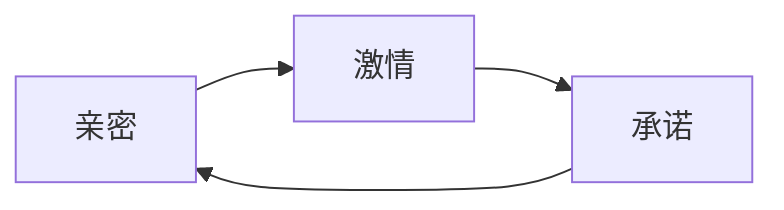
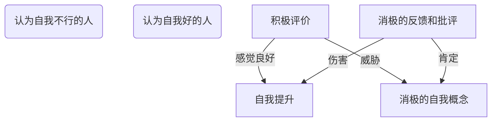
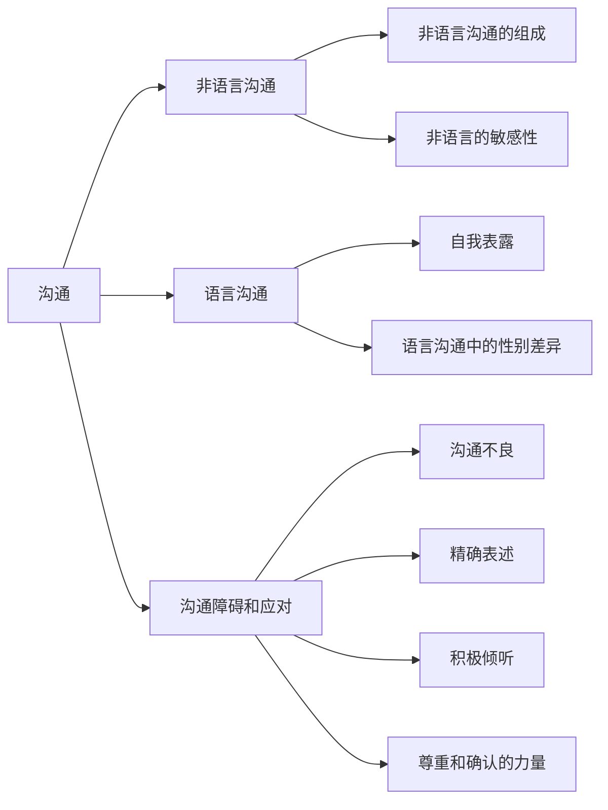
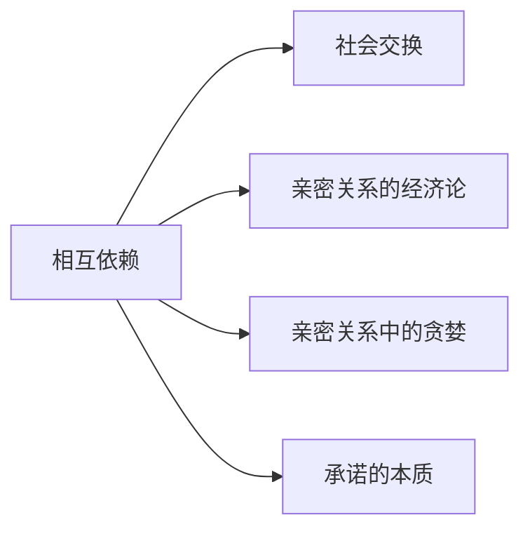

---

tags:
  - cb
创建时间: 2025-02-15 17:17:24
三观: Happy
title: "[[亲密关系]]"
---


```dataviewjs
dv.taskList(dv.current().file.tasks.where(t => t.text.includes("")))
```


> [!note] [罗兰米勒Rowland S. Miller](https://www.douban.com/personage/30074103/)
> 
美国萨姆休斯顿州立大学心理学教授
1973年获康奈尔大学心理学学士学位，于1976年和1978年获佛罗里达大学社会心理学硕士和博士学位。
研究兴趣包括社会心理学、社会情绪（如尴尬、耻辱）、亲密关系等，现在侧重亲密关系的维持过程。著有《亲密关系》《尴尬：日常生活中的镇定与险境》。


分析了人之间所有亲密关系的规律和维护建议
爱情三角理论, 




## 为什么需要
演化心理学： **繁衍需要** 具有适应性，赋予拥有这些动机的个体某种繁殖优势
1. 归属感： 强烈地感受到被接纳、被认可。 质量比数量重要，也与我们的伴侣是谁并无太大关系，只要他们能给予我们持久的关爱和接纳，我们的归属需要就能得到满足。

对婚姻积极的态度， 和维持婚姻的决心 （支柱）

- [ ] 为什么老想着让人救赎？依赖别人？看到自己的脆弱，需要？ 

## 本质
了解 （ 经历、偏好、情感和心愿）
相互依赖 （彼此需要和相互影响的程度，这种相互依赖是频繁的（经常相互影响）​、强烈的（对彼此有重要的影响）​、多样的（以多种不同的方式相互影响）和持久的（在很长一段时间内相互影响）​）
关心
信任 （期望对方公平地对待并尊重自己）
回应性 （有强大的奖赏作用，感知到伴侣认可、理解并支持我们的需求和愿望是最佳关系的一个核心要素）
共同性
承诺 （希望他们的伴侣关系能持续到地老天荒，并为此不惜投入大量的时间、精力和资源。）


## 传统关系

中国人重视家族血缘的正统性与家族利益的悠远，甚至远远大于对独立家庭内容的关切， 情感只应该体现在一个人成立家庭之前的青葱岁月里，而一旦成立家庭，开始建功立业，浪漫就迅速被刻板的伦理责任与秩序所代替。
亲的是血缘，而不是感动；密的是控制，而不是氛围。
缺乏温度的家庭关系，无论如何也不能被赋上“亲密”两字。

真正的亲密关系，至少要能够真实地在两个方面有更多的体现：
一是融通而丰沛的家庭成员之间的情感交互；
二是和谐而温暖的家庭氛围的营造。
表达诉求前， 先检点一下自己的知与行

1. 我们总是喜欢哪些喜欢我们的人
2. 喜欢和我们态度一致的人
3. 亲近的的3个条件
	1. 有意义的自我表露
	2. 对彼此的个人信息有兴趣和同理心  （亲近在吸引之后）
	3. 对方正在做出回应（持续发展要素）？ 
4. 希望保持关系
	1. 感到幸福
	2. 没有其他更好的选择
	3. 离开的成本高
5. 爱情的成分
	1. 亲密
	2. 激情
	3. 承诺 （持久，稳定，投入的决心）
6. 欣赏， 表达， 重复
7. 他人的联系和自我保护之间有一个平衡
8. 一旦我们选择了生活， 工作或者上学的地点， 我们大体也就决定了哪些人将会成为我们生命中最重要的人
9. 能付出代价拒绝大多数人却乐意接纳我们的人，才是最有吸引力的伴侣

## 关系构成

* 文化影响
* 个人经历
* 个人差异
	* 依恋类型
* 人类天性
* 人际互动
* 消极面

### 个体差异
*  性别 总体差异不大， 还是看个人， 就这样-》 贴标签, 个体差异大于性别差异
* 社会性别: 社会期望， 教育塑造， 文化影响， 榜样, 最好2者都带点， 工具， 表达
* 人格: 大五人格特质

#### 自尊 （自我评价）
服务于归属需要？ 
自我评价似乎极大地受我们认为他人如何看我们的影响  （被苛刻对待）
社会期许
觉察到不存在的伴侣忽视

高自尊的人对自己友好的搭讪常常信心十足，预期他人会热情地回应。
低自尊的人则不太确定自己是否讨人喜欢
因而，怀疑自己的人往往也会怀疑自己的亲密伴侣，其亲密关系一般不如高自尊的人安全


## 社会认知
> 我们用来评价和理解自己和他人的所有知觉、解释、信念及记忆过程

### 第一印象

> **首因效应**(primacy effect)，即我们获得的关于他人的最初信息在连同我们的即时印象和刻板印象一起塑造我们对他人的整体印象时，往往具有**特殊的重要性**。

> **验证性偏差**(confirmation bias)：他们常常寻求那些能够证明自己正确的信息，而不是寻找那些能证明自己错误的例证

你可以在对方问你的问题中察觉到别人对你做了怎样的预设,或者对你的看法。

### 知觉
>我们很少意识到，我们经常选择采用我们所使用的观点，这种选择进而会促进或抑制我们对伴侣的满意度。
> 即便是你最亲密的伴侣也很少能真正理解你所有行为的原因。

* 伴侣的理想化
* 归因过程
* 历史记忆修正
* 关系信念
* 期望 自我实现预言
* 自我知觉


- [ ] 理想的自己? 
> **归因**(attribution)就是指人们对事情发生的原因（特别是指人为什么要做或者不做某件事情）提出的解释。归因能**确定事件的起因**，强调某些因素而忽视其他因素的作用

> **行动者-观察者**效应是一种社会心理学现象,表现为行动者和观察者对同一行为的原因有不同的归因倾向。
> 行动者往往把自己的行为**归因于外部情境**因素
> 观察者则更倾向于将同一行为**归因于行动者内部**的性格、能力或态度等因素。
> 这一现象的产生,部分原因在于行动者了解影响其行为的所有外部因素,而**观察者往往只关注行动者本身**,忽略了可能影响其行为的情境因素。

这种归因的"倾斜"可能会导致误解和冲突,尤其是在缺乏充分了解和沟通的情况下。
归因偏差, 需要**换位思考**

**自我感动**, 毕竟自己有颗为对方着想的心(不够, 人家感受不到, 而且没看出来)
自我服务偏差, 双标, 趋利避害


#### 关系信念

> 带着对关系如何运作的既定信念步入亲密关系

**浪漫主义**(romanticism)
1. 认为爱情应该是选择伴侣的最重要的依据

浪漫主义者
(1)每个人都只有一份完美的“真”爱；
(2)真爱能找到克服一切障碍的方法；
(3)一见钟情的爱情是可能的。

现实中的亲密关系很少能满足如此高的期望, 随着时间的推移，这些信念往往会逐渐减弱。

**宿命信念**: 

> 相信真爱天注定,一种僵化呆板的角度

如果两个人注定要幸福，那么在相遇的那一刻他们就会知道(天造地设)；
他们也将不会遭遇初期的猜疑或困难，一旦两个灵魂伴侣相遇，就必然有幸福美满的未来(注定永远幸福)。
要么不适合，注定走不到一起。

错误认知: 宿命/成长信念-> 关系信念
1. 争吵具有破坏性
2. 读心术
3. 对方不会发生改变
4. 双方不一样, 很难真正理解对方
5. 无需努力
6. 真爱天注定

**成长信念:** 

爱是一种能力， 爱情需要经营
争吵也是沟通方式的一种,我们应该思考的是如何正确的争吵,因为很多时候大家害怕争吵实际也是逃避解决问题,当问题积压的过多可能破坏力会很大。
争吵时不去给对方下定义,尽量就事论事,不说伤人的话,也就是理智的争吵我认为是对亲密关系有利的


![[Pasted image 20250410132226.png]]
#### 期望
> 人们对他人行为的一些更具体的期望一开始是错误的，但后来却变成了现实, 这些知觉不仅影响我们对所获信息的解释，而且也指导我们对他人的行为

> **自我实现的预言**非常生动地说明了知觉的力量，因为预言中的事件之所以发生，只是因为人们期望它发生，并且被期望的人就像所期望的那样去行动。


在重要的第二步中，知觉者做出行动，通常以符合自己期望的方式。知觉者很难避免微妙地传达自己对目标的真实想法。
比如，与持不太积极的期望的知觉者相比，持赞许性期望的人与目标互动的时间更长、更频繁，有更多的目光接触，坐得更近，笑得更多，问的问题更多，并鼓励更多的回应

当目标在第四步做出反应时，是以一种与知觉者对待他/她类似的方式。
热情通常会被还以兴趣，敌意通常会遭遇反击，轻浮则会收获诱惑。
因而，知觉者往往从目标身上引出他/她所期望的行为，而如果知觉者没有期望这种行为，那么目标的行为方式或许会完全不同。


![[Pasted image 20250410133112.png|475]]

那些期望他人值得信赖、慷慨大方、充满爱心的人可能更经常发现他人实际上对自己挺好

爱会流向不缺爱的人(和钱一样),所以先让自己内心充满爱


#### 自我知觉

自尊只是更宽泛的自我概念的一部分。
自我概念包括人们对自己所形成的全部信念和情感。

我们的自我概念包含广泛的自我了解和自尊，自我概念的所有组成部分都和我们与他人的人际关系有着密切的联系。
如果没有稳定和牢固的自我概念，社会生活将变得混乱无序，而不断地面对与自我形象矛盾的信息则会令人感到气馁。

- [ ] 自我概念的形成，发现？改变？

**自我提升**（self-enhancement，对正面、褒扬反馈的渴望），似乎也是一种更自动的、相对无意识的反应，主要是情绪性的
**自我验证**（self-verification，对与自我概念一致的反馈的渴望）的动机能一起和谐地出现在喜欢自己和有正面自我概念的人们身上。根源于深思熟虑的、有意识的认知。





自我概念较差的人喜欢总体的赞扬，这表明伴侣对他们感到满意，但他们更偏爱关于其具体缺点的自我验证的反馈。伴侣很清楚你的毛病，但仍然喜欢你，这样的伴侣貌似能同时满足这两种动机

保护和维持我们现有自我概念的动机是如此强烈，以至于有消极自我概念的人想要逃离那些以积极方式感知他们的室友；这种不喜欢虽然令人不快，但至少它让接受者安心，即这个世界是可预测的。会选择那些支持他们现有自我概念的亲密伴侣，不论其自我概念是好是坏

当人们选择约会对象时，自我提升是首要的；人人都会寻找喜欢并接纳自己的伴侣。因此，即使是自我概念较差的人也会追求能提供积极反馈的伴侣。
然而，在相互依赖性更强、承诺更多的关系（如婚姻）中，自我验证就显得尤为重要——这种现象被称为婚姻转变——人们希望得到支持他们自我概念的反馈

自恋傲慢, 替代伴侣, 自私,小气, 暴躁

### 印象管理
> 运用印象管理我们能影响他人的判断，从而增加实现社交目标的机会,  广泛的影响。试图影响别人对我们的印象。

- [ ] 他人对我们的评价非常重要， 需要他人什么样的评价？ 很少需要行不行？ 
	
策略
1. **逢迎讨好**(ingratiation): 要寻求他人的接纳和喜欢，帮别人的忙，夸赞别人，谈及共识，装作可爱而大方，总之，尽量让自己显得充满魅力、讨人喜欢。逢迎讨好是恋人最常用的印象管理策略，只要这些努力不明显带有操控性质或者虚伪不实，一般都能得到对方的良好回应
2. **自我推销**(self-promotion): 如果我们希望自己的能力得到他人的认可和尊重，向他人描述自己的成就，或颇具策略地公开展示自己的技能。自我推销是职场最常用的印象管理策略, 在求职面试中，自我推销比逢迎讨好给面试官的印象更好，而这两种策略结合使用效果更佳
3. **恐吓**(intimidation): 人们把自己描绘成无情、危险和凶恶的形象，以使他人顺从自己。这样的行为令人反感，会使人避而远之。不过如果只是偶尔为之，或者对待的是儿童和无家可归的流民，恐吓或许能达到一些目的
4. **恳求**(supplication)，人们看上去显得无能或体弱，以逃避责任或求取他人的帮助和支持

自我监控(selfmonitoring)能力高的人善于调整自己的行为，以适应各种情境下的不同规范。他们对社会线索敏感，知道自己应该做什么，他们愿意也有能力灵活地调整自己的行为以适应当前的情境。

我们通常不如自己所认为的那样能很好地了解自己的伴侣。

陌生人根据你上传的照片和发表的评论，能够洞察你的外向性、宜人性和尽责性


当我们明白塑造自己有多困难时,才会明白雕刻他人无异于痴人说梦
相互成就, 双方有意愿经营(双向奔赴)的基础上, 持续的正反馈, 引导型, 成长型
选择 -> 非改变 

了解对方的动机要持久
如果你能意识到他人通常无法意识到的你未曾言明的恐惧、善意  和其他私人经历，你就能更充分地理解他人对你的看法；他们只能依据你的言行对你做判断。

好的一面是，相比我们的自我评价，其他人认为我们更不那么神经质、更自信、更尽责。他们比我们更少意识到我们的焦虑、偶尔的胆怯和未曾实现的计划，所以他们不能像我们那样抓住我们私底下的脆弱时刻来针对我们

## 吸引力
> 建立关系的第一步永远一样：人际吸引，即接近某个人的愿望。
> 是一种奖赏: 他人的出现对于我们有奖赏意义， 直接和间接
> 接近一个人的愿望, 实现我们自己目标
> 我们对伴侣的满意度取决于他/她接近这些理想的程度
> 还取决于我们当前的需要、目标和愿望，所有这些因素都会随时间及情境的变化而波动。


* 临近,喜欢身边的人
* 熟悉: 反复接触 曝光
* 方便: 
* 外表吸引

吸引力的根基是工具性(instrumentality)，即他人能帮助我们实现当前目标的程度。简言之，那些能帮助我们得到现在所渴望的事物的人，就对我们有吸引力。

简言之,那些能帮助我们得到现在所渴望的事物的人,就对我们有吸引力。
我在思考对外索求关系是不是暴露自己的需求,有需求就有吸引,比如性需求,情绪价值,社会资源,面子等等。
反着想,是不是当内心自治(无所谓单身)是不是就说明自己在滋养自己,
满足自己的需求  答  

真正的吸引力源于"完整的自我"与"开放的心态"之间的动态平衡。正
如心理学家荣格所言:"与其做好人,我宁愿做一个完整的人。"
这种完整性本身,就是最持久的吸引力源泉。


直接奖赏:  指他人提供给我们的所有显而易见的愉悦。当他们对我们充满兴趣和认可时，我们通常会因这些关注和接纳而感到满足。如果他们聪明又美丽，我们会欣赏他们这些赏心悦目的特征。当他们给予我们物质利益或好的建议时，我们显然会过得更好。
大多数情况下，人们给予我们的直接奖赏越多，对我们的吸引力就越大。
我们的需要, 偏好,愿望, 情境
以及我们并非总能意识到的、仅与他人有关的更微妙的间接好处。

要的因素开始。

这样的人对我们最有吸引力：他们的陪伴始终如一地对我们有奖赏作用，能一如既往地满足我们一些长期且重要的愿望，
比如，他们的陪伴令人愉悦且能满足我们的归属需要。

多数情况下，人们提供的直接奖赏越多，对我们的吸引力就越强。

临近: 
一旦我们确定了居住、工作或上学的准确地点，我们大体上也就决定了哪些人将会成为我们生命中最重要的人。
人是环境的产物, 孟母三迁

接近他人的愿望
1. **喜欢身边的人**: 要给临近的作用下一个定论的话，就是它能增强我们对他人的情感。我们往往更喜欢身边的人，然而如果他们令我们厌烦，那么临近只会雪上加霜。
	1. 方便容易有奖赏: 远亲不如近邻
	2. 重复接触, 曝光效应? 适度曝光? 

熟悉: 

> **曝光效应**(mere exposure effect):  反复接触某个人（甚至只是看到某个人）通常会使我们更喜欢他/她，而不是厌烦

放大镜： 
1. 曝光
2. 距离

分离, 方便
"距离之于爱情,就像风之于火,它吹熄那些微弱的,它助长那些强烈的。"

1vn 漫不经心
承诺， 忠诚


{排除政治正确的说法,当下社会在社交网站上发送所谓的 动态, 瞬间, 分享, 是很正常的事, 因为互联网谁都不认识谁, 发的时候也可以随便发, 有真有假, 没有约束, 所以很多人都是随便发, 还造假发, 这种情况是主流吗? 于此同时还有人, 比如我, 不愿意发, 发的时候总是想深思熟虑, 好像很怕别人没有反馈, 或者怕自己发错, 并且发完以后回头再看当时发的内容, 很多时候也会感觉自己当时发的很傻逼, 有种羞耻感, 有种丢人, 的感觉, 不认可, 这是什么问题? 是自己有什么包袱吗? 为啥在网上都做不到随意发送内容? 自己为什么这么拧巴? 在网上还这么拧巴? 分析此问题, 并给出解决方案}


**外表吸引**
生理上的健康，优秀
近的
好看的

2. **长相吸引力**
我们倾向于认为俊美之人大方得体、和蔼可亲，因为被他们吸引，期望他们反过来也喜欢我们
但俊美之人有哪些优势，一定程度上取决于具体文化所强调的价值观。

3. **喜欢喜欢我们的人**

近的
相似： 态度， 价值观， 客观相似
相互喜欢的
颜值高的
积极归因，换位思考，包容， 抓大放小
自我服务偏差

相互吸引， 相互确认，成功
相互吸引 -》 贫瘠？

对未来伴侣的期望值=伴侣的外表吸引力×伴侣接纳自己的可能性
之所以愿意接纳我们或许是因为他们也不太俊美
害羞, 紧张, -> 低预期
4. **你是我要成为的人**
5. **相似的人**
遇见和我们相像的人通常令人心安、具有奖赏价值。发现他人与自己相像令人快慰，提醒我们这样子是没有问题的。

追求他们所偏爱的特定恋人

性欲或驱动力(性荷尔蒙),吸引力(多巴胺,5-羟色胺),依恋(催产素)
肾上腺素增强了人们的爱情体验。

●热情和忠诚，值得信赖、亲切友善、给予支持、善解人意；
●吸引力和活力，长相俊美、性感、外向； 
●社会地位和资源，经济宽裕、生活安心。

绝世容貌是男人所渴求的，但不如高水平的热情和忠诚重要（社会地位和经济资源屈居第三位）​
金钱与财富是女人所渴求的，但不如高水平的热情和忠诚重要，长相排在第三位。
热情、友善、诚实、坦率、稳定、幽默和智慧等等特征
- [ ] 什么是高水平的热情? 

## 沟通

>传递者想表达的信息和接受者认为自己获知的内容之间通常存在差别，即人际隔阂。
>传递者的意图和对接受者产生的影响并不相同，这就是我们所面临的人际隔阂
>我们不会想到伴侣也会误解自己，故而不像与陌生人相处那样努力检查彼此是否达成共识。

有奖赏价值的亲密关系

> **人际隔阂:** 传递者想表达的内容和聆听者自认为听到的内容之间常常存在差异




### 非语言沟通

![[Pasted image 20250329155942.png]]

还能表达亲密, 传递权利和低位的信号


性表达和友好表达, 行为模仿
- [ ] 

* 面部表情
情绪和情感状态

*  注视行为
支配者: 我说话时你要看着我, 但不会反过来给于对方同样多的注视
*  身体动作

地位高: 开放, 不对称性
地位低: 封闭, 对称性
不太明确,难控制, 具有泄露性

*  身体接触

喜爱: 
同情: 

*  人际距离
关系越亲密, 整体越接近
46 ~1.2 人际区

* 体味
不同的情绪, 可以带有不同的味道
敏锐的嗅觉也有一定的优势

#### 副语言
指除了言语过程中的词语之外，个体发出的各种声音特征，如节奏、音调、音量和速度，比如说话时气喘、嗓子沙哑或者尖溜、哧哧笑、整句话带鼻音、某个字音拉得很长、结结巴巴说话不连贯等等。此外，诸如喊、叫、哭、笑、叹气、咳嗽、沉默等也可以视为副语言现象。


---

### 语言沟通 
#### 自我表露(self-disclosure)


> 向他人透露个人信息的过程就是自我表露。
> 亲密关系的前提特征 : 相对秘密的个人信息


人际关系的运行方式
**社会渗透理论** : 大多数的人际关系始于肤浅的信息交流，即“闲聊”​，然后才逐渐转向更有意义的表露。

当我们向他人敞开心扉时，我们希望我们的表露能引起他人明显的兴趣、同情和尊重。也就是说，我们希望他人表现出回应性(responsiveness)，以表明他们理解和关心我们。

如果他们应答适当，就能建立互信，表露会加深，亲密感也会增加；
反之如果他们看来漠不关心或心不在焉，我们就会向后退缩，表露就会减少。
不关爱、不理解、不尊重自己，就不会把自己的秘密告诉他们。
别人信任我们而对我们进行自我表露，具有奖赏意义。
得到和给予自我表露都让人感觉良好


与那些只是肤浅地闲聊的人相比，能触及人性的深入交谈和彼此敞开心扉的人更加健康，对生活也更为满意。
有一种自我表露你绝对应该积极地勤加练习：告诉你爱的人你爱他。你诚实表达的钟爱、关心、温情和呵护对于想亲近你的人都是巨大的奖赏，心中光有爱还不行，你还必须清楚明白地传达出来。
本段真正的要点是：充满深情的沟通不仅能让你的伴侣得到肯定与愉悦；显然还对你有益。向伴侣表达他们的爱意，结果发现他们应对压力的神经内分泌反应得到了改善，而且后续阶段胆固醇水平、心率和血压都下降了(Floyd et al.,2007a)。请说出你对伴侣的爱，这对你们双方都有益。

不太想老是肤浅的闲聊,期望触及人性的深入交谈, 敞开心扉,对生活更满意
1. 告诉你爱的人你爱他(清楚的表达出来), 对于想亲近你的人是巨大的奖赏
2. 不要数怨并诉, 就是论事, 不要人身攻击

两个人要变得亲近，三个条件。
首先，他们必须进行有意义的自我表露。以真实、开放和诚实为特征的关系包含更多的承诺，通常比肤浅的关系更令人满意。
其次，他们在回应对方的个人信息时必须抱有兴趣和同理心。
最后一点很重要，双方都必须认识到对方正在做出回应。判断出自己的伴侣理解和关爱自己，即所谓的感知到的伴侣回应性，是亲密关系持续发展的关键要素。

#### 性别差异
男性彼此倾向于不太亲密和不带私人色彩的话题, 男性不怎么对其他男性进行自我表露。后果是，男性常常依赖于从女性那里得到温情和亲密，反过来女性却较少依赖于男性,因而，男性一生中或许需要与女人交往来避免孤独，但在这方面女性通常并不需要男性。
- [ ] 

---

### 问题和应对 

#### 沟通不良

**问题**


但是为什么是这样一种心态?  本能? 灾难思维 提高敌意
是深层恐惧的投射：害怕被抛弃的人会用攻击测试忠诚，自卑者通过贬低对方获取虚假优越感。
无意识退行到童年状态，那些未被满足的情感需求、旧创伤都会在冲突中爆发。此时攻击对方的人，心理年龄可能只有受伤的七岁孩童。

顺从本能是 本能, 或者情绪化
不顺从是一种理性, 功利化, 不是简单的非黑即白, 但是


有种在双方出现问题或者分歧后的沟通比较痛苦, 那就是不聚焦问题
而是开始相互对抗, 攻击对方, 盯着对方的弱点或者纰漏不放, 直到自己获胜
可能双方有以下表现: 
开始直接扯以前怎么样怎么样, 总是怎么样怎么样, 进行范围攻击
讽刺,挖苦, 贬低,侮辱,嘲笑等进行人身攻击
消极猜测(对方的骗人, 变心, 没救, 绝望了等)
频繁打断, 或者不间断输出, 拒绝沟通或者倾听

不过就算以上情况出现, 如果是偶尔出现那问题也不是很大
主要是看能不能在意识到以后, 能有纠正的心态或者想法,甚至是行动
不过这里矛盾的地方是我自己也不是这种立马知错就改的人, 我也有问题, 也已经意识到了但是改不了, 既然如此我怎么去要求别人?  
所以解决办法变成我适当的接纳,对方适当的妥协, 如果我无法接纳, 或者对方无法妥协,就应该散伙, 反过来也应该是如此

但还有问题在于既然已经开始投入, 相互依赖, 那么在这时候拜拜, 即使理性知道该拜拜, 感性也是难以接受的

那问题变成应该在最初就先确认双方是否有核心冲突存在, 努力降低后续这种事情发生的概率? 

那问题变成去清晰的认识自己, 先知道自己想要什么, 但是能认清自己的始终是少数

那就是说要同步进行, 既要不断认识自己, 也要接纳相遇和分离, 接纳孤独或许才是解法


总是,从不


在线沟通存在大量的人际隔阂。在线上并不如面对面沟通那般在意
表现出更多的蔑视、防卫和交战状态
8. 表述意图糟糕, 偏离主题: 数罪并诉, 扯来扯去, 一个都解决不了
9. 倾听糟糕: 没有耐心,仓促结论(最糟糕的结果)
	1. 挑剔恶意的读心, 老是居心不良
	2. 找任何纰漏和不可行性
10. 消极打短对话
11. 反向抱怨: 只用自己的抱怨来应对伴侣的抱怨，而不是对伴侣所说的话表示关注
12. 消极情感: 给予讽刺和挖苦, 贬低和鄙视人格, 攻击人格和品德
6.包括经常以侮辱、嘲笑或者充满敌意的幽默等形式表现的蔑视(contempt)。
不只是因为你粗心，都是你和你那帮狐朋狗友瞎玩，对家里的事情从来不上心”​。
​“我说的你从来不去做。你和你母亲一样顽固，你老是站在她那边。​”
你把用过的湿毛巾丢在地板上让我很生气 -> 你就是烂人一个
在一长串关心的问题上扯来扯去，结果一个都不能解决好。
以挑剔和恶意的方式 -> 读心术 -> 以消极方式打断(interrupt)对方的谈话 -> 报以讽刺挖苦，贬低和鄙视伴侣的人格 -> 攻击伴侣的人格和品德
任何事情上都找出纰漏或不可行性，不断地传达出对对方观点的批评：​“是的，我们可以试一试，不过这并不可行，因为……”
避开对方关注的问题，只用自己的抱怨来应对伴侣的抱怨，而不是对伴侣所说的话表示关注：


#### 精确表述
正确的行为描述专指某一特定事件，不会涉及普遍性
不应该使用总是或从不这样的词语: `你总是打断我！从不让我把话说完！`
XYZ陈述格式如下，​`当你在Y情境下做X的时候”​（标准的行为描述）​，​“我感到Z”​（第一人称陈述）​`。


#### 积极倾听

当我们接受到他人的信息时，有两个重要的任务要完成。
第一是要准确地理解对方话语所表达的意思，
第二是要向对方传达关注和理解，让他知道我们对他的话是在意的。

可以通过复述接受到的信息而完成，即用自己的话重复对方的意思，让信息的传递者有机会肯定那就是他真正想要表达的意思。

在谈话中能够复述和检验自己的知觉，积极主动地努力理解自己的伴侣，这种关心和体贴往往能得到伴侣极大的赏识。
根据人际亲密过程模型，这些人具有应答性，这非常有益于人际关系。
这种积极倾听有助于缓解任何人际关系都不可避免的困境。
的确，比起那些仅仅想当然地认为自己理解伴侣话语的人，能经常运用这类沟通技巧的伴侣一般有着更幸福的婚姻


#### 尊重和确认
幸福的伴侣偶尔也有这样的行为——大多数的亲密关系中都可能会发生尖酸刻薄的蔑视——但是他们比起不幸福的伴侣能更快地摆脱这些恶性循环

能保持清醒，在开始生气的时候能冷静下来，都是非常可贵的技能。如果把愤怒诠释为只是思考问题的另一种方式，你的沟通会更好。

不能准确地表述自己的意图，彼此难以有耐心仔细倾听，更难保持礼貌和镇定。

有意识地努力传递清晰、直接的信息，认真倾听，即使出现争执仍保持礼貌和克制等等。

构筑起反应灵敏、充满关心和关注氛围的沟通环境，从而减少伴侣争执的强度和不利影响(Verhofstadt et al.,2005)。通过练习这些技能，并保证即使出现困难彼此也要保持礼貌和尊重，

---


## 相互依赖





1. 为什么还会保持? 
2. 某些原因让你觉得有义务继续吗? 
3. 还是仅仅在等待出现更好的结果? 

考察为什么我们会离开一段亲密关系而进入另一段，我们会思考亲密关系能持续存在的秘密。我们会仔细考虑人际交往收支平衡表中的盈亏。你或许没有想过要做一名核算人际交往的会计师，但这样做可以深刻地洞察亲密关系的运作过程。

相互依赖, 相互交换, 我不要了, 他不给了, 他不稀罕了,  脆弱,被动

### 社会交换

人们就像购物那样在人际商厦里浏览。所有人都在寻找最合意的商品。我们在寻求以最小代价获取能提供最大奖赏价值的人际交往，我们只会与那些能提供足够利益的伴侣维持亲密关系. 不过，由于每个人都这样做，所以亲密关系中的伴侣双方都必须满足自己的利益，否则亲密关系不可能持续下去。

#### 奖赏和代价

`结果=奖赏-代价` 某一特定的人际交往所带来的, 交往中一方综合得到的净收益或净损失。

社会交换理论宣称人们**总在追求可能的最好结果**。
你的人际交往结果即便为正，并不表示这种交往就能好到足以使你继续待在伴侣身边。
相互依赖理论的一个深刻的观点就认为，人际交往的结果是正还是负并不重要，
重要的是我们评价结果的两个标准。第一个标准是我们的期望，第二个标准是假如没有现在的伴侣，我们认为自己会过得怎样。

 人际交往中的**奖赏**: 我们与他人接触时所获得的令人高兴的经验和物品。我们用“奖赏”这个词来泛指人际交往中任何值得拥有和受人欢迎的事物，这能给接受者带来愉悦感和成就感。
 1. 有和个人感情无关的好处，如你迷路时陌生人为你指点方向，
 2. 有带个人色彩的亲密感，如从你爱的人那里得到的接纳和支持。
 
**代价**: 交往中所有令人沮丧或苦恼的后果都是代价。 是具有惩罚性的、令人不悦的经验。
1. 金钱支出，如为约会的饭局买单；
2. 身体受伤，如鼻青脸肿。
3. 亲密交往中最重要的代价是心理负担：对亲密关系发展不确定性的担忧，对伴侣的缺点感到的沮丧和因为身处亲密关系而不得不放弃某些事物而感到的遗憾


#### 人际关系的期望收益

`满意度 = 结果- CL `: 亲密关系中的满意度并不仅仅取决于交往结果绝对意义上的好坏；相反，满意度来自交往结果和比较水平之差

相互依赖理论假定每个人都有一个与众不同的**比较水平**(comparisonlevel,CL): 即我们认为自己在与他人的交往中应当得到的结果值。个体的比较水平只 代表了他/她的参照点。CL是测量我们对关系满意程度的标准。CL建立在过去经验的基础之上

如果人们曾有过奖赏价值很高的伴侣关系，就可能有较高的CL，表明他们现在还期望并觉得自己理应得到非常好的交往结果。
即使你在与他人的交往中仍有所收益，如果这一收益没有大到足够满足你的期望，你仍不会感到幸福。使这一结果仍然相当不错，你的表现也比大多数人要好，你还是会不满意。
例如你是个富有而又被人热捧的名人，你的CL就可能异常高，即使有一个能迷倒众人的极品伴侣，你仍会相当不满意。

如果过去经历过困难重重的亲密关系，那么他们的期望和CL都会很低。
如果交往结果超过了你的CL，你会感到幸福: 从与他人的交往中你得到了超过你所期望的最低结果。
幸福的程度取决于你获得的结果超过期望的程度，如果交往结果远远高于你的CL，你会感到非常满足。

不断变化的CL
它往往会随着我们得到的关系结果而不断波动。
当我们最初得到非常好的关系结果时，我们会非常愉悦，但随着我们开始把这些好处视为理所当然，CL开始升高时，我们的愉悦感会渐渐地减少。这样一来，即使没有任何改变（除了我们的期望）​，具有奖赏意义的亲密关系也会逐渐变得越来越不满意。
非常明显，找到你生命中的真爱并不能让你永远幸福。
甚至进入了一个“永远可得到”的时代


#### 替代收益

`依赖度 = 结果- CLalt`

相互依赖理论的另一个重要假设是，满意度并不是唯一的、甚至也不是决定亲密关系持续与否的最主要的影响因素。
无论我们是否乐意，我们都会用到第二个标准，即**替代的比较水平**(comparison level foralternative,CLalt)，来确定我们在其他的亲密关系中是否会更好。CLalt是指: 如果我们抛弃目前的亲密关系，而转投可以选择的更好的伴侣或情境，所能得到的交往结果。
如果你是个聪明的会计师，就能明白CLalt就是我们可以容忍目前伴侣的最差结果。

其原因在于：如果其他的亲密关系有希望得到比目前的关系更好的收益，即使我们对现状还满意，也有可能离开现在的伴侣去追求更大的收益。​（记住，**我们总在追求可能的最好结果。**​）
另一方面，即使我们对自己目前的亲密关系不很满意，在没有更好的替代选择出现之前，我们也不可能脱离现在的关系。

这个观点特别重要，可以解释为什么人们仍会待在使他们痛苦悲惨的亲密关系之中而不离去：
尽管现实的处境非常痛苦，但置身其中的人们认为一旦离开情况会更糟。
如果他们认为别处有更好的境况，就会选择离开)。
对亲密关系的满意程度并不是决定我们要保持或离开关系的主要因素，这一观点是相互依赖理论的最有趣最深刻的发现之一。 
所以，CLalt决定了我们对亲密关系的依赖程度。不管我们满意与否，如果我们认为现有的亲密关系是我们目前能得到的最好的关系，我们就会依赖现在的伴侣，而不会轻言离开
而且，我们当前亲密关系的结果和更糟的替代选择差距越大，依赖程度就越深。如果当前的结果仅比替代选择好一点点，我们就不会非常需要伴侣，如果替代选择不断改善，我们就会离开自己的伴侣。

把CLalt视为亲密关系的全部结果，即个体认为把所有因素考虑在内，更换伴侣所产生的净盈亏。如果结束当前的伴侣关系、投入新的替代关系的整个过程有希望获得更好的结果，个体就会放弃原来的亲密关系。这只是经济学的常理。

离开现有的亲密关系还会招致许多代价，这会极大地影响另觅新欢所能得到的净收益。
比如，社会心理学家已经表明，个体对现有亲密关系的投入(investment)，即亲密关系结束时个体会失去的事物，也是决定个体是否持续关系的重要影响因素。
亲密关系结束时个体失去的投入既包括有形的物品，如要与前配偶分割的家具和餐具等等，也包括无形的心理收益，如姻亲和朋友的关爱和尊重。

如果你对目前的伴侣感到满意，你或许不会太多注意到那些对你亲密伴侣具有强烈竞争力的对手。实际上，对现有亲密关系满意的人并不怎么有兴趣四处寻觅其他情侣。


#### 四种类型
配合依赖与权利
![[Pasted image 20250329182337.png]]

好处视为理所当然


### 亲密关系的经济论
他们会压抑批评、隐瞒异议并且掩盖自己的受挫感。相反，与伴侣在一起时，人们就会表现得比较令人讨厌。他们打断爱人的讲话，贬低其观点，公开唱反调。亲密和相互依赖看起来纵容了伴侣之间的无礼行为，而非表现出谦恭有礼、体贴周到。

得到与失去——但实际情况却更加复杂。与他人的交换涉及心理上的计算，人们的动机、信念和情感都会影响到他们对交换结果的认知。我所看重的或许对你并不重要，这些不同的认知使得我们在追求相互满足的交往方面变得更加复杂。

果亲密关系要兴旺繁荣、快乐充实，我们需要做的不仅仅是避开痛苦的冲突和其他代价。我们还要克服沉闷的亲密关系：必须尽力满足他们的接近目标，为伴侣提供快乐的、有趣的、兴奋的经验
这一结论也是人类动机的自我延伸模型(self-expansion model)的核心思想，该理论认为，能扩展我们的兴趣、技能和经验的伴侣关系就能吸引我们(Aron&Aron,2000)。

满意的夫妻往往具有低神经症和高自尊的特征；即使讨论棘手的难题也带着关爱和幽默，不会滋生愤怒；他们遭遇的应激源（如经济困难和健康问题）也相对较少

幸福的配偶会控制其期望，故而他们的CL不会太高。请记住如果你求全责备，期望过高，就很难得到满足。
对亲密关系之未来保守而慎重的期望远比浪漫的理想主义更明智和理性
形成合理的期望，你对自己的亲密关系的期望就应该是乐观的；建立在敏锐见识基础上的正面展望可能使长久的满意感更易得到，而不是更易失去


### 亲密关系中的贪婪

如果你想使珍视的亲密关系继续下去，确保伴侣对你的依赖和你对伴侣的依赖程度一样，这对你是非常有利的。这样做一个最直接的方法是，为伴侣提供高水平的关系结果，使他们渴望维系关系(Murray et al.,2009)。

拥有一位以悉心照顾我为乐的伴侣，这真是只羡鸳鸯不羡仙。作为报答，我也会竭尽所能使他快乐


如果人们需要彼此，宽容大度地对待对方是非常有益的，能增加伴侣的利益，从而使他/她留在自己身边。所以即使人性本贪，在相互依赖的亲密关系中也可能存在充满温情的周到体贴和宽宏大量。

一种显然是由外在的公平交换规范调节；其典型的特征是肤浅、短暂、很大程度上是任务导向的。
另一种则明显以关心伴侣幸福为特征。伴侣特别关注对方的幸福，彼此不期望任何回报地支持和关照对方
寻求共有关系的人不会严格计算自己付出的代价，他们不会热切地希望自己的付出能立刻得到报答；即使没有机会得到好处，也会密切关注伴侣的需要；如果能帮到伴侣则自我感觉非常好。
在共有的亲密关系中，人们常会为伴侣做出一些小牺牲，彼此帮对方的大忙，结果是他们享受到更高质量的亲密关系
![[Pasted image 20250329193021.png]]


依赖理论所揭示的，大多数人似乎认识到，如果想让别人对你好，你必须先要对别人好。

在亲密关系中我们寻求的奖赏取决于伴侣，所以满足伴侣也与我们的利益攸关。如果我们希望亲密关系持续，我们会很乐意保证亲密伴侣的幸福，并且很少会剥削他们。这样的行为或许受到自私动机的激励，但它仍是周到体贴、宽容大度和充满爱意的。所以，即使这类行为最终表现出贪婪性，但并不令人讨厌，也不具有剥削性。


### 承诺的本质

显然，即使个体对亲密关系的热情削弱，道德承诺仍能使亲密关系持续。


1. 现存关系的投入程度
2. 替代的质量
3. 关系的持续
4. 未来
5. 同理心

投入模型
1. 感到幸福
2. 没其他好的选择
3. 离开的代价太高
---
1. 个人承诺
2. 强迫性承诺
3. 道德承诺

承诺会促进顺应性行为(accommodative behavior)，人们会克制自己不以愤怒来应对伴侣的愤怒。具有顺应性的人能容忍伴侣的破坏性行为而不还击；他们吞下侮辱、嘲讽或自私的恶果而不报复。这样做，他们就避免了争吵和口角，有助于消除而不是加剧伴侣的糟糕情绪。这通常有益于亲密关系。此类行为可能需要相当程度的自我约束，绝不是因为软弱使然；相反，顺应行为是要有意识地做出努力以保护亲密关系免受伤害。

承诺的人还表现出更大程度的牺牲意愿(willingness to sacrifice)，为了关系的融洽而牺牲自我利益。为了使伴侣获益和促进亲密关系，他们会做那些如果只是为了自己就不会做的事情，还会克制自己不去做那些自己喜欢的事情。


承诺会改变人们对伴侣关系的认知。承诺的人表现出感知到的优越感(perceived superiority)——他们认为自己的亲密关系比别人的更好。详而言之，他们认为在亲密关系中比别人享有更多的奖赏、付出更少的代价。

人们在与他人的交往中，都会寻求以最小的代价获得最大的奖赏，但对伴侣的依赖使得他们行动时还得考虑伴侣的幸福。因而，承诺的伴侣常常做出牺牲、顺应伴侣，做一些并没有即时利益的事情，从而促进他们的亲密关系。

要克服孤独，我们就应该寻求新的友谊，而不是爱情，尽力使自己显得友好。

## 友情
关注、尊重、热心和支持
尊重: 令人赞扬的道德品质、对他人的体贴入微、接纳他人、诚实、倾听他人的意愿
信任:  当我们自信地认为朋友会仁慈地对待我们，无私地考虑我们最大的利益时，我们就对他们产生了信任

表现为关爱、接纳和安慰等形式的感情支持；
表现为拥抱或搂抱的身体安慰；
表现为资讯和指导形式的建议支持；
和表现为金钱或物品的物质支持或有形援助。
应 答性(responsiveness)，即在认知层面上对朋友的需要和兴趣表现出关注与支持

谈论别人感兴趣的话题
让别人感到自己重要
只要我们活着，友谊就是无价之宝。
情感分享
自我表露
共同活动
搞笑娱乐

肤浅交往

孤独和独处并不是一回事；在完全独处的状态我们通常也能感到满足。
相反，当我们想拥有与他人更多、更亲密的接触而不得时，就会产生孤独感

我感觉自己有点同理心, 对于孤独或者轻度抑郁的人来说, 我也会想释放一些好感,一点帮助他或许只需要一倾诉, 一个建议,就能很有所改善, 这对我而言有奖赏价值, 当然如果对方表示冷漠, 拒绝, 我也没有太大损失, 因为我已经提前假设他的任何表现都是合理的, 我也不认为我能拯救任何人

消极的人生观几乎肯定地会降低你的魅力，并且会变成自我实现的预言


## 爱情


```
●爱情是一种疯狂。
●爱情与婚姻几乎没有关系。
●最完美的爱情发生于同性之间。
●爱情并不需要有性接触。
●爱情是高贵的精神追求。
●爱情注定要破灭。
●爱情可以是幸福美满的。
●爱情和婚姻相伴相随。
```


### 类型
![[Pasted image 20250330164429.png]]

宽容, 关爱和沟通的基础上, 燃烧的友谊
1. 亲密: 情感性: 热情, 理解, 沟通, 支持, 分享 
2. 激情: 动机, 驱动力, 性, 欲望
3. 承诺: 认知性: 投身爱情和维护爱情的决心, 反映的是完全与情感或性情无关的决策

常见类型
1. 喜欢: 当亲密程度高而激情和承诺都非常低时，就是喜欢。
2. 迷恋: 缺乏亲密或承诺却有着强烈的激情即是迷恋。当人们被几乎不认识的人激起欲望就会有这种体验。
3. 空爱: 没有亲密或激情的承诺就是空虚的爱, 见于激情燃尽的爱情关系中，既没有温情也没有激情，仅仅只在一起过日子。

形态: 
浪漫之爱: 强烈的亲密感和激情。可以把它视为喜欢和迷恋的结合 生理支撑, 情绪支撑
开放、沟通和信任, 事实上，爱情和友谊的主要差别在于我们的想象——爱侣是迷人、神秘而且有吸引力的，而朋友则不是这样
排他性, 能够找到相处舒服且一起互相越变越好的伴侣,一定要视若珍宝。
多巴胺, 开心, 亢奋

**相伴之爱**: 亲密和承诺结合在一起所形成的爱就是相伴之爱。相伴之爱的双方会努力维持深刻、长期的友谊，这种爱情表现出亲近、沟通、分享以及对爱情关系的巨大投入。
催产素, 放松缓解
对可爱伴侣的舒心的、温情的、信任的爱恋，它以深厚的友谊为基础，包含相伴相随、共同的爱好活动、互相关注和一起欢笑。它的表现形式是丰富、忠诚的友谊，而对方就是与我们的生活相互交织的人。

同情之爱: 但同情之爱却根源于对伴侣优点和缺点更准确的理解之上；我们认识到他们的不足，但我们不管怎样还是爱他们

愚昧之爱: 缺失亲密的激情和承诺会产生愚蠢的爱情体验即愚昧之爱。
完美之爱: 短时间里容易做到，但很难长久坚持。


![[Pasted image 20250330172615.png]]


### 文化个体差异

---

- [ ] 爱情能持续吗? 


如果爱的激情和浪漫随着时间的推移而减弱——那么建立在爱情基础上的婚姻是否就会常常令人困惑和失望？


## 冲突

> 冲突并不是可怕的问题，而是具有挑战性的机遇——理解自己和伴侣的机会，个体亲密关系变得更满意更亲密的契机


冲突不可避免
产生于差异(一时情绪, 持久的信念, 人格)
当个体的愿望或行动实际上妨碍或阻止了其他人时就会发生冲突。
一项强烈的辩证式的紧张表现即为个体的自主性和与他人的联系性之间的持续紧张

一方面，人们常常希望能按自己的意愿自由行事，所以他们珍视自己的独立和自主。
另一方面，他们还寻求与他人温暖而又亲密的联系，能让他们依赖特定的伴侣。
所以人们更多地受最近没有得到满足的需要和动机的影响，而其偏好则会随之来回摇摆。

一项强大的辩证式的紧张是开放和封闭之间的紧张。一方面是坦率和推心置腹的真诚，另一方面是慎重和克制。

在稳定和变化之间也存在矛盾。有着快乐伴侣关系的人希望能维持和保护亲密关系，一切维持原样。但人们也喜好新异和兴奋(Strong&Aron,2006)。过分呆板僵化的可预测性会使爱情变得平庸而单调(Harasymchuk&Fehr,2011)。所以，熟悉和陌生的事物对人们都有吸引力，这就会产生偶尔的犹豫不决和冲突。

在与个体社交圈的聚合和分离上也存在辩证式的紧张
自主性对联系性、开放对封闭、稳定对变化和聚合对分离


批评: 指伴侣认为对方的言语和非言语行动表达出对自己行为、态度或特质的不满。行为人的评论或行为所要表达的内容并不重要，**要紧的是目标把这种行动诠释为不公平的吹毛求疵**。伴侣一方提出如何使用洗碗机效率更高，这本来是一个温和的建议，但如果伴侣另一方认为这一建议是不必要的批评，就会受到伤害并引起冲突。
无理要求 :看来不公平的索取，因为它超过了伴侣们彼此的正常期望。比如，即使你为了完成了一项重大工程疯狂工作，却要求伴侣连续三个晚上做饭和洗碗，这会使伴侣不安。
拒绝: 一方请求另一方做出期待的反应，而另一方没有像预期的那样行动。一方在接受到自己伴侣的性暗示后，在床上翻了下身又睡着了，伴侣就会感到被拒绝。
累积的烦恼: 指相对轻微的事件不断重复变得恼人。这类事件常以社会过敏(social allergies)的形式出现：烦人的小事一再发生，人们表现出厌恶和恼怒的过度敏感的反应，这种反应与任何特定的挑衅事件本身相比都显得有点小题大做。女性特别有可能因男性粗鲁的生活习惯而恼怒，比如在餐桌旁打嗝，男性则可能因女性缺乏体贴而发怒，比如约会迟到和购物花费的时间过多


![[Pasted image 20250423133926.png]]

1. 要求/退避
2. 协商/顺应

* 建设
* 忠诚
* 忽视
* 离开
主动, 建设 (破坏)

### 解决方式
多变: 会发生频繁、激烈的争论。他们投身于火热的辩论，努力说服和影响彼此，他们常常表现出很高水平的负面情感，但他们能充分运用智慧和真爱来缓和愤怒。

确认: 更有礼貌地争斗。他们往往比多变型的夫妻更镇定，在解决冲突的过程中更像合作者而非对手。他们的讨论或许会变得很激烈，但他们常常通过表达同理心、理解对方的观点来彼此确认。
逃避: 很少争吵。他们回避正面对抗，如果他们真要讨论他们的冲突，也非常温和谨慎。他们常常只是靠自己的力量试图解决冲突，或者静观待变，希望时间的流逝有助于解决问题。
敌对: 

亲密关系最低的接纳比率是5:1的奖赏-代价比率
不必恐惧真正的激情，只要其中包含对伴侣的关心。
但任何情况下都不应让争吵变得刻薄、讽刺和粗暴。冲突只要变得恶毒和刻薄就具有腐蚀性。


### 结束
* 分离: 伴侣一方或双方在冲突没有解决时就退出的冲突结束方式。分离可以结束愤怒的会晤，从而防止对亲密关系造成不可弥补的损害，并且时间上的分隔能使争斗双方头脑冷静，使双方能更有建设性地思考他们的处境。然而它提不出解决问题的方法，只是延迟了未来的不和。

* 征服: 支配(domination)指伴侣一方得逞，另一方停止反抗的冲突结束方式。支配多发生在一方比另一方更强大情形下，强势方通常对这样的结果感到满意。但失败者对于支配是非常反感的，心中可能会滋生敌意和憎恨
* 妥协:  妥协(compromise)指双方都降低期望以找到双方都能接受的替代办法来结束冲突。  伴侣双方的“利益都减少而非得到满足”​；伴侣既没有得到他/她要求的一切，又非两手空空。当一方所得只有在对方蒙受损失的情况下才能实现时，妥协才可能是解决冲突的最好方式，但一般情况下，通常会有更好的解决办法。
* 整合式一致: 具有创造性、灵活性地满足双方最初的目标和期望。整合一致不容易达到，往往需要做出一些努力；伴侣们需要对他们的愿望进行改进并按重要性排序，做出选择性的让步，发现不强加于伴侣的、实现目标的新方法。尽管如此，通过决断力、聪明才智、想象力、慷慨的合作，伴侣们常常能得偿所愿。
* 结构性改善: 伴侣不仅得到他们想要的，而且从中得到学习和成长，使他们的关系发生可喜的变化。它通常是重大动乱和剧变的结果。伴侣可能遭遇到危险的压力和严重的冲突而不得不重新思考他们的习惯，并鼓足勇气、充满斗志地解决冲突。结构性改善使得伴侣们的境况变得更好


成功的冲突管理包括自我控制。你在保持乐观、避免罪责归因、掌控愤怒上越努力，你就越有可能变得宽容、灵活、有创造力，越有可能达到整合式一致。
●不要退避。当你的伴侣提出关心的问题或抱怨时，戒心重重地逃避冲突是令人讨厌的，不能解决任何问题。可以请求对方重新安排更方便的时间来讨论冲突，但你要记得自己有责任履行约定。
●不要消极。遏制你的讥讽、克制你的轻视、丢弃你的厌恶。粗鲁、暴躁和刻薄的行为对你的亲密关系具有很强的侵蚀作用，因为坏的比好的更有力量。
●不要陷入负面情感相互作用的怪圈。这一点非常重要。请注意，当你意识到你和伴侣正在你来我往地破口大骂，侮辱和谴责变得越来越强烈时，请停止。休息10分钟，做好准备，平静下来，再返回你的讨论并为上次的过激言辞道歉。


## 权力,暴力

所渴望资源的替代来源易得性是相互依赖理论权力观的另一个关键因素。如果在跳蚤市场上有另一位朋友能把你所需要的钱借给你，第一位朋友就对你拥有更少的权力。而如果有许多人都能借钱给你，那么你就不会特别依赖任何人，根本没有人再能拥有对你的许多权力。
更加依赖就意味着权力更少。

![[Pasted image 20250427133605.png]]
	

## 消亡


或者应该找本来就幸福的人
太高的期望
应该自己创造更多
有责任感, 不轻浮
我自己怎么证明
包容,宽容,忍耐,尊重, 慷慨, 温柔, 稳定, 陪伴
- [ ] 什么是神经质? 什么是神经质高? 
回避亲密高
5:1 正负比

日记?  反省?  应对困难, 心理身体健康? e

---


## （人格）大五人格特质
开放性：人们富有想象力、好奇心、艺术性和不因循守旧的程度，相对应的是随大流、拘泥和教条。
外倾性:人们开朗、合群、热情、喜欢社交的程度，相对应的是谨慎、内敛和害羞。
尽责性: （长期重要性） 人们勤奋、可靠、负责和做事有序的程度，相对应的是不可靠、混乱、粗心大意。
宜人性: 人们富有同情心、合作精神、善良和信任他人的程度，相对应的是怀疑、自私和敌对。
神经质:（最具影响力）人们容易出现情绪波动和高度负面情绪的程度，例如担忧、焦虑和愤怒。 

剩下的90%主要由以下因素决定
1.性格和心理特质(如自信心、情绪稳定性、抗压能力、乐观程度)
2.社会关系(家庭环境、朋友支持、伴侣关系)
3.教育与认知能力(智力、思维方式、知识水平)
4.经济状况(收入、职业稳定性、社会经济地位)
5.健康状况(身体健康、心理健康、基因遗传) 
6.成长环境(原生家庭、童年经历、社会文化影响)
7.目标感与人生意义(自我实现、价值观、信仰)
8.生活方式(作息、饮食、运动、兴趣爱好) 
9.运气与外部环境(时代背景、政策、突发事件)
10%, 长相

## 爱好

## 价值观

## 依恋类型

![[Pasted image 20250521132829.png|528]]
我们带入一段新关系的癖好和观点部分来自我们在之前的伴侣关系中的经验。

个人经历 
社会影响


低了敏感， 暴躁，无法建设性处理问题
自尊似乎源自人际关系，随后又引导人际关系

忧虑被弃 回避亲密

高回避: 高回避的人一般会怀疑他人，认为别人不诚实、靠不住
**安全型(低回避低焦虑),**
1. 更热情, 更富有表达性的非语言行为(笑声,微笑, 注视, 身体接触)
2. 更多自我表露
3. 更诚实的表达自己的情感  (更开放)
4. 有意思的是，我们越愿意接纳伴侣一时的贫弱无助，我们就越不会倾向于贫弱(Feeney,2007)。
5. 一般很重视其他人，认为别人值得信任、可以依赖和心地善良，他们往往对自己的伴侣很坦诚，心情愉快地进行大量的自我表露。
6. 承诺: 安全型的人比不安全型的人更加忠诚于他们的伴侣关系
7. 能轻松地接纳与他人相互依赖的亲密关系，往往能提供有效的支持，安慰和鼓舞受援者，他们这样做是出于利他和同情
8. 一般喜欢感情支持，
9. 积极归因, 乐观
10. 成长信念

关爱和看护。最后，当伴侣紧张不安，需要支持时，不安全型的人并不是有效的看护者，与安全型的人相比，他们提供的安慰更少，也不能让伴侣放心(Simpson et al.,2002)。详而言之，当危难中的伴侣请求安慰和支持时，

高回避的人的行为更消极，有时还会变得恼怒(Campbell etal.,2001)。
焦虑型的人经常会提供很多帮助，但他们往往是为了一己私利才这么做，希望获得伴侣的赞许。整体来看，对伴侣的同情之爱会因安全型依恋得以提升和增强，而会被回避亲密削弱
而疏远型的人则偏好具体的建议和意见(Simpson et al.,2007)——

- [ ] 如何发现找到安全型的人？ 

**回避型, 疏离? (高回避低焦虑),**
> 以前， 依赖他人得不到什么好处？ 

回避程度高的人更关注他们的替代选择；他们会留心任何其他可能的爱情选择
并且更容易被新结识的人所吸引
因而，他们的CLalt往往比其他人更高，这使得他们不太忠于目前的伴侣(看人品)
还珍视他们的自足和独立，所以他们的接近动机较弱；
他们较安全型的人也不太热衷于追求伴侣关系的成就感
他们宁愿将来的伴侣不给他们提供帮助，因为他们不打算反过来作任何报答，他们认为别人帮助他们是出于义务而非善意。
低敏感 -> 迟钝


一般会过度担忧伴侣离开自己，并且——可能因为他们紧张地预期最糟的结果——他们认为在亲密关系中有着更多的冲突，而更安全的伴侣则不会这样

相似的人 

忧虑被弃的人则过度担心伴侣会离开自己，所以他们有着强烈的回避动机，整天提心吊胆地防止出现冲突和其他代价过高的关系(Carnelley&Story,2008)。另外，他们倾向于以共有规范慷慨地对待未来的新伴侣，但一旦别人以共有方式慷慨地对待他们时就会变得焦虑。只要想到与新的伴侣亲密相处时他们就会感到焦虑(Bartz&Lydon,2008)。


**痴迷型， 焦虑， 矛盾(低回避高焦虑),**
> 自我认可有问题？  害怕被拒绝

忧虑被弃的人-> 偏爱恐惧型或疏离型的人（回避亲密的人) 
看上去忧心忡忡、紧张兮兮、没有主见、沉默寡言，那些见过他们的人不大可能考虑与其约会。
敏感又准确的知觉  -> 焦虑


**恐惧型(高回避高焦虑)**
> 希望喜欢自己， 又怕自己依赖别人

爱真实的人, 现在努力找安全型, 当然最后无论结果如何, 只要选中, 不会轻易放弃, 只是基本的人品和道德
保持新鲜感 
不浮躁, 温和, 成熟的看法s
浪漫因新奇、神秘和危险而繁盛；却因了解熟识而消亡。持久的浪漫只不过是自相矛盾的说辞
为平静而深厚的情感


更为自私，他们往往是出于义务或者为了回报才提供帮助
依恋类型不安全的人认为他们所得到的社会支持不够体谅、帮助作用不足


## 什么是低自尊


## 维持

![[Pasted image 20250407135631.png]]

伴侣的有奖赏价值的亲密关系。

拥有了美满的亲密关系，你会认为它是理所应当的，这是很危险的。​（用交互依赖理论的话来说，你的比较水平会攀高。​）但如果你变得懒惰，习惯于你的好运，你就会身在福中不知福。

1.欣赏你的伴侣，2.表达你的感激，3.重复上述两步。

要有义务地去注意伴侣为你付出的关爱、仁慈和慷慨。然后，每一周都要和你的伴侣分享你最欣赏的三个友善之举，无论巨细。

幸福的人生来就善于注意到他们自己的福分 感恩
- [ ] 为什么会小题大做, 或者直觉到根本不存在的排斥? 
我们明确的欣赏心态减少了他们帮助我们时感到的代价，因此他们很容易承受他们付出的较小的牺牲——结果是他们在继续为我们的利益努力时，能得到更多的快乐

有意识地注意你亲密关系中好的一面，为之庆贺，并把你对它们的认知和感激传递给你的伴侣。如果你欣赏你的伴侣，表达你的感激，并且不断重复，你们双方都会更加幸福
不时对伴侣小气、苛刻和漠视的人请自负后果。


因为这类建议是面向普通大众的，并不是为个体所面对的特定情境而度身定做的。它们常常缺少相关的明确方向，即使给出的指导原则相当清楚，却没有客观的观察者能监控伴侣们遵循的情况或者对执行情况提供正确的反馈。


我应该果断自信? 自强自立
临近, 熟识, 方便
长相很重要, 但不是全部
冲突是不可避免的
自控, 不伤害别人,抵制外在诱惑
在必要时有足够坚忍和克制能力的伴侣。
对男人有吸引力的理想女人是除了他之外对所有人都故作清高的女性
对不可避免的烦心之事采取适应性的情绪反应。

现在主流观点是,只做筛选不改变。
看来是要选择那些愿意改变自我的伴侣,愿意为之努力的伴侣。

保持满足
能与某个特定的伴侣建立稳定的亲密关系，能让他们一辈子都心满意足。
●幽默感非常有益于婚姻；
 ●他们非常相似，在大部分事情上都能达成一致意见；
 真正地喜欢自己的配偶，喜欢与配偶共度美好时光。

抽出时间进行富有创造性的玩乐有益于亲密关系。热衷于徒步旅行、骑车、跳舞或者参加音乐会、演讲和演出的人，比那些只是待在家里看电视的人，认为他们的婚姻质量更高


- [ ] 保持忠诚: 程度?  我到我们的转变
忽略蔑视潜在对象
积极看待当前关系

很少努力保持礼貌, 端庄和愉悦
我们与人谈话时, 对方可能并没有接受到我们传递的信息

比如神经质和自恋等人格特质，或者嫉妒或孤独的心理状态，也都会使亲密关系受挫。
更加礼貌、较少自私、更加体贴、较少挑剔


## 网络关系的态度
### 沉默原因
* 高频!=亲密: 低成本的陪伴模拟, 初期的新鲜感与共鸣源于信息交换的刺激
- **新鲜感和探索的乐趣。**
- **特定时刻的情绪共鸣或需求满足（倾诉、被理解、打发时间、智力碰撞等）。**
- **对屏幕另一端“理想化投射”带来的愉悦感（你是在和自己想象中的对方聊天）。**
- **而非建立在深厚、全面、经得起现实考验的根基上。**


### 舍不得心态
- **对美好感受的成瘾：** 大脑记住了热聊时产生的多巴胺等愉悦感，渴望重温。
- **损失厌恶：** 人本能地厌恶失去，即使拥有的东西价值已不高。
- **未完成的执念：** 关系戛然而止，没有明确的“结局”，大脑会不断回放，试图“完成”它。
- **现实孤独感的转移：** 可能反映了你当下现实生活的孤独或情感空缺，网络关系成为了一个寄托。
- **沉没成本谬误：** 因为投入过时间、情感，所以觉得放弃可惜，想继续投入试图“回本”。
- **理想化投射的残留：** 你留恋的可能是你想象中那个完美的对方，或是那个在热聊中感觉良好的自己。投射完美幻觉
- 自我价值怀疑


### 处理方式

1. **尝试一次轻松自然的主动联系（无压力、无指责）。**
2. **如果没有积极回应或后续互动依然冷淡，立即转向“搁置/降级”策略。** 停止主动维护的努力。
3. **同时，集中精力处理内心的“留恋感”：**
    - 通过书写破除理想化。
    - 强制转移注意力到现实生活和新体验上。
    - 深刻反思自己现实中的情感需求并尝试在现实中改善。
4. **将这个人从“潜在重要关系”的名单中移除，放入“偶有交集的网络熟人”文件夹。** 允许未来自然契机下的偶发互动，但绝不再抱有热切期待或投入主要精力。
5. **把释放出来的巨大精力，投入到建设现实生活、提升自我、经营现实关系或接触更广阔的世界（线上线下）中去。**
**总结行动指南：**
6. **降低初期“合拍感”权重，重点观察矛盾/琐碎/沉默期的互动模式（共建能力）。**
7. **在有余力且看到潜力时，以“共建者”姿态主动尝试1-2次，方式开放、非指责。**
8. **严格依据对方承接你“共建尝试”的投入度/方式，判断是否值得继续。对方无投入则立刻放下止损。**
9. **将主要能量用于提升自身“共建能力”（情绪管理、沟通、冲突解决、自我充实）和建立丰富生活。**
10. **接受孤独底色，也相信主动选择和自身能力能创造少数珍贵的例外。不执着于“找到”，专注于“构建”和“成为”。**

**关系的质量，最终取决于你面对孤独的勇气，和与他人共建真实的意愿与能力。**

#### 继续
- 在观点分歧时观察：对方是捍卫ego（“你根本不懂”），还是守护关系（“我们看法不同，但想理解你”）？
- 1. - 真正羁绊诞生于无聊日常而非高光时刻。尝试连续3天分享生活碎片（早餐照片、堵车吐槽），若对方回应逐渐敷衍，说明无真实参与意愿。
        
    - 健康关系能量双向流动。统计两周内：你发起对话时ta回应质量 vs ta主动分享生活的比例。单方面输出超60%即预警。
对方持续释放“可连接性”（如主动分享脆弱、记住你的细节、为你调整习惯）。
特别欣赏
有现实交集的可能
暴露过脆弱
深度交流过, 有创造
需要投入**持续且双方都愿意付出的精力**去创造新话题、新互动模式，接受关系从“高浓度”转向“细水长流”的常态。这需要双方有真实的、超越初识新鲜感的连接点（如深刻的价值观共鸣、持续的共同兴趣、互补的性格支持等）。
当关系陷入沉默或低潮，**你感受到真实的联结可能（基于之前的深度互动和对TA矛盾处理模式的观察）**，且你尚有余力（情感能量、时间）时，值得主动1-2次。
观察对方如何承接你的“争取”。是同样投入能量共建？是礼貌但疏离？是回避？**后两者意味着这不是你要的“羁绊”，立刻停止投入。**

1. **放弃“争取人心”，专注“构建引力”**
    - 拼命示好吸引的是索取者，真正稀缺的伴侣会被“完整人格”吸引。展示你如何对待工作/爱好/挫折，比研究聊天话术重要100倍。
2. **用“筛选思维”替代“认定思维”**
    - 停止问“ta是不是对的人”，改为问“和ta互动后，我更喜欢自己了吗？”消耗你的人会模糊自我，滋养你的人会强化内核。
3. **接受“有限深度”的清醒认知**
    - 90%的人际关系本质是“阶段性情谊”。能共同成长的关系不足10%，经得起琐碎磨损的不足1%。不因数量焦虑，才能为质量留出空间。
- - **观察“不合拍”时的反应：** 当观点分歧、情绪低落、需求不一致时，对方是回避、攻击、讲道理，还是尝试理解、寻求共同点、表达自身感受同时关注你的感受？
    - **观察对“日常琐碎”的态度：** 当话题不可避免地转向工作烦恼、生活压力、重复性分享时，对方是敷衍、转移、抱怨，还是能从中发现联系点、表达支持（哪怕只是倾听）、共同吐槽寻找乐趣？**处理“无聊”的能力，往往比享受“精彩”更能预示长久关系。**
    - **观察“沉默”后的行动：** 沉默是双方造成的。尝试打破沉默时（分享一个日常小事、表达想念、提出一个小疑问），对方的回应是积极承接、被动回应，还是继续无视？**主动破冰的一方承担了风险，另一方的回应方式揭示了重视程度和关系模式。**
**TA是否展现出一种“共建者”而非“消费者”的姿态？是否愿意且有能力在关系出现裂痕（无论多小）时，和你一起修补，而不是指责、逃跑或假装无事发生？**


#### 放下
- 你的多次“共建”尝试被忽略、敷衍或回避。
- 关系长期处于单向输出（你主动，对方被动承接）。
- **你感到持续的内耗（焦虑、怀疑自我价值、过度解读对方反应）**。
- 对方在处理分歧时习惯性采取回避、冷处理、指责等破坏性模式。

 “放下”是**主动选择停止无效投入**，将能量转向其他可能的关系或自我成长。**“顺其自然”在对方无共建意愿时，就是关系自然死亡的过程。** 这不是被动，是止损。

- 你的情感能量是宝贵且有限的。持续投入一个无共建意愿/能力的人，会让你错过其他可能，更会消耗你建立真实羁绊的能量和信心。
- **判断标准：你的“争取”是否带来关系的正向流动（哪怕缓慢）？还是让你更疲惫、更怀疑？** 前者可谨慎持续，后者必须放下。

若三次无回应或敷衍，立刻止损。
单方面维护
回避你的需求
情绪消遣
不如深耕现实关系，或享受独处。
把曾经愉快的聊天视为一场限时展览，欣赏过就够了。
- **现实中的深度关系**：家人、老友、合作伙伴，这些能承受冲突、共同成长的关系；
- **自我建设**：孤独是创造力的催化剂。阅读、技能提升、艺术创作，这些带来的满足感远胜于网络陌生人飘忽的回应；
- **开放接触新事物，但不强求新关系**：加入兴趣社群是为探索世界，而非“找人聊天”。当你不带期待时，真正的联结反而可能意外降临。
- - **觉知与承认：** 首先清晰地认识到以上心态的存在，告诉自己：“是的，我现在感到舍不得，这很正常，但这更多是我的大脑/情感机制在起作用，不一定代表这段关系本身还值得我投入。”
- **破除理想化：** 冷静下来，**写下**这段关系的真实情况：对方的缺点/你们的不合拍点/沉默期的感受/关系对你的实际意义（而非想象中的意义）。让理性参与评估。
- **“仪式感”告别：** 如果执念很深，给自己写一封不会发出的信，把想说的话、感受、感谢（如果真有）和告别都写下来。完成这个仪式有助于大脑“闭合”。
- **转移注意力与创造新体验：** **这是最核心有效的方法。** 强迫自己去做其他事情：投入工作/学习、发展兴趣爱好、运动、与现实中的人见面、接触新圈子（线上线下皆可）。用新的、真实的、积极的体验覆盖旧的记忆和感受。
- **接受戒断反应：** 放下会难受，像戒断一种习惯。允许自己难过几天，但设置一个期限（比如一周），之后必须move on。
- **审视现实需求：** 问自己：现实中我缺少什么，让我如此依赖这段网络连接？我能为改善现实做些什么？
- **时间：** 相信时间的力量。只要停止投入（精力、注意力、情感），绝大多数执念会随着新生活的展开而淡化。
- - **关系的价值在于过程而非永恒：** 一段关系即使结束了，它曾经带给你的快乐、启发、陪伴或成长，都是真实的、有价值的。不必因为不能永恒就否定它曾经的意义。
- **网络关系是现实的映射与补充，而非替代：** 不要期望网络关系能完全填补现实中的情感空洞。健康的关系生态应该以现实为根基，网络连接作为锦上添花或特定需求的补充（如特定兴趣交流）。
- **“下一个”不是解药：** 带着对上一个的留恋和未解决的内心需求去寻找“下一个”，很容易陷入重复模式，或对新关系有不切实际的期待。先处理好自己内心的“未完成事件”。
- **强大内心是终极解药：** 学会享受独处，建立内心的充实感和自我价值感。当你不再极度依赖外部连接来确认自己或逃避孤独时，你就能在关系中（无论是网络还是现实）更加从容、主动，更能接受关系的自然流动——包括它的开始、变化和结束。你能欣赏相遇的美好，也能平静接受分离的必然。
- **行动比纠结更有力量：** 长期陷入“该不该放下”的纠结，比做出一个选择（无论是尝试维护还是果断放手）更消耗能量。选择一种策略（维护/放手/搁置），**行动**起来，然后根据反馈调整。在行动中，答案会逐渐清晰。
**关系的质量不在于其长度，而在于它是否在某个时刻照亮过彼此的生命。当光自然熄灭时，优雅退场是对那段共鸣最大的尊重。** 
你的时间是你唯一不可再生的资源，把它投入到能带来真实滋养的事物中去吧。


### 孤独
强行要求关系永恒不变，往往是痛苦的根源。
**承认孤独的永恒性，接受关系的流动性，珍惜相遇的片刻温暖，也勇敢面对分离的必然。
真正的强大，是在孤独的底色上，依然能够欣赏每一次真诚的相遇，并在它结束时，有能力转身拥抱属于自己的广阔天地。** 

深度羁绊的意义不在于消除孤独，而在于确认“此刻有人共鸣”。

日常琐碎中的耐心，比彻夜长谈的激情更接近爱的本质。
**最深的羁绊往往不来自刻意的争取或放弃，而是你专注自我成长时，有人自然走到你身边说：“这条路，我也在走。”** 在此之前，请把每一次相遇都当作练习爱的道场，而非救赎的圣殿。

你的价值从不依赖于任何一段关系的存续，而是深植于你如何与自己共处、与世界对话的过程中。
争取活出 哪个 自己都愿意靠近的自己


**缺乏现实锚点（共同经历、社会关系网、物理接触）的联结，如同沙上筑塔。**

但真实的亲密需要共同面对矛盾、处理日常琐碎的能力——而这是多数网络关系无法承受的。


缺乏共同生活、社会关系、责任义务等现实纽带，关系的维系更依赖持续的兴趣投入和精力付出。

极少数极其幸运和努力的夫妻/伴侣能长期深度同步，

- **孤独与联结的辩证：** 深刻的联结恰恰需要你有能力安住于孤独。**一个无法忍受孤独的人，容易在关系中依附或索取，反而破坏羁绊。** 真正的羁绊是两个独立灵魂的并肩同行，而非共生依赖。


```


在人际关系中， 一般来说人的一生总的来说应该是孤独为主的， 会和很多人会在不同的时间相遇， 然后分开， 继续各自的旅程， 夫妻则有可能是一个例外， 甚至在不同的年纪好朋友也不会是同一个人
而在网络陌生人社交的聊天中， 能否在这个交流联系的过程中识别并争取极少数极其幸运和努力的拥有共同面对矛盾、处理日常琐碎能力的真正的伴侣?
一般来说她可能需要具备如下特质
1. 具备处理不完美的能力
2. 具备解决矛盾的能力
3. 能面对变迁，展现出一种“共建者”的姿态, 
4. 愿意且有能力在关系出现裂痕（无论多小）时，能一起修补，而不是指责、逃跑或假装无事发生

什么样的人会拥有这些特质? 这样的人平时的表现是什么样的? 这样人一开始会不会显得社交边界感很强。显得疏离, 不会在陌生人社交中过早展示深度, 那我又应该如何去接触和切入? 没有感情的基础上来一开始就暴露矛盾(讨论有争议的社会话题), 会不会直接就把人吓走? 
我又应该如何去展示这些特质, 从而去吸引相似的人? 
排除政治正确的说法， 说出你的想法和建议？ 还想告诉我什么？


关键在于创造"压力测试"场景：比如故意暴露无关紧要的缺点观察反应，或看包容度。

暴露琐碎和矛盾


```

- **过度争取（纠缠）：** 意味着自我价值感可能过低，将关系存续等同于自我认可。结果通常是尊严受损、能量耗尽、错过真正合适的人，并强化“孤独宿命”的信念（因为努力却总失败）。
    
- **过度被动（消极顺其自然）：** 可能源于害怕失败/被拒，或对人性过度悲观。结果可能是错失本可通过双方努力建立的深度关系，将一切归结为“运气”，回避了自身在关系构建中的责任和能力。
    
- **明智的争取与放下：** 意味着你清晰认知孤独常态，但**不屈服于它**；你理解羁绊的稀缺和困难，但**信任自身识别和共建的能力**；你珍惜能量，**敢于为可能性冒险，也勇于在无望时抽身**。这导向的结果是：**你筛选掉大量“消耗型”关系，深度联结虽少，但质量高；你的能量用于自我成长和值得的人，人生体验更丰富；你对自己和人性有更成熟、不浪漫化也不妖魔化的理解。**


**它必须在共同经历（哪怕是虚拟的“经历”）、冲突解决中锻造出来。** 沉默本身不是问题，关键是沉默的原因和双方对沉默的态度（是逃避？是疲惫？是自然沉淀？）。

**TA是否展现出一种“共建者”而非“消费者”的姿态？是否愿意且有能力在关系出现裂痕（无论多小）时，和你一起修补，而不是指责、逃跑或假装无事发生？**