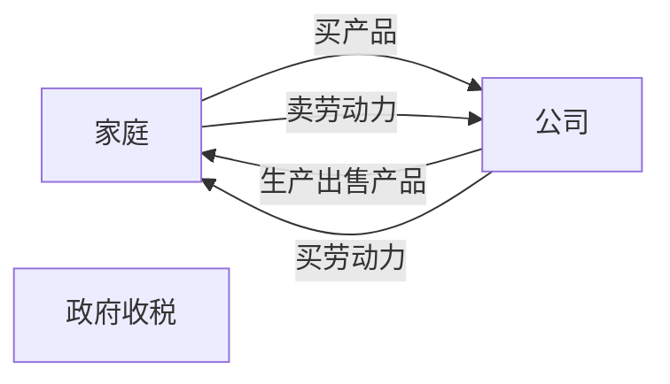
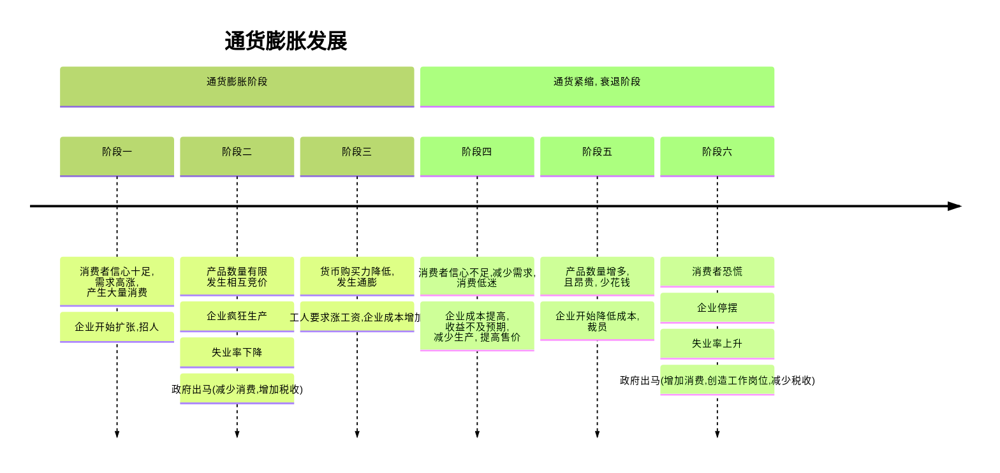
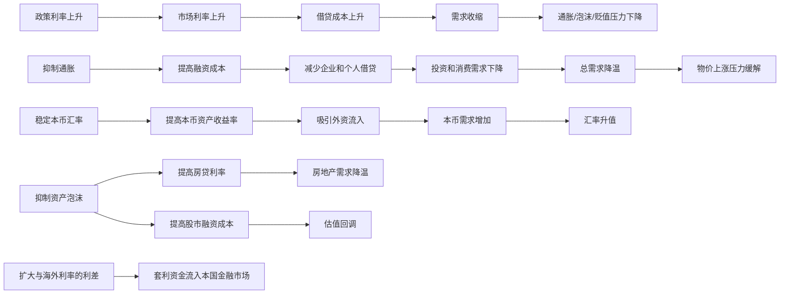
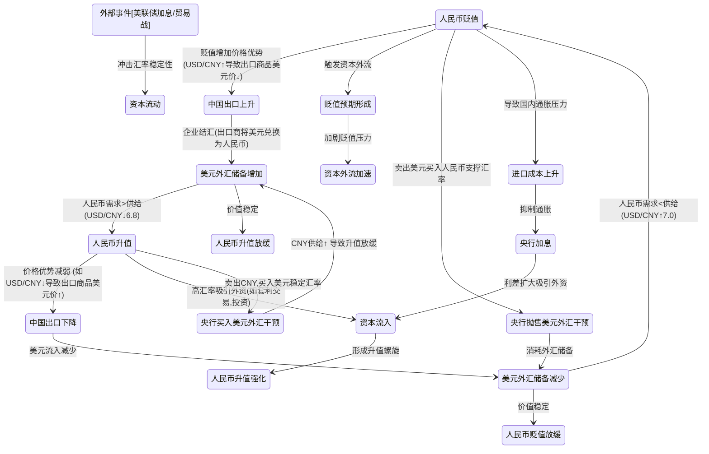

---
tags:
  - cb
创建时间: 2025-02-24 12:46:04
三观: Happy
title: "[[十分钟经济学]]"
---

YouTube频道[经济速成课(Crash Course Economics)](https://www.youtube.com/user/crashcourse)的“货币政策”系列。

**经济学**: 人与决策的科学, 研究人如何获得收入和花钱, 不是研究金钱和致富的, 不是股票市场, 资源稀缺和决策的科学

2个前提假设
1. **资源稀缺(scarcity)**:  资源是有限的, 欲望的无限的
2. **每一件事都是有成本的**: 分析我们的决策从有限的资源获得最大的利益 
合适的选择, 合适的激励政策

18岁少年选择去工作还是大学, 以及这个选择会怎样影响他的未来收入
公司选择生产手机还是电脑, 这个选择如何收到消费者喜好的影响
政府选择在经济衰退,是否增加财政支出, 以及这种支出是否值得举债

# 宏观

**背景**: 工业革命, 专业化分工 -> 生产效率提高, 贸易交换 ->使人富裕
自给自足效率低, 效率低使人贫穷

主要研究繁荣和萧条, 主要通过以下几点观察
1. 维持经济增长 (gdp)
2. 控制失业 (失业率)
3. 维持价格稳定 (通货膨胀率)

## 经济体系
1. 生产什么?  消费者花出去的钱 
2. 如何生产? 
3. 谁获得产品

谁,拥有和控制生产要素? 
### 自由市场经济(资本主义经济)
个体拥有生产要素, 政府对生产, 商务和贸易采取自由放任态度
稀缺的资源会满足迫切的需要? or 使用最高效率的 大概率? 
政府要求控制安全标准, 秩序, 公共设施, 基本待遇

供给和需求? 

**市场类型**: 
1. 完全竞争市场, 很容易加入竞争
2. 垄断市场: 
3. 垄断竞争: 
4. 寡头垄断

### 计划经济: 
维持政府本身的利益
政府控制, 效率, 反应慢
一部分公共的部分(教育, 医疗, 公共建设, 国防等)
一定程度避免资源竞争导致的资源的浪费(3家发电厂)

### 货币供给机制

（基础货币→货币乘数→M2）。

### 收入, 一部分控制能力来源(暴力)
税收: 
直接税: 财产税, 所得税
间接税: 增值税, 营业税
累退税
累进税
比例税

### 混合经济:
当下主流, 一部分市场经济, 一部分公共的部分, 市场不会做的部分政府参与调控

政府提高支出 (要钱) ,  -> 增加税收 -> (减少消费者的可支配收入)  -> 更少的消费
政府提高支出 (要钱)  -> 不增加税收 -> 负债
赤字支出: 花费比税收更多的钱,   政府需要借钱 -> 政府负债
预算赤字(): 某一年政府支出,超过了税收, 不得不借钱来填补这一年的短缺
负债是预算赤字的积累

## 参与者

政府
消费者 
生产者 

## 主要问题

### 就业

**失业率**: 降低失业率可能推动通胀, 高失业率促使刺激政策, 积极找工作,但是没找到工作的人数, 失业人口的数目/劳动人口的数目(合法劳动年龄) x100
**摩擦性失业**: 暂时没工作, 换工作期间
**结构性失业**: 市场不需要特定类型的劳动力
**周期性失业**: 衰退引起的, 不买东西, 企业裁人, 工人收入降低, 不买东西

### 通膨通缩
需求拉动通货膨胀(太多钱, 追着太少的商品), 大量消费增加GDP --> 相互竞价 --> 通膨 --> 货币购买力降低 --> 同样的钱买的东西更少
消费者为商品竞价
洗劫一生积蓄
企业扩张 --> 失业率下降 -->  产品数量有限 -->   工人要求涨工资 --> 企业成本增加 --> 利率增加 --> 贷款难了 --> 买房买车的数量变少 
生产者(成本提高 )提高售价, 减少商品生产引起
一般手段: 减少消费, 提高税收, 冷却经济

鼓励少花钱 --> 预期未来价格会更低 -->  更少的消费 --> GDP下降 --> 失业率增加
一般手段: 增加消费(政府提高支出, 创造工作岗位), 减少税收(增加消费者的可支配收入) -> 扩张性财政政策

## 调控手段

### 货币政策
改变货币的供给, 稍微平滑, 利率调整、公开市场操作、存款准备金率、量化宽松或紧缩，前瞻指引等

#### **加息**
紧缩性货币政策核心工具, 抑制通胀, 调整政策利率, 央行向商业银行提供短期资金的利率, 是金融市场的基准利率, 适用于CPI持续超过目标(>3%) GDP增速过快
**直接影响**: 商业银行的融资成本
**间接控制**: 市场利率(存款利率, 国债收益率) , 推高政府/企业债务利息负担（尤其高杠杆经济体）。
**滞后性**: 加息效果需6-12个月才能完全显现，易出现“超调”。
- **美联储激进加息引领全球**：美国全年加息7次共425个基点，迫使其他国家跟进（防资本外逃）。
-  **短期暴跌** 加密货币崩盘（比特币跌64%）高息环境抽离市场流动性，比特币等风险资产被抛售
- **做空高估值资产**：通过ETF做空科技股（如SQQQ基金2022年+142%）。
- **决策难点**：需在 **数据滞后性**、**市场预期管理** 和 **国际政策协调** 间取得平衡。
- 服务全球雇主（规避本国经济衰退）；
- 争取以美元/欧元结算的外贸、外包工作（如东南亚IT工程师）；

- **加息周期**：  
    → 美元走强 → 风险资产（美股、BTC）资金流出 → BTC短期下跌。  
    → _历史案例_：2022年美联储激进加息，BTC从4.8万跌至1.6万（-67%）。
- **降息周期**：  
    → 美元走弱 → 资金涌入高风险资产 → BTC反弹。  
    → _历史案例_：2020年美联储降息至零，BTC从5千涨至6.9万（+1280%）。

#### 降息
降息刺激借贷和消费

#### **2. 经济数据间接影响**
- **非农就业超预期**：  
    → 加息预期升温 → BTC承压（但若数据引发“软着陆”乐观情绪，可能先跌后涨）。
- **CPI低于预期**：  
    → 降息预期升温 → BTC快速拉升（如2023年10月CPI 3.2% vs 预期3.3%，BTC当日+7%）。

    1. 降息=刺激经济（企业借贷成本↓→投资↑→就业↑）。
    2. 加息=抑制通胀（消费和投资↓→物价压力↓）。
    3. 美联储通过买卖国债调节市场流动性（例如QE=大规模买债→向市场注资）。

**量化宽松(QE)**:  中央银行买光银行更长期的资产(政府债券, 房贷)  -> 给商业银行更多的钱?  -> 可能会通膨? , 外国人也会选择把美元留在手里
超发货币推高资产价格（股市、房价），富人资产增值，无产者仅承受通胀
法币购买力被稀释
**暴涨催化剂**：流动性泛滥推高投机需求
**监管套利**：资金通过加密货币逃离资本管制（如中国居民通过USDT转移资产）。

#### **存款准备金率下调**
- **隐性通胀**：银行可贷资金增加→信贷扩张→物价上涨（如中国2008年4万亿计划后猪肉价格翻倍）。
- **理财收益下降**：银行间流动性过剩→货币基金收益率走低。
- **远离现金**：避免长期持有低息存款，转投抗通胀资产。
-  **杠杆购房**：利用低首付政策锁定资产（需确保现金流稳定）。
- - **间接利好**：银行体系流动性外溢至高风险资产（如DeFi协议TVL增长）。
- - **稳定币扩张**：USDT、USDC发行量随信贷周期同步波动。

### 财政政策
改变政府的支出和税收, 急性的, 税收变化、政府支出、补贴、债务发行等。

短期进入补贴行业,政策退坡前退出。

- **加息周期**：做空垃圾债、囤积现金、做多波动率（VIX指数）。
- **降息周期**：加杠杆买核心资产、持有高beta加密货币（如SOL、AVAX）。
- **央行不可能三角**：资本自由流动、汇率稳定、独立货币政策只能三选二，普通人需预判政策妥协方向（如中国保汇率则需资本管制）。
- - **财政货币化本质**：现代法币体系=税收驱动货币需求+债务货币化维持运转，持有实物资产是唯一退出策略。
- - **货币政策宽松期**：加密货币作为“法币替代物”被疯炒，市值向黄金（12万亿美元）靠拢。
- **货币政策紧缩期**：沦为高风险投机品，与科技股同步暴跌，但BTC因2100万上限属性逐渐分化。
- **财政政策扩张期**：成为灰色资金通道（如俄乌战争中加密货币用于规避制裁），监管打击与市场需求并存。
- 将加密货币视为**非对称押注工具**——配置5%-10%资产，在法币体系崩溃时可能获得百倍收益，平时不影响生活。

| **政策类型** | **配置优先级**  | **加密货币关联操作**               |
| -------- | ---------- | -------------------------- |
| QE+低利率   | 房产、BTC、成长股 | 杠杆做多BTC，参与DeFi流动性挖矿        |
| 加息+缩表    | 现金、黄金、短债   | 持有稳定币赚取高息，做空山寨币            |
| 财政扩张+发钱  | 大宗商品、军工股   | 买入通胀对冲币（BTC），抛售治理型代币（如UNI） |
| 增税+监管收紧  | 离岸资产、隐私工具  | 转移至隐私链，减少CEX持仓             |

### 国际贸易全球化
科技变成了技术工人的补偿, 变成了非技术工人的替代品, 拉大了收入差距, 生活在贫困中的本科生, 工会没有影响力, 税收对富人有利
选择社会看好的工作

**全球化**: 企业, 消费者,  受害者, 工人? 环境? 
**净出口**: 出口--进口
**贸易顺差**: 贸易盈余  出口大于进口
**贸易逆差**: 贸易赤字   出口小于进口, 消费者, 企业, 和政府想要购买的东西比自己本国生产的多, 就必须出售资产来支付这些进口商品
**汇率**: 你的货币值多少钱, 当你用来交换其他国家的货币时

消费者消费
企业消费, 投资
政府消费
出口 -> 其他国家进行的消费

## 金融市场
 机构(银行),市场(股市),合同的网络(债券), 把这2群人聚在一起
1. 有钱(企业, 家庭, 个人), 想要有一种方式把现在的钱在未来变成更多的钱
2. 需要借钱,未来会还钱, 买房买车, 做企业, 政府

**货币**: 交换媒介, 作为商品或者服务的酬劳, 价值储藏手段, 标准化计价单位 , 衡量事物的相对价值
容易携带, 持久, 难以伪造
技术上来讲, 钱是任何被充当交换媒介的东西
钱有价值, 是因为每个人都认为他有价值
**股市**: 经济基础或被感知到的变化的反应(消费者信心, 失业率, GDP增长)
**股票**: 资产工具, 公司的一部分所有权
**国债**: 政府借钱,会让企业能借的钱变少? 国债收益率反映市场对经济和利率的预期, 10年期美债是关键指标
**债券**: 债务工具, 一个欠条, 借款人同意以一定的利息并承诺在未来规定的时间内还款
 **政府债券**: 政府发行的借条 (银行为啥要持有? 有收益, 风险小), 政府还钱 -> 银行现金变多 -> 货币供给增加多, 发行越多, 货币供给越少
 **证券**: 
**利率**: 借钱的本金以外还有的百分比的收益(弥补通胀, 增加收入)
法定准备金
**贴现率**: 降低, 银行更容易借钱, 增加货币供给

### 存在的问题

**货币流通速度**: 一元每年被使用的次数
**流动性陷阱**: 上涨-> 预期上涨 -> 真的上涨,  下降 -> 预期下降 -> 真的下降
**滞涨**: 产出放缓, 停滞, 物价上涨
**金融危机**: 
**次贷危机?**: 
**恶性通货膨胀**

## 经济学发展

**马尔萨斯** 认为人会饿死 结合达尔文, 认为社会福利不好 ->   社会达尔文主义 
凯恩斯
马歇尔
马克思 , 恩格斯  共产主义, 集体经济

---

## 微观:

研究市场, 消费者, 企业和政府的决策

## 其他

### 国际援助

### 地下经济
主要观察手段
1. 电
2. 支出大于收入
3. 现金需求  
### 移民经济
一般来说, 移民即能提高劳工收入, 又能提高当地就业, 并且带动消费, 基本是利大于弊

### 行为经济
人类是做决定的时候容易非理性做出, 而非一定做出理智的决定

### 医疗经济

### 死亡经济

### 幸福经济

## 基本名词

**国内生产总值(Gross Domestic Product)** : 一年内一个国家境内所有最终产品和服务的价值, 核算国民收入, 出口, 消费, 投资? 
**名义GDP**: 未经通货膨胀矫正的GDP
**真实GDP**:
**人均GDP**:  真实GDP/国家人口, 每个人的产出
**消费者物价指数(CPI)**:物价上涨速度, 美联储目标为2%  衡量通货膨胀的方法, 消费者购物篮 , 除以一个基准年x100
	CPI上升 超过2%, 失业率处于低位, FED暗示加息
	CPI低迷 失业率上升, FED可能降息
**衰退**:连续2个季度内的真实GDP下降
**垄断** : 担心价格定制问题, 价格歧视
**基尼指数**: 收入分配绝对平等, 和实际分配, 差距的大小
**博弈论**: 

### 供给和需求
**需求弹性**: 
**供给弹性**: 
**相对优势**: 
**替代效应**: 
供给曲线
需求曲线

### 价格
**价格欺诈**: 
**掠夺性定价**: 
**价格上限**: 
**价格下限**: 
**价格信号**: 
**均衡价格**: 

### 利润
**会计利润**: 收益-显性成本
**经济利润**: 收益-显性成本-隐性成本

### 生产概念
**生产力**: 
**生产可能性边界(ppf)**: 
**生产要素**: 土地, 劳动力, 资本  -> from: 马克思 资本论? 
**生产过剩**:
**生产短缺?**: 
**生产效率**: 最大化利用一切生产资源, 不想浪费资源, 浪费钱, 需要利润最大化
**配置效率**: 
**挤出效应**: 政府借钱 -> 利率上涨?  -> 企业会更难贷款买工厂和工具 -> 使经济脆弱  -> 增加政府负债
**乘数效应**: 
**边际效益递减**: 
**均衡数量**: 
**泡沫**: 依赖不断增加的买家供给量

### 成本
**隐性成本**:  间接的机会成本
**沉没成本**: 花出去, 收不回来的成本
**显性成本**: 做生意自然想到从口袋里拿出去的钱
**机会成本(opportunity cost)** : 观看一个视频的成本, 是你没有看其他视频(认为稍微差一点的选择价值
**固定成本**: 
**可变成本**: 
**边际收益**: 
**边际成本**: 

---

 去年前年大环境是退烧政策, 到了25年应该是不退烧了, 市场有点衰退 --> 政策大概率是激励性的? 宽松性的? 
 
#### **学习目标达成标准**（检验是否掌握80%）：
- 能用自己的话解释：GDP、失业率、实际利率、货币政策的传导路径。
- 看到新闻标题如“美国Q2实际GDP增长2%”，能判断经济处于扩张还是收缩。
- 理解“美联储加息50基点”对股市、房贷、企业融资的直接影响。
- - **初级**：看到“美国10月CPI同比3.2%”（前值3.7%），能判断通胀降温，降息预期升温。
- **进阶**：若美联储声明删除“限制性政策”一词，同时点阵图下修利率预测，可推测12月可能降息25基点。

如果总计投入50U 
其中花 5U 买入BTC 并且加5倍杠杆, 那么 相关风险是如何计算的?  
- 当BTC单日跌幅>15%时，**止损点设为买入价-20%**, 假设BTC从7万跌到5.9万，用5%资金买入，反弹到6.5万时卖出（盈利率≈10%）。
应该如何计算单日跌幅?   如何计算设置止损点?  如何计算盈利率

关键字热度
https://trends.google.com/trends/explore?date=today%203-m&q=How%20to%20buy%20crypto&hl=zh-CN

当“**恐慌贪婪指数**”连续3天<20时，买入BTC；>80时卖出10%仓位

普通人赚大钱的机会来自极端波动，但必须用极小仓位试错。

