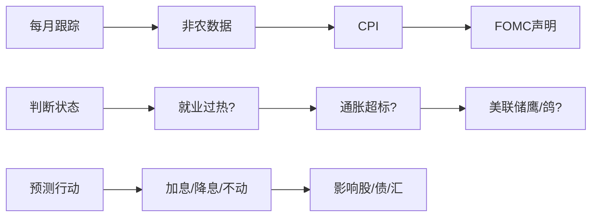

---

tags:
  - cb
创建时间: 2025-02-23 21:27:12
三观: Happy
title: "[[基本概念]]"
---

**美联储(FED)** : 美国中央银行, 职责包括控制通胀, 最大化就业, 稳定金融系统
**联邦公开市场委员会(FOMC)**: [会议纪要](https://www.federalreserve.gov/monetarypolicy/fomccalendars.htm), [下一次会议时间和对市场加息/降息概率的预测基于联邦基金期货价格](https://www.cmegroup.com/markets/interest-rates/cme-fedwatch-tool.html)
**点阵图**: [解读](https://go.gerentouzi.com/563.html)  大概是一年4次, 一个季度一次? 反映的是FOMC成员随时间推移对美联储目标利率的预测 [Recent Documents-> Projections Materials](https://www.federalreserve.gov/monetarypolicy.htm)
**菲利浦斯曲线**:  通胀与失业率的短期权衡(失业率↓ -> 通胀↑)
**泰勒规则**: 公式化利率决策(利率=通胀率+0.5x通胀缺口+0.5x产出缺口)
**美联储双重使命**: 就业最大化+ 物价稳定

非农就业报告, CPI数据, GDP季度报告, 
国债收益率曲线倒挂可能预示经济衰退, 

每年大概是8次的会
- 美联储官网的[历史利率工具](https://www.federalreserve.gov/monetarypolicy/openmarket.htm)（1982年至今的联邦基金利率）。

**非对称押注工具**:  风险与收益极度不平衡的投资标底或策略, 潜在损失有限, 但可能获得远高于本金的超额收益, 在加密货币领域: 尤其适合应对法币体系崩溃, 技术革命等极端场景, 同时避免因过度冒险而破产
本质: 概率和赔率的博弈?  期望值 = (胜率x潜在收益) - (败率 x 潜在损失)
- 若潜在收益 ≥ 10倍本金，即使胜率仅10%，期望值仍可能为正（例如：10%×1000% - 90%×100% = 10%）。
- 用1%资产买入市值＜1亿美元的新公链代币，归零风险可控，但若成为下一个SOL（涨超100倍），整体收益翻倍。
- **对抗系统性风险**：当法币因QE无限超发贬值时，1%仓位押中一个百倍币，即可保护99%资产的购买力；
- **突破阶层固化**：普通人通过极低成本的押注，可能实现财富量级跃升（如SHIB早期投资者万倍收益）；
- **推动技术创新**：资本向高风险高回报领域聚集，加速区块链与AI、生物技术等前沿领域的融合。
将总资产的**1-5%**配置于非对称押注工具，其余95%存入BTC/黄金/现金。  
**非对称押注不是赌博，而是用数学和纪律，在文明更迭中为自己买一张逃生船票。**
trump?  

| **维度** | **对称押注（如股票、BTC）**       | **非对称押注（如低市值山寨币、期权）** |
| ------ | ----------------------- | --------------------- |
| 风险/收益比 | 1:1~1:3（如BTC涨100%或跌50%） | 1:10+（如归零 vs 涨100倍）   |
| 时间成本   | 中长期持有（1年以上）             | 短期爆发（3-6个月）或归零        |
| 适用场景   | 稳态经济环境                  | 黑天鹅事件、技术范式转移          |
#### 1. **低市值高叙事币种（市值＜5亿美元）**
- **案例**：
    - **RNDR（去中心化渲染）**：2023年AI热潮中从0.4美元涨至8美元（20倍）；
    - **TAO（去中心化AI）**：2024年从50美元涨至800美元（16倍）。
- **操作要点**：
    - **叙事验证**：只押注已被现实需求验证的赛道（如AI、DePIN）；
    - **筹码分布**：前10地址持仓＜40%（避免被庄家控盘收割）；
    - **流动性底线**：日交易量＞500万美元（确保能逃顶）。

#### 2. **加密期权（以Deribit为例）**
- **策略示例**：
    - **买入BTC看涨期权**：支付5%本金购买3个月后行权价10万美元的看涨期权，若BTC涨至15万美元，收益= (15-10)/10 - 5% = 45%；若下跌，仅损失5%权利金。
- **优势**：
    - 杠杆效应：用小额资金撬动大额收益；
    - 精准押注：可针对特定事件（如ETF通过、减半）下注。

#### 3. **Pre-Market一级市场投资**
- **私募轮参与**：
    - 以0.05-0.1美元单价投资未上线代币，上线后若涨至1美元（20倍），即使90%项目归零，整体组合仍可盈利。
- **风险对冲**：
    - 仅用≤2%资产配置，且要求项目方有链上产品（非纯PPT融资）。

### **三、普通人的实操框架**

#### 1. **仓位管理：凯利公式改良版**
- **公式**：仓位占比 = （预期胜率 × 赔率 - 败率） / 赔率
    - 例：某币种预期涨10倍的概率10%，归零概率90% → 仓位 = (10%×10 - 90%)/10 = 0.1%（仅建议用0.1%资产押注）。
- **实操纪律**：
    - 单项目投入≤1%总资产；
    - 全赛道（如AI+DePIN）总投入≤5%。
#### 2. **退出策略**
- **分级止盈**：
    - 涨2倍卖出50%收回本金，剩余仓位博取更高收益；
    - 若市值进入前50（如CoinGecko排名），清仓50%转入BTC。
- **归零预警**：
    - 代币连续30天无代码提交→ 止损；
    - 核心开发者离职→ 止损。
#### 3. **反常识认知**
- **不依赖技术分析**：低市值币种K线被庄家完全操控，MACD/RSI等指标失效；
- **拒绝社区信仰**：即使项目方“AMA承诺赋能”，若链上数据（活跃地址、TVL）未增长，立即撤退；
- **利用信息差**：在英文社区（如Discord、X）提前获取消息，避开中文社区“喊单接盘”。

---

建立分析流程  

数据源和跟踪分析
- - [美国劳工统计局](https://www.bls.gov/)（失业率、CPI）。
- [美联储经济数据库(FRED)](https://fred.stlouisfed.org/)（历史数据可视化）。
- 金十数据
- 鲍威尔的发布会
分析模版
- 每月检查失业率、CPI、GDP趋势。
- 对比美联储最新声明与历史数据(就是FOMC会议纪要)，判断政策倾向。

就业数据, 通胀数据, GDP季度数据 ,债券市场

|美联储动作|股市|美债价格|美元|黄金|
|---|---|---|---|---|
|**加息**|↓|↓（收益率↑）|↑|↓|
|**降息**|↑|↑（收益率↓）|↓|↑|

建议从分析[美联储2020年疫情声明](https://www.federalreserve.gov/newsevents/pressreleases/monetary20200315a.htm)开始，对比当前政策差异，快速积累经验。

### **六、最终建议：建立你的分析框架**

1. **每月决策清单**：
    - **数据前**：记录市场共识预期（参考Bloomberg调查）。
    - **数据后**：对比实际值，评估对美联储双重使命（通胀/就业）的影响。
    - **声明後**：拆解措辞变化，结合点阵图调整利率路径预测。
2. **长期跟踪模板**：

|日期|关键事件|数据结果|市场反应|你的预测修正|
|---|---|---|---|---|
|2024-03-08|非农就业|+275K|美债收益率↑|推迟降息至7月|
|2024-04-10|CPI同比3.5%|超预期|美元跳涨|加息概率升至30%|

经济学和政策分析的本质是“概率游戏”，而非追求绝对正确。你的目标应是：
1. **比市场共识更快识别趋势**（例如提前发现通胀黏性）。
2. **在不确定中管理风险**（如用“情景分析”制定不同政策路径下的应对策略）。
3. **保持迭代思维**：每次美联储决策後，复盘你的预测逻辑，持续修正认知盲区。

**行动建议**：从今天起，每周花30分钟做以下两件事：

1. 速读当周FOMC官员讲话，标注鹰鸽关键词。
2. 在FRED数据库对比当前CPI曲线与历史周期（如1970s、2008年）。

坚持3个月，你将建立起对政策逻辑的直觉，远超普通投资者的分析深度。

1. **杠杆是双刃剑**：
    - 5U本金+5x杠杆，若连续止损5次（0.1U×5=0.5U），需暂停一周反思策略。

---

非常感谢你的额外建议
包括市场心理和行为经济学, 投资者预期, 时间滞后效应, 数据修订问题, 黑天鹅, 技术分析
最后提出鼓励加入社区, 参与讨论, 鼓励实践包括模拟交易以及转写报告

提到跨资产联动, 隐含波动率, VIX(恐慌指数),利率期权等等

排除政治正确的说明, 这里关于模拟交易的板块, 因为美股具有一定的门槛对于普通人来说(开卡入金要求), 其他市场要求不了解, 比如外汇, 期权, 债券, 不知道普通人是否可以入局? 
而现在炒币的入场门槛较低, 注册交易所账号, 入金即可参与交易, 算是参与交易比较好的方式? 
那么假如现在考虑入场虚拟交易比如入金50U感受, BTC是现在的龙头之一, 比如拿出仓位的10% (5u, 并加5x杠杆入局 BTC合约,风险应该不高)  , 我应该如何不断与验证政策影响, 加入到对BTC的短期投机行为中?  以上整体的学习, 验证内容, 应该真对BTC做出哪些适应性的调整? 

非常感谢地你的建议, 其中你建议学习经济学原理（宏观分册） 第1、2、15章 他的题目是咋样的? 大致内容是什么? 
对于这几章的基本学习框架(期望可以用20%的时间可以掌握80%的知识的框架)和应该达成目标是什么? 
关于数据源,还有哪些更好更合适的推荐? 
关于分析, 美联储最新声明与历史数据在哪里能看到?  他们声明的频率是咋样的? 

