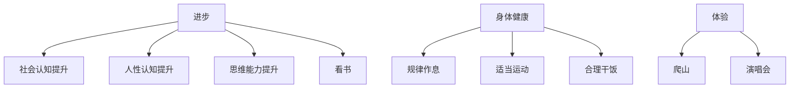
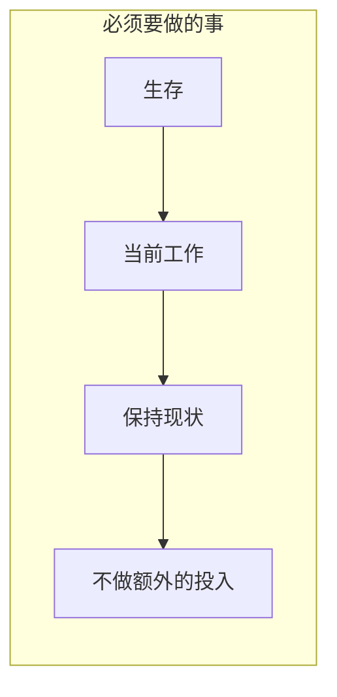

Nothing
≤
https://github.com/Guoaking/ob


https://chat.deepseek.com/sign_in


不知道干啥就干无聊且正确的事





```chart
type: pie
labels: [睡觉,运动,饮食]
series:
 - title: Title 1
   data: [3,2,1]
width: 40%
labelColors: true
```


[[123.canvas|123]]

### 健康 

![[00-预防]]





```
排除政治正确的说法和正确的废话,  
对于一个普通人来说一个事实是这样的:  随着年龄的增长,  寿命越来越少, 同样的自己所拥有的时间自然也越来越少 
那么如果在年龄越早的时候, 做到长期对的事, 长期有价值的事, 那么随着年龄的增长, 可能会体会到这些选择或者做法带来的复利效应
比如: 
1. 如果注意身体健康, 规律作息, 那么在未来可能比同龄人更健康
2. 如果有一些合适的人脉资源(警察, 医生, 律师), 那么可能在某些事情, 或者状态下会少走很多弯路, 省去很多时间, 或者损失
3. 什么辩证的思维之类的
那么有哪些人, 事, 工具,资源, 或者别的什么, 应该是长期有价值的? 既然他们是长期有价值的, 当下又应该怎么做?   
```


```
排除政治正确的说法和正确的废话,  
对于一个普通人来说一个事实是这样的: 当下社会娱乐极度的方便和丰富(游戏, 短视频,小说, 剧) 各种猎奇, 低智, 让人眼花缭乱的内容层出不穷, 疯狂争夺注意力, 和精力
但是适当的放松也是必不可少的, 那么如何控制和平衡? 或者说如何管理时间和精力?  


随着年龄的增长,  寿命越来越少, 同样的自己所拥有的时间自然也越来越少 
那么如果在年龄越早的时候, 做到长期对的事, 长期有价值的事, 那么随着年龄的增长, 可能会体会到这些选择或者做法带来的复利效应
比如: 
1. 如果注意身体健康, 规律作息, 那么在未来可能比同龄人更健康
2. 如果有一些合适的人脉资源(警察, 医生, 律师), 那么可能在某些事情, 或者状态下会少走很多弯路, 省去很多时间, 或者损失
3. 什么辩证的思维之类的
那么有哪些人, 事, 工具,资源, 或者别的什么, 应该是长期有价值的? 既然他们是长期有价值的, 当下又应该怎么做?   
```


```
排除政治正确的说法和正确的废话,  从最本质, 第一性原理来帮我分析,可以勇于创新, 打破常规思维, 给我详细建议, 
对于一个普通人来说想获得最低限度的财富自由(钱生钱的收益能覆盖日常开支)原始积累: 
一个事实是这样的: 100000*0.0125/365*30  当普通人有10w, 存唾手可得的零钱基金那么一个月的收益大概100元,  一天3块左右的收益. 如果想一天有20块的收益, 那么意味着本金最少需要是60w才有可能, 亦或者收益能较为稳定的做到6%左右, 才有可能达到这个目标

那么去普通人增加本金到60w, 可能需要辛苦工作10年以上, 要么尝试增加收益率, 这2个都很不容易,
因为普通人平时还要养家糊口, 对本金的损失可能是极度恐惧的, 对中高风险的高收益的事, 下意识都是排斥的, 无法allin 全力投入
处在这样一个情况下如何破局?  一个想法是拿出 5000左右投入,炒股炒币? 用较低的成本损失,去博取可能存在的潜在高收益? 这样是否可行? 还有什么办法?  


```

1. **行动力基础薄弱：** 个体可能本身缺乏目标感、自律性、抗挫折能力、解决问题的技能。面对现实挑战时，更容易选择退缩到幻想中，而不是笨拙地开始行动。
替代性满足现象,心理学上的“想象完成效应”和“自我效能感”概念
2. 逃避现实
3. 行动力薄弱
停止自我欺骗
打破0行动的状态
过程导向


## 认知
- **批判性思维：** 识别信息陷阱，避免重大决策失误。
- **系统思维：** 看清事物间关联，预判长期影响（如：当前消费习惯对10年后财务的影响）。
- **元认知（学习如何学习）：** 快速掌握新领域的能力，在技术迭代中不被淘汰。
- **主动挑战观点：** 阅读时强制自己写下：“作者的核心假设是什么？证据是否可靠？反例是否存在？”
- **构建思维模型库：** 刻意收集跨学科原理（如复利、熵增、概率思维），用它们分析日常问题（例如用“机会成本”决定是否参加饭局）。
- **学习“学习科学”：** 研究《认知天性》《学习之道》中的方法（间隔重复、主动回忆），应用于任何新技能学习。


##  **抗风险缓冲系统**


- **长期价值：** 避免一次意外击穿所有积累（疾病、事故、法律纠纷）。
- **当下行动：**
    - **基础保险即刻配置：** 医疗险+重疾险+定期寿险（家庭支柱），年保费控制在年收入5%-10%。
    - **建立危机应对清单：** 记录紧急联系人（律师、医生）、重要文件存放位置、基础应急流程。
    - **保留“生存金”：** 账户中始终保有3-6个月基本开支的活期存款，不动用、不投资。


### 信任关系(人脉)
在于“谁信任你解决问题的能力
- **聚焦“价值提供者”定位：** 在专业领域持续输出干货（如写技术博客、提供免费行业分析），吸引同频者。
- - **深度维护关键节点：** 每年筛选3-5位良师益友，定期深度交流（非寒暄），主动分享对其有用的信息或资源。
    - **建立“互助清单”：** 明确记录“我能为谁提供什么价值”和“谁在哪些领域能帮我”，避免无效社交。

构建“睡着也有收入”的系统。


##  **精神内核与意义感来源**

- **长期价值：** 在漫长低谷期提供续航力，避免陷入虚无主义。意义感是指引长期行动的灯塔。
- **当下行动：**
    - **定义个人核心价值观：** 写下5个绝不妥协的原则（如诚信、家人健康、思想自由），重大决策以此为准绳。
    - **创建“意义证据库”：** 定期记录“今日我做过的有意义小事”（帮同事解决难题、坚持健身等），低谷时回看。
    - **实践“小贡献”：** 每周做一件微小的利他之事（公益咨询、分享知识），积累自我价值感。


### **关键执行策略：让复利齿轮转动**
1. **聚焦“可积累性”行动：** 每次选择前问：“这件事的效果会随着时间增强，还是衰减？”（如读书积累认知 vs 刷短视频消耗注意力）。
2. **设置“复利账户”：** 物理或虚拟建立6个账户（对应上述6类资产），每日/周固定投入资源（时间、金钱、注意力）。
3. **量化追踪核心指标：** 监控关键数据（如力量训练重量、资本积累率、深度社交次数），避免自我感动式努力。
4. **容忍短期低回报：** 真正的复利曲线前段平缓（如最初写作可能无人阅读），坚持到拐点需要延迟满足能力。


### **一、长期有价值的“资产”分类及筛选标准**
**核心筛选标准：**
1. **复利性：** 价值随时间**指数级增长**（如知识、健康、信任）。
2. **防御性：** 能规避未来重大风险或损失（如法律意识、医疗资源）。
3. **稀缺性：** 难以被快速复制或替代（如深度人脉、独特技能）。
4. **可积累性：** 能通过持续行动逐步叠加（如资产、经验）。
---
### **二、具体长期价值项及当下行动策略**
#### **1. 身体健康：最基础的复利资产**
* **长期价值：**  
  - **节省时间：** 减少就医、康复时间，避免“用钱买命”的被动局面。  
  - **提升效率：** 精力充沛是所有行动的基础，中年后差距显著。  
  - **降低风险：** 避免因健康问题导致财富/机会损失（如突发疾病耗尽储蓄）。
* **当下行动：**  
  - **最小成本健康投资：**  
    - **睡眠优先：** 固定23:30前入睡（比补觉更有效）。  
    - **抗炎饮食：** 减少精制糖/油炸食品，增加Omega-3（深海鱼、亚麻籽）。  
    - **碎片化运动：** 每日3次10分钟高强度间歇训练（HIIT），效果优于每周1次健身房。  
  - **建立健康档案：** 每年做一次**深度体检**（重点：心血管、癌症早筛、代谢指标），数据存档对比。  
  - **储备医疗资源：** 认识1-2位靠谱的**全科医生**（非三甲专家，而是能快速给出初步建议的基层医生），比认识院长更实用。
#### **2. 精准人脉：非数量，而是“关键节点”**
* **长期价值：**  
  - **节省决策成本：** 关键时刻获得**准确信息**（如律师提示合同陷阱、医生告知治疗方案优劣）。  
  - **降低系统性风险：** 在政策变动、行业危机时获得预警（如税务稽查、行业整顿）。  
  - **撬动资源杠杆：** 用少量时间维护关系，换取关键时刻的**专业解决方案**。
* **当下行动：**  
  - **人脉“三三制”原则：**  
    - **3个核心圈：** 律师（合同/纠纷）、医生（健康决策）、税务/财务顾问（资产优化）。  
    - **3个行业圈：** 你所在行业的**技术大牛**（趋势判断）、**资源掮客**（机会链接）、**资深前辈**（避坑指南）。  
    - **3个跨界圈：** 不同领域但**认知层级高**的人（如投资人、政策研究者），打破信息茧房。  
  - **维护策略：**  
    - **价值互换：** 定期分享你领域的**独家信息**（如行业报告、技术趋势），而非单纯请客吃饭。  
    - **低频高质：** 每季度与关键人脉深度交流1次（1小时），比每月聚餐更有效。  
    - **工具辅助：** 用**Notion**或**CRM系统**记录人脉信息（专业领域、需求、最近动态），避免“用完即忘”。
#### **3. 认知能力：对抗信息过载的“操作系统”**
* **长期价值：**  
  - **提升决策质量：** 在复杂环境中快速识别本质（如辨别政策真实影响、商业模式可持续性）。  
  - **避免认知税：** 减少因思维局限导致的财富/时间损失（如盲目跟风投资、陷入无效努力）。  
  - **创造差异化优势：** 在同质化竞争中，认知深度决定天花板。
* **当下行动：**  
  - **建立“认知防火墙”：**  
    - **信息源净化：** 取消关注90%的社交媒体，只保留**3-5个高质量信源**（如专业期刊、行业白皮书、深度智库报告）。  
    - **每日“反常识”训练：** 每天质疑一个“理所当然”的观点（如“努力一定成功”），用**第一性原理**拆解。  
  - **构建思维模型库：**  
    - **核心模型：** 复利效应、二八法则、能力圈、概率思维、系统思维。  
    - **实践方法：** 每周用1个模型分析1个现实问题（如用“能力圈”评估是否该跳槽）。  
  - **输出倒逼输入：**  
    - **写作/教学：** 每月写1篇深度分析（哪怕只发朋友圈），强迫自己梳理逻辑。  
    - **跨界学习：** 每年学1个**非功利性技能**（如编程、心理学），打破思维定式。
#### **4. 财务资产：被动收入的“时间机器”**
* **长期价值：**  
  - **购买时间自由：** 被动收入覆盖生活成本后，可自主支配时间。  
  - **对冲通胀风险：** 现金长期贬值，优质资产保值增值。  
  - **提供选择权：** 在职业危机、机会来临时有底气决策。
* **当下行动：**  
  - **“50/30/20”资产配置法：**  
    - **50%防御性资产：** 现金（6个月生活费）、国债、保险（重疾/医疗/意外）。  
    - **30%稳健性资产：** 指数基金（沪深300+标普500）、核心城市房产（非投机）。  
    - **20%进攻性资产：** 你深度理解的行业股权、高成长企业股票。  
  - **自动化理财：**  
    - 设置**每月定投**（工资到账自动扣款），避免情绪干扰。  
    - 用**记账APP**（如MoneyWiz）分析消费结构，砍掉“拿铁因子”（如无效订阅、冲动消费）。  
  - **提升财商：**  
    - **必读清单：** 《穷查理宝典》《漫步华尔街》《稳健投资》（避开鸡汤书）。  
    - **实践工具：** 用**雪球/集思录**跟踪投资逻辑，而非只看涨跌。
#### **5. 情绪韧性：避免“内耗”的底层能力**
* **长期价值：**  
  - **维持行动力：** 在挫折中快速恢复，避免长期陷入负面情绪。  
  - **保护决策理性：** 减少因焦虑/愤怒导致的错误选择（如割肉离场、冲动辞职）。  
  - **提升关系质量：** 情绪稳定是深度合作的基础。
* **当下行动：**  
  - **建立“情绪止损点”：**  
    - 当感到持续焦虑/愤怒时，立即执行**5分钟“物理隔离”**（离开现场、深呼吸、冷水洗脸）。  
  - **每日“情绪复盘”：**  
    - 睡前用3分钟记录：**今天最强烈的情绪是什么？触发点？下次如何优化？**  
  - **培养“反脆弱”习惯：**  
    - **每周1次“可控冒险”：** 做一件略超出舒适区的事（如公开演讲、陌生拜访）。  
    - **建立支持系统：** 认识1-2位**高情绪价值**的朋友（非抱怨型，而是能提供解决方案）。
---
### **三、关键工具与资源推荐**
| **类别**   | **工具/资源**                 | **核心价值**           |
| -------- | ------------------------- | ------------------ |
| **健康管理** | Apple Watch/小米手环（监测心率/睡眠） | 数据化健康预警，防患未然       |
| **人脉管理** | Notion（人脉数据库模板）           | 系统化维护关键关系，避免遗忘     |
| **认知提升** | 得到APP（课程《香帅的北大金融学课》）      | 系统化建立经济思维模型        |
| **财务工具** | 且慢APP（指数基金定投）             | 自动化执行长期投资策略，避免情绪干扰 |
| **情绪管理** | Headspace（冥想引导）           | 训练专注力，降低焦虑阈值       |

### **四、残酷但必须面对的真相**
1. **“长期主义”是反人性的：**  
   - 大多数人高估1年变化，低估10年复利。**当下行动的本质是用短期痛苦（自律、学习）购买长期期权。**  
2. **资源有限，必须取舍：**  
   - 你不可能同时成为健身达人、社交名流、投资高手。**聚焦2-3个核心领域深耕，其余保持“及格线”即可。**  
3. **时间不可存储，但可“投资”：**  
   - 每天省下1小时刷手机，用于阅读/运动，10年后就是3650小时≈152天，足以掌握一门技能或改善健康。
---
### **总结：当下该做的3件小事**
1. **今晚睡前：** 用手机设置**23:00自动提醒**，从此刻开始优化睡眠。  
2. **本周内：** 整理通讯录，筛选出**3个关键人脉**，预约一次深度交流（提供价值，而非索取）。  
3. **本月工资到账：** 自动扣款**10%到指数基金账户**，启动被动收入引擎。  
**时间的复利只眷顾那些在年轻时就开始“播种”的人。你此刻的每一个微小选择，都在为40岁、50岁的自己铺设一条更少焦虑、更多自由的路。**


你好我去 手感不错 
o

---
- [ ] 买票
- [ ] 整理东西
- [ ] 寄到那里
- [ ] 加班诉求
- [ ] 最差的情况, 可以承受