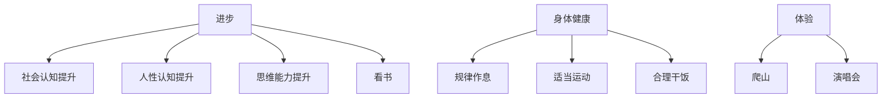
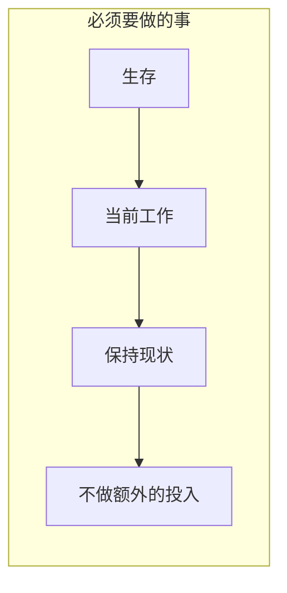

Nothing
≤
https://github.com/Guoaking/ob

https://chat.deepseek.com/sign_in

不知道干啥就干无聊且正确的事

排除政治正确的说法和正确的废话,  
对于一个普通人来说一个事实是这样的:  随着年龄的增长,  寿命越来越少, 同样的自己所拥有的时间自然也越来越少 
那么如果在年龄越早的时候, 做到长期对的事, 长期有价值的事, 那么随着年龄的增长, 可能会体会到这些选择或者做法带来的复利效应
比如: 
1. 如果注意身体健康, 规律作息, 那么在未来可能比同龄人更健康
2. 如果有一些合适的人脉资源(警察, 医生, 律师), 那么可能在某些事情, 或者状态下会少走很多弯路, 省去很多时间, 或者损失
3. 什么辩证的思维之类的
那么有哪些人, 事, 工具,资源, 或者别的什么, 应该是长期有价值的? 既然他们是长期有价值的, 当下又应该怎么做?   

长期价值的工具, 积累, 人脉

1. **行动力基础薄弱：** 个体可能本身缺乏目标感、自律性、抗挫折能力、解决问题的技能。面对现实挑战时，更容易选择退缩到幻想中，而不是笨拙地开始行动。
替代性满足现象,心理学上的“想象完成效应”和“自我效能感”概念
2. 逃避现实
3. 行动力薄弱
停止自我欺骗
打破0行动的状态
过程导向

