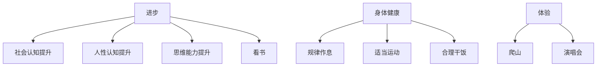
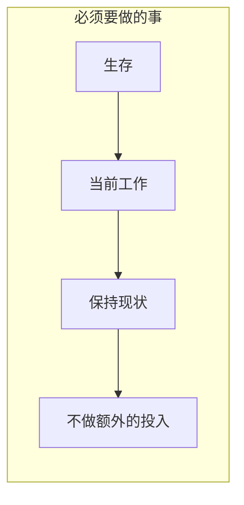

Nothing
≤
https://github.com/Guoaking/ob


https://chat.deepseek.com/sign_in


不知道干啥就干无聊且正确的事




```chart
type: pie
labels: [睡觉,运动,饮食]
series:
 - title: Title 1
   data: [3,2,1]
width: 40%
labelColors: true
```
- **即刻优化睡眠：** 固定入睡/起床时间比追求时长更重要（即使周末）。睡前1小时禁用电子设备。
- **力量训练优先：** 每周2次力量训练（深蹲、硬拉、推举）比单纯有氧更能维持肌肉量（抗衰老核心）。
- **饮食做减法：** 先戒掉含糖饮料和过度加工食品，再考虑“吃什么更健康”。





排除政治正确的说法和正确的废话,  
对于一个普通人来说一个事实是这样的:  随着年龄的增长,  寿命越来越少, 同样的自己所拥有的时间自然也越来越少 
那么如果在年龄越早的时候, 做到长期对的事, 长期有价值的事, 那么随着年龄的增长, 可能会体会到这些选择或者做法带来的复利效应
比如: 
1. 如果注意身体健康, 规律作息, 那么在未来可能比同龄人更健康
2. 如果有一些合适的人脉资源(警察, 医生, 律师), 那么可能在某些事情, 或者状态下会少走很多弯路, 省去很多时间, 或者损失
3. 什么辩证的思维之类的
那么有哪些人, 事, 工具,资源, 或者别的什么, 应该是长期有价值的? 既然他们是长期有价值的, 当下又应该怎么做?   


长期价值的工具, 积累, 人脉


1. **行动力基础薄弱：** 个体可能本身缺乏目标感、自律性、抗挫折能力、解决问题的技能。面对现实挑战时，更容易选择退缩到幻想中，而不是笨拙地开始行动。
替代性满足现象,心理学上的“想象完成效应”和“自我效能感”概念
2. 逃避现实
3. 行动力薄弱
停止自我欺骗
打破0行动的状态
过程导向


- **批判性思维：** 识别信息陷阱，避免重大决策失误。
- **系统思维：** 看清事物间关联，预判长期影响（如：当前消费习惯对10年后财务的影响）。
- **元认知（学习如何学习）：** 快速掌握新领域的能力，在技术迭代中不被淘汰。
- **主动挑战观点：** 阅读时强制自己写下：“作者的核心假设是什么？证据是否可靠？反例是否存在？”
- **构建思维模型库：** 刻意收集跨学科原理（如复利、熵增、概率思维），用它们分析日常问题（例如用“机会成本”决定是否参加饭局）。
- **学习“学习科学”：** 研究《认知天性》《学习之道》中的方法（间隔重复、主动回忆），应用于任何新技能学习。


- **聚焦“价值提供者”定位：** 在专业领域持续输出干货（如写技术博客、提供免费行业分析），吸引同频者。
- - **深度维护关键节点：** 每年筛选3-5位良师益友，定期深度交流（非寒暄），主动分享对其有用的信息或资源。
    - **建立“互助清单”：** 明确记录“我能为谁提供什么价值”和“谁在哪些领域能帮我”，避免无效社交。

构建“睡着也有收入”的系统。


时间精力管理