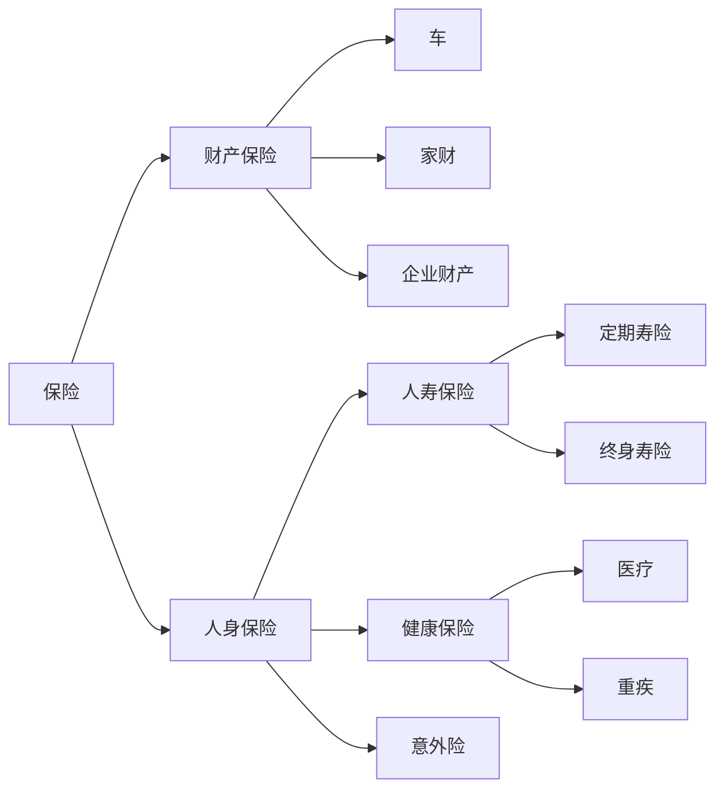

---

tags:
  - cb
创建时间: 2025-02-12 22:50:14
三观: Happy
title: "[[保险]]"
---


```dataviewjs
dv.taskList(dv.current().file.tasks.where(t => t.text.includes("")))
```





人身保险的优先级一定是 **医疗 > 重疾 > 寿险 = 意外。**
- 医疗险是报销型保险，依据发票金额报销，用于患病治疗。
- 重疾险是给付型，身患重疾时保险公司一次性支付一笔钱给被保人，这笔钱可作生活费，因为生病无法工作没有收入。
- 寿险在指定年龄前身故，按投保金额赔付。
- 意外险常见，如航空意外险、交通公交险、旅游险等。

**市面上有些组合险，以平安符为例，涵盖了医疗险、重疾险、寿险、意外险等。然而其保额较低，保费却不便宜。所以我认为购买保险时单独购买性价比更高。**

# 第一阶段
当时年轻，公司给买的团险含门诊医疗险。市面上常见的是支付宝和微保推出的百万医疗险，且为一年期、不保证续保。我认为年轻时风险低，买医疗险价值不大，其价值多在年长后体现，可年长后又有不续保风险，于是决定**用重疾险替代医疗险**。

购买重疾险要关注保额，保额越高越好，但保费也越高，需权衡找平衡。在微保工作时听过一种说法，若一种病 30 万都治不好，再多钱也难治好。综合考虑通货膨胀及自身保费承担上限，最终选了百年人寿 50 万保额的重疾险，不过该保险只能理赔一次，这也为后续补充重疾险做了铺垫。

# 第二阶段

后续因买房背负负债，结婚后开始担心另一半无法独自承担债务，便研究起寿险。
寿险关键在于保险期限和保额。保额确定为比剩余贷款略高，以解决房贷压力。
保险期限有定期寿险和终身寿险：
- 终身寿险保障终身，必定赔付，保费较高，常被富豪用于财富传承。
- 定期寿险可选择保障 x 年或到 x 岁。

经与同事探讨，**认为寿险主要解决经济压力**，到 60 岁退休后，不再是家庭主要经济支柱，保障到这个年纪就足够。购买终身寿险的话，每年多出的保费不如自己定投指数基金，还能让资金更灵活。最终选择了华贵保险的定额寿险。


# 现阶段

随着工作年限增长，体检指标出现异常，家庭支出上升，保险考虑与刚工作时大不相同，需**重新审视**。
保险作为理财的一部分，鉴于家庭收入和支出增加、对未来生活预期提升，希望升级保障。
加入 GEC 后，视野拓宽，决定在香港购买保险。**最终投保重疾险和储蓄险**。
- 重疾险因之前购买的重疾险仅有一次理赔，经了解二次理赔概率不小，为增加保障而购买。
- 储蓄险则考虑到养老，明白现行养老基金运作模式下，退休后可能面临延迟退休或领取金额少的情况，所以提前在工作时进行强制储蓄，开启提前退休计划。


我想要你爱我 但是我又觉得我没法像你爱我一样爱你

我说一下我的理解
你已经明确申明我对你的感觉很少, 这意味着你很自然的忽冷忽热, 对于我是无尽的内耗
对于你:  永远都有权利用忙, 理性, 自由, 代替陪伴, 共情, 可以自然的展示冷漠
对于我: 人家已经说了不怎么爱, 反正偶尔也会理你, 可能和现状没有任何区别 

自然的享受情感, 我的付出对你来说已经是再正常不过的事情
简单抽象一下: 我1小时的情绪付出 -> 你3分钟的回应或者亲密?

责任的严重不对等, 基于你的前提, 约等于免责, 这些话可能在自然不过
"你想太多了", "别乱猜行不行", "我早就说了我就这样", "这是你自己的决定,关我什么事", "是你要求太高"


