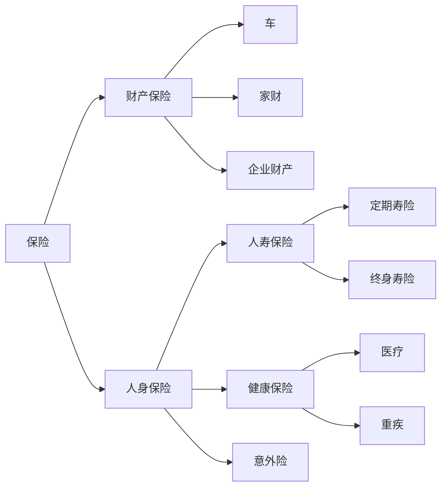

---

tags:
  - cb
创建时间: 2025-02-12 22:50:14
三观: Happy
title: "[[保险]]"
---


```dataviewjs
dv.taskList(dv.current().file.tasks.where(t => t.text.includes("")))
```





人身保险的优先级一定是 **医疗 > 重疾 > 寿险 = 意外。**
- 医疗险是报销型保险，依据发票金额报销，用于患病治疗。
- 重疾险是给付型，身患重疾时保险公司一次性支付一笔钱给被保人，这笔钱可作生活费，因为生病无法工作没有收入。
- 寿险在指定年龄前身故，按投保金额赔付。
- 意外险常见，如航空意外险、交通公交险、旅游险等。

**市面上有些组合险，以平安符为例，涵盖了医疗险、重疾险、寿险、意外险等。然而其保额较低，保费却不便宜。所以我认为购买保险时单独购买性价比更高。**

# 第一阶段
当时年轻，公司给买的团险含门诊医疗险。市面上常见的是支付宝和微保推出的百万医疗险，且为一年期、不保证续保。我认为年轻时风险低，买医疗险价值不大，其价值多在年长后体现，可年长后又有不续保风险，于是决定**用重疾险替代医疗险**。

购买重疾险要关注保额，保额越高越好，但保费也越高，需权衡找平衡。在微保工作时听过一种说法，若一种病 30 万都治不好，再多钱也难治好。综合考虑通货膨胀及自身保费承担上限，最终选了百年人寿 50 万保额的重疾险，不过该保险只能理赔一次，这也为后续补充重疾险做了铺垫。

# 第二阶段

后续因买房背负负债，结婚后开始担心另一半无法独自承担债务，便研究起寿险。
寿险关键在于保险期限和保额。保额确定为比剩余贷款略高，以解决房贷压力。
保险期限有定期寿险和终身寿险：
- 终身寿险保障终身，必定赔付，保费较高，常被富豪用于财富传承。
- 定期寿险可选择保障 x 年或到 x 岁。

经与同事探讨，**认为寿险主要解决经济压力**，到 60 岁退休后，不再是家庭主要经济支柱，保障到这个年纪就足够。购买终身寿险的话，每年多出的保费不如自己定投指数基金，还能让资金更灵活。最终选择了华贵保险的定额寿险。


# 现阶段

随着工作年限增长，体检指标出现异常，家庭支出上升，保险考虑与刚工作时大不相同，需**重新审视**。
保险作为理财的一部分，鉴于家庭收入和支出增加、对未来生活预期提升，希望升级保障。
加入 GEC 后，视野拓宽，决定在香港购买保险。**最终投保重疾险和储蓄险**。
- 重疾险因之前购买的重疾险仅有一次理赔，经了解二次理赔概率不小，为增加保障而购买。
- 储蓄险则考虑到养老，明白现行养老基金运作模式下，退休后可能面临延迟退休或领取金额少的情况，所以提前在工作时进行强制储蓄，开启提前退休计划。


# 一些心得

## 保险即服务

购买保险实质是购买服务，且是一种最好不体验的服务。

因购买与体验服务间隔时间长，所以购买保险的途径，最好找靠谱、可信赖的人，而非通过 App 一键购买。

> 在互联网保险平台上，通常不太适合购买重疾险、寿险这类保费高额的保险，而意外险这类注重实时性、弹性的保险则比较适合在该类平台购买。

## 保险组合是动态

家庭成员与财富会变化，保险组合必然要动态调整。

而且年龄不断增长，健康程度也在改变，所以年纪大了或出现异常指标后再去投保，可能遭遇拒保或出现保险除外条款，使保障范围缩小。

**我的感悟是，最佳投保年龄是刚开始工作时，其次就是当下。**

## 保险公司的选择

保险产品组合繁多，很难找到完全一样的产品，所以选择产品某种程度上就是选择保险公司。

关于如何选择产品，我认为要么找到值得信任的人帮忙，要么自己成为专业人士。

国内保险公司受保监会保障，若有保司倒闭，保监会会指定其他保司承保，因此不必过于担忧保司倒闭问题。但也不能随意选择，毕竟承保保司倒闭的话，理赔难度会增加，这也是一种成本。

## 保险公司的盈利方式

保险公司的盈利主要来源于三个方面：

- 利差：这是指保险公司把收取的保费用于投资所获得的收益。例如，保险公司收取了大量保费后，将这些资金投入到稳健的金融市场，如债券、股票等领域。如果投资收益高于预期的成本和收益，这部分超出的差值就是利差带来的利润。
    
- 死差：计算方式是用收到的保费减去理赔的金额。简单来说，保险公司在预估被保险人发生保险事故需要赔付的金额时会有一个预期值。如果实际理赔金额低于这个预期值，那么两者之间的差额就是死差产生的利润。比如，预计某一批被保险人在保险期间内会有 100 万元的理赔金额，但实际只赔付了 80 万元，这 20 万元的差值就是死差收益。
    
- 费差：涉及保险公司的各种经营费用。保险公司在运营过程中有许多成本，包括员工工资、场地租赁、营销费用等。如果保险公司实际收取的保费所包含的费用预算高于实际经营中产生的费用，这个差值就是费差利润。例如，在保险产品定价时预计运营成本为每份保险 100 元，但实际经营下来只花费了 80 元，这 20 元的差额就构成了费差盈利。
    

## 内地和香港保险的差异

### 风险 & 收益

香港保险的优势恰好是部分国内保司所欠缺的。香港保险公司收取的保费能够用于投资全球资产，这样一来，投资风险能够在全球范围内进行分摊。

香港保险产品收益相对较高。与之不同的是，国内保司投资的标的范围局限于大陆，这使得其与国内经济紧密相连。

这种差异导致国内储蓄险的收益率通常在 3% 以下，而香港储蓄险却能够实现长期收益率达到 5 - 6% 的水平。这种不同的投资策略和市场环境使得香港保险在收益方面表现出一定的优势。不过，消费者在选择时还需要综合考虑汇率、法律、理赔等多种因素。

### 投保方式

在投保方式上，国内和香港存在明显差异。

国内是 “宽进严出”。所谓 “宽进”，是指在投保初期，保险公司对投保人的健康状况等条件审核相对宽松。例如，对于一些有轻微既往病史的投保人，可能也会允许其投保某些保险产品。然而，在理赔阶段（即 “严出”），保险公司会进行严格的核查。比如，会仔细审查投保人是否如实告知健康状况、事故是否符合保险条款规定的理赔范围等诸多细节。如果发现投保人在投保时有隐瞒或不符合理赔条件的情况，很可能会拒绝理赔。

香港则是 “严进宽出”。“严进” 体现为在投保时，香港保险公司会对投保人进行非常严格的审核。这包括要求投保人详细地告知过往病史、进行严格的健康检查等诸多环节。他们这样做是为了精准评估风险，确保投保人符合保险产品的要求。一旦投保人成功投保，在理赔阶段（即 “宽出”）就相对宽松。只要符合保险条款规定的理赔条件，一般来说，理赔过程会比较顺利，香港保险公司会及时、足额地进行赔付。

## 投保前注意事项

这里需要着重提醒一下，大家如果有投保的打算，在此之前最好不要去进行体检。因为一旦体检出现临时的指标异常情况，很可能会对投保产生不利影响。

一方面，可能会致使投保的保障范围下降。比如原本可以正常获得全面保障的一些保险产品，由于体检指标异常，保险公司在审核时或许会将某些疾病相关的保障列为除外责任，使得保障不再完整。

另一方面，还可能增加许多补充检查。保险公司为了更准确地评估投保人的风险状况，看到体检的异常指标后，往往会要求投保人去做更多的针对性补充检查，这不仅增加了投保人的时间成本和经济成本，也可能会让投保过程变得更为繁琐复杂。所以，打算投保前不进行体检是比较明智的做法。

## 养老金制度

现在的养老金制度是现收现付制与基金累计制相结合的模式，也就是说现在发放的养老金确实有一部分来源于现在年轻人缴纳的养老金。以下是关于抚养比的具体情况：

当前抚养比：据统计，2022 年职工基本养老保险参保人数 4.87 亿人，参保职工为 3.5 亿人，参保离退休人员还有 1.3 亿人，目前的抚养比约为 2.6:1

未来 90 后退休时抚养比：据权威机构预测，到 2048 年，1 个年轻人，就要养 2.7 个老年人，形势较为严峻


