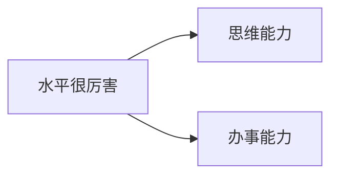
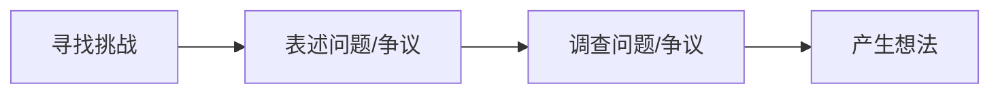
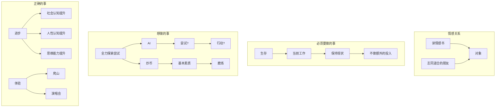

## 工作

有出彩的事迹和战绩，是肯定能盖过学历的世俗意义的

## 生活

**高敏感**: 洞察力? 如何使用? 


圈子

自己的长板, 不费力的, 有优势的, 有价值的
天赋: 热爱, 擅长
投入: 资源, 时间


> 优势=天赋 x 投入


比别人做的快: 
比别人做的好: 
有成就感 (天生的驱动力): 

30 个最想做的
市场上有人愿意买单的 (离钱近): 
自我效能感: 我觉得我自己肯定能行

经营放大优势

反馈: 

短板

### 导航

1. 高兼容导航
	1. 多, 复杂, 成功概率高 -> 有效决策
2. 自建自己的导航

表达性协作
倾听式表达
验证性阅读


---


倾向于探索, 只有探索? 

寻找处理过重大经济利益, 权利博弈, 复杂男女关系的人, 他们有大量的社会经验, 是所谓的高人
否则应该多读书


需要理解4类概念
人格, 人性, 社会脉络, 功利

### 功利
功名利禄, 显示成就
为了社会生存, 我们必须要有**功利目标**, 
升职,赚钱, 买房买车, 父母生病住院, 自己享乐, 娶媳妇,养孩子, 教学费
自力更生,满足正常生存物质需求是每个人成熟的成年人必须做的, 代表现实生存必须获取的资源和成就目标

### 社会脉络

身体生存, 财富, 权利, 繁衍(男女关系)
脉络都会对应好的人生发展
医生, 资本家,企业家, 政客官员律师, 
中国经济双轨制以后, 好的人生发展政与商是最突出的, 其他的不太稳定

#### 身体导致的时间不平等

有效时间: 清醒时完成功利目标或精神追求的时间
是否健康, 是否精力旺盛
##### 增加精力
健身和饮食起居

###### 提高效率
思维能力? 读书? 

### 权利
人们总是会把控制权和分配权交给少数他们认为有能力的人
在商业中, 可以把人对权利的追求放入预判因素中, 当你了解他人在某种情境对权利的欲求, 就能提高决策正确度, 提高决策质量

### 财富

必要的财富, 最大的作用是对抗复杂人生和世态炎凉的压力, 如果无法过好功利生活, 赚取维持自认为体面的生活财富, 会是一种苍白的人生状态, 人会饱受困扰, 很脆弱

更多的财富不是更大的快乐和幸福, 但意味着更多的选择权和体验, 比如在医院
财富的态度
* 对钱的喜爱: 钱带来的感受, 喜欢财富积累的感觉, 对物质消费没太大的兴趣
* 对赚钱的喜爱: 少部分, 挣钱的欣喜感, 更少计算时间和体力的付出, 关注利润
* 对花钱的喜爱: 大部分人关注花钱效果, 苦逼的挣钱维持生存, 时刻在计算自己枯燥的付出和收入的对等性
普通人[[经济学原理]]  [[行为经济学]]
涉及到个人挣钱, 买房, 投资理财, 经济学,和心理学, 逻辑学应该都学一些


### 男女

带来幸福满足感的家庭基础, 一定是深厚感情, 和谐性爱, 足够物质条件, 婚姻和养育后代是消耗性行为, 没有基础和物质条件, 经不起消耗

在预判他人心理活动时, 了解一个男人对异性的渴望程度, 以及在性吸引下的自控程度, 并且了解其在道德层面的看法, 有助于预判在追求功利过程中这个人的心理活动和行为

一般来说, 男人追求公里的博弈更加隐蔽, 追求男女时就没法那么隐蔽了, 相对容易看出这个人特质


研究男女的科学主要是[[社会心理学]] [[亲密关系]] [[进化心理学]] [[情爱关系中的选择]] [[社会学]]

### 人性
人性是人类的本质, 人类本质心理活动属性
人类共有的心理活动特征, 善恶, 感觉, 道德等...

如果宁某种程度预判他人的行为和想法, 那么在功利相关的活动中, 你可以部分做到得心应手

如果你能够某种程度给他人灌输自己的想法, 那么结合预判, 你大概率可以做到庖丁解牛

所以处理现实生活需要你洞悉人性, 方法是熟悉, 人类在处理金钱, 权力, 与男女之事时的普遍心理活动

研究人在社会中的心理和行为 主要是[[社会心理学]] [[社会学]]

### 人格

人格是一个人一贯的行为方式和内部心理过程 科学理论是[[人格心理学]]
**对自己越了解, 越能友善与适当地对待自己,**
有助于分析他人性格特征, 做到知己知彼, 在与他人交往过程中充满自信和从容
有很多心理学流派研究人格, 大致有5个维度, 大⑦, 有助于预测不同性格的人在遇到某些情况下, 会有什么样的反应
精神质, 外向性, 求新性, 亲和性, 尽责性, 独特性, 不道德性
人是否觉得满足与否, 都来自于自己的情感, 欲望, 思想的共同作用.
九型人格? 没有得到人格心理学界的普遍承认, mbti也是这类


## 提升思维质量的工具


###  创造性思维和批判性思维

无论什么想法, 我们都用一些通用的办法, 来提升想法的质量, 想法的质量提高了, 做判断, 解决问题的水平, 就更高了, 学习效率也会提高

[[思考的艺术]] : 介绍了必备的底层思考方法

### 创造性思维

> 得到一些想法来探索新问题, 及时发现已存在的问题, 创造新方法解决问题, 做出判断, 形成结论, 做出决定

问题能有新的想法, 新的决定, 新的方案
一切事情的结果, 都取决于你思考的质量, 这就是创造性思维的作用

1. 采用新思路
2. 设计或修改程序制度
3. 发明新产品和功能
4. 现有事务找到新用途
5. 改进现有事物
6. 创造或者重新定义概念

创造步骤: 



### 批判性思维

> 检视和评价我们在前一步得到的想法, 关于想法的论证
> 检验想法的质量, 让产生的想法的思考过程接受理性评估


检验思维会用到逻辑的方法
[[思考的艺术]] 中改进问题的解决方案 
1. 落实细节
2. 找出瑕疵
3. 做出改造

### 有效推理
推理是解决问题的主要手段. 生活中处处充满了要解决的问题, 逻辑学就是用来提高推理水平的

[[生活中逻辑学]]  初步的  [[批判性思维]]  [[批判性思维工具]]  难啃的

因为推理是解决问题的主要手段, 而生活中处处充满了要解决的问题, 所以生活中处处需要推理, 如果生活中能够更多的解决问题 就提高了生活质量, 而提高生活质量是我们都追求的, 所以就有必要提高推理的水平

[24种逻辑谬误](https://www.cnblogs.com/schips/articles/12356563.html)


### 金字塔原则  MECE, 逻辑树

[[逻辑模型]]  [[金字塔原理]]

---

### 维度思考方法 (格局...)

#### 高度
如果一个方法能够驱动的事情规模更大, 更重要, 惠及更多的人, 影响更深远
在一个层面上逻辑自洽的思考, 提升一个高度, 就能出现新的逻辑
站在领导的位置思考

#### 广度
指视野的宽度和事物有关的元素的广度, 当持续扩大视野在更广泛的区域内搜集更多元素, 也许会扩充创新想法, 解决更难的问题

医院疑难杂症的会诊

#### 深度
深度思考的方法, 一般可以是多问为什么
#### 远度
引入时间轴, 近期, 中期, 长期, 问题可能就会更清晰 

#### 灵活度
常用换位思考, 或者不断在各种高度, 宽度, 远度来回跳跳跃思考


## 目标规划

目标设定有2个作用
1. 确立正确的目标作为行动目的
	1. 要功利相关的目标成为现实, 需要的就不仅仅是一次性目标的设定, 而是需要一步步树立方向靠谱的目标. 
2. 靠规划出目标让人生有效率前行

这些特征能更有效帮助我们达成目标
1. 行为= 期望x价值, 我们需要制定价值高一些, 让人非常有期许的目标
2. 目标的难度要适度, 这是提升能力的最佳办法, [[心流]] 
3. 大目标的实现要拆分成多个具体的小目标, 最好有层次
	1. 减肥: 可拆分为增加消耗和减少摄入2个子目标 等等
4. 目标要足够具体, 有衡量的量化标准
5. 目标分为短期, 中期和长期目标, 需要循序渐进
6. 为实现目标想出多个办法和路径
7. 经常同时去想一下: 目标实现后的的好处. 以及当前要实现目标需要的行动元素, 靠心理比较来推动
8. 动起来, 这是最重要的一步

#### 目标的执行实现

参考[[动机心理学]] 自我奋斗一章

##### 1) 设立标准
能够感受当前进展和目标的差距, 这是一种无形的压力, or激励

##### 2) 监控行为
建立一种机制, 不断去监控我们完成目标的行动, 是不是出现偏差

##### 3) 自制力量
延迟满足? ?  
自我损耗理论揭示了人的自控力是每天只有固定一管, 大部分需要自主去完成的事情, 都消耗自控力
建议: 当今天有完成目标的计划时, 尝试减少一部分自控力的消耗.......
建议: 尽量与有共同目标的人在一起, 争取结伴, 付费..........

## 决策的方法

#### 决策流程的方法

参考[[决策的艺术]]  
[[思考的快与慢]]  

#### 决策依据的质量

保证正确的决策流程和方法, 是正确决策的一部分
依据越正确, 越充足, 我们就越能做出优良的决定
在相对熟练的决策技能下, 错误的决策往往都是因为决策的依据出了意想不到的问题

如果是一件和我们自己切身利益与发展有关的事, 那么我们需要
1. 非常清晰事情到底是咋样的, 也就是了解事情的本质
2. 对事情所处的人群的环境有深刻的理解, eg: 部门内, 部门间, 下属与领导, 单位之间
3. 对相关人的想法,有比较靠谱的判断

需要基本认识和经验, 以及思维质量, 理解与洞悉他人的想法

#### 理解和洞悉
在竞争社会里, 人与人之间的能力等级有3种
1. 专业技能的高低
2. 思维与实践能力的高低
3. 理解与洞悉他人想法能力的高下

理解他人进行帮助和合作, 洞悉, 为了利益和权利的博弈
长远的功利想法和抉择, 都是理性与长时间思考的抉择过程
有几个角度可以帮助我们提高这方面的能力
1. 掌握社会与人的知识, 具备逻辑思维能力
2. 对人普遍的社会行为心理机制熟悉, 对决策心理熟悉
3. 亲密关系种他人想法的预判, 要熟悉一般人在两性关系中的心理活动
4. 权利相关的, 必须深入理解中国社会运转的规则, 中国小农经济的差序格局, 权力组成结构, 官僚体系, 社会治理核心逻辑等
像老谋深算的人学习
##### 方法建议

正面: 希望与别人相互理解, 降低合作与交易成本, 
反面: 洞察他人利己心思, 以便采取对自己最优的博弈策略
1. 明确对方在这件事中的角色和利害关系, 以及人际关系
2. 尽量获取个人信息, 从家庭背景, 成长经历, 教育背景, 工作经验, 个人爱好特长, 喜好, 三观, 习惯等,
3. 分析出人格属性和社会心理属性, 全面了解其个性与习性
4. 透彻了解对方诉求, 无非集中诉求的混合, 利益诉求, 权利诉求, 功能诉求, 或者感情诉求
5. 用第一类和第二类工具分析以上信息, 作为决策依据, 在使用决策方法进行决策, 进行利害取舍

## 处理关系

### [[亲密关系]]

[[社会心理学]] 中有提到一部分
亲密关系可以从心理学途径学习, 也需要练习维护, 用心理学社会学的科学建立健康的亲密关系, 经营好, 是可能得
找到合适的对象, 经营好恋爱关系与婚姻关系, 是重要的人生工程, 也是人生里最难的事之一, 维系家庭关系获得美满, 个人生活体验是往后余生都要做的

应该是需要二人从新的起点开始努力经营,
[[亲密关系]]  [[进化心理学]]
[[少有人走的路]]  分析了成熟心智的重要性, 对爱的不同角度的解读
[[家庭婚姻社会学]]  分析了人类谈恋爱, 结婚, 离婚, 再婚, 家暴, 老年婚姻各个环节
[[性学入门]]  从生理和心理方面解释了性爱, 李银河

### 原生家庭

原生家庭影响着一个人的生活习惯, 饮食习惯, 性格的养成, 价值观的养成, 以及对婚姻观的态度等

### 功利关系
进单位: 上下级
自由职业: 甲乙方
搞生意创业: 合伙人, 客户, 
核心是信任基础上的利益权力资源交换

[[乡土中国]]  费孝通: 对中国特色社会关系的认识
[[中国人的心理]] 杨国枢
[[中国近代史]]
[[人情与面子, 中国人权利游戏]] 黄光国
[关系](https://zhuanlan.zhihu.com/p/486385125)
[生意关系](https://zhuanlan.zhihu.com/p/486382585)
**权利角度** : 政府国企体制内, 站队, 开拓和处理关系能力是关键
**金钱角度**: 给公司创造价值的能力强, 不是某个技能强
**人性角度**: 领导的目标权利or业绩, 要让自己成为他的工具(合伙), 一起获取权利或利益

## 抵抗挫折和照顾自己心灵
让自己度过难关, 继续正常生长和生活, 并且还有能力帮助他人, 为所爱之人所爱之事付出, 这是成熟心智的作用

#### 研究自己
最终我们活得怎么样, 只有我们自己感知的最清晰, 所有好合不好, 也由自己承担, 
对自己认识的越明白, 越有可能在困境时帮助自己找到办法, 保护心智和情绪, 
把自己研究的明白一些, 容易找到自我

真正的依托, 来自于你内在那个自我认知的你

#### 1. 毫不犹豫的接纳自己

把自己的性格, 特性, 心理习惯都搞清楚, 并且要肯定自己所有的性格与特性
敢于肆意评判他人个性与人格的, 都是极具侵略性的人, 性格较差

详细研究自己 社会学精品译丛系列的[[自我]] , 坚定了自我的认知, 可以帮助抵御那些侵略性的强势权力控制和pua, 

#### 2. 从道德观, 价值观, 和人生观研究自己
我的自私程度: 平均, 较弱, 较强
我觉得最舒服度过人生的状态是什么? 
一直这么过也会舒适吗? 
我能一直保持现在满意的状态码? 
欲望的自制力: 对财富和权利的态度


#### 3. 原生家庭

很多思维习惯和性格, 都是在原生家庭中形成的, 类似拼图需要慢慢找

### 自信

能力已经被结果证明后, 这个时候的信心只能说是一种对事实的认知, 这种信心的精神力不足
自信是在几乎没有具体根据的基础上, 对自己的一种相信, 自信其实需要勇气, 懦弱和胆小性格的人很难充满自信

只有在尝试未知事情的时候, 依然相信自己能够达成理想结果, 才是真正的自信

成年人培养: 
1. 不断增长且被证明的能力
2. 勇敢一点

### 情绪自我安抚
你的情绪都是正当的
[[情商]] 对情绪做了详细介绍, 情绪从何而来, 如何分辨不同的情绪, 如果搞清来源, 
不要因为自己产生某种情绪而更加羞愧和自责, 一个人有情绪的时候, 都是正当的, 要坚持和相信这一点, 情绪对人产生比较大的伤害, 往往是二次伤害, 也就是你对服么情绪的自责, 加深了对自己身心的伤害
1. 找没人地方释放
2. 如果有能力一边宣泄, 一边想着自己的分身, 旁观自己, 如果还有能力, 可以想想这些情绪是从哪儿来的
3. 平静一点后, 先吃点好的, 活动若干小时, 别让自己闲着
4. 过一天再去思考
5. 从社会关系, 人性, 思维上各个角度符分析
6. 有情绪, 冲动的时候, 不要做任何决定, 不要和当时人说话

### 应对焦虑与压力的具体方法

from: [[人格心理学]]
**主动的问题中心策略**
1. 我尽可能多的获取相关情况的信息
2. 我制定了一个行动计划
3. 我考虑了各种可供选择的办法, 并权衡了利弊
4. 我与一些有类似经历的人商量
5. 我努力让事情好转
6. 我向一些知道的比我对的人寻求帮助
7. 我留出时间来解决这个问题

**主动的情绪中心策略**
1. 我和朋友们讨论自己的情绪
2. 我思考怎样从经验中吸取教训
3. 我接受所发生的一切
4. 我努力正确的看待事情
5. 我努力寻求一线希望
6. 我向专业咨询师倾诉我的情感

**回避策略** 
1. 我努力不去想这个问题
2. 我假装问题并不存在
3. 我喝酒或者麻醉自己
4. 我努力吧自己的注意力转移到其他活动上
5. 我回避那些让我想起烦恼的人和场景
6. 我睡得比平时多
7. 我拒绝承认问题发生

### 通过目标给生活带来意义
给自己的生活设立一些目标, 没有目标, 就把找到目标作为目标
最好是内部动机驱动的目标, 不靠外界奖励元素推动的目标
1. 所有的你的爱好都可以成为内部动机的目标, 你在从事自己的一个业余爱好时, 动力不会来自老板的赏识和薪水, 爱好的满足感也不来自于能赚取多少钱(多数人都是花钱体验爱好)
并不是目标本身有意义, 而是目标制定和执行过程带来的意义

良好的读书习惯最大的意义可能就在于能及时获取意义

### 找到业余爱好
业余爱好就是人生润滑剂的一种, 
好的爱好追求的是 [[心流]]  , 也就是有持续的挑战, 有不断提升能力解决不断提升的挑战的掌控感, 全神关注执行合一, 忘我和时间流逝加速感

**主动爱好**: 爱好最好是需要自己亲身参与, 需要你挑战一些目标, 或者参与创造出一些东西的, 运动, 摄影, 乐器演奏, 绘画, 木匠, 模型制作
**被动爱好**: 被动享受: 欣赏, 观看, 倾听, 丰富生活也很有帮助,旅行, 看演出,  获取继续深入体验本身就变为一种有乐趣的主动挑战,并且能争取吧体验变为对他人有参考和有用的信息, 比如发评论, 参与讨论, 收集整理作品等

### 规避习得性无助, 了解抑郁的认知习惯

#### 习得性无助

#### 抑郁的认知习惯

1. 对自己的消极思维
2. 对未来的悲观态度
3. 以消极的方式解释当前经历

### 利用前2类工具规避焦虑与抑郁状态

社会人性认知和逻辑思维能力后, 具备一点帮助自己和他人疏解心理的能力

[[人格心理学]] 社恐: 一种评价恐惧, 特别担忧别人怎么看他们, 缺乏的是一种 "给对方留下好印象的自信心", 而不是具体能力, 需要树立信心

### 锻炼意识, 锻炼身体

加入有个开关, 你打开他, 心理感觉就能好一些, 那么我们需要尽量寻找这样的机会,  可以带来正面积极心理的效果


## 工具的使用建议

1. 使用目标规划的工具, 明确长期目标, 分解为短期目标,形成目标结构
2. 尽快打牢基础 , 学会逻辑思维, 了解对功利, 人性, 与社会的必要认知
3. 使用决策工具, 确定时间和精力的投入, 找到可选项, 做工作与生活的必要抉择
4. 进入目标实现阶段, 利用"目标" "监控" 与自我约束力量来尽量达到近期, 中期以及远期目标. 并且在某个阶段, 利用批判性思维手段, 及时分析和调整明显发生问题的目标
5. 任何时候, 如果你需要处理亲密关系, 在学习[[亲密关系]] [[婚姻心理学]] 的基础上, 尽快成熟心智, 尝试调整自己沟通亲密关系的方式
6.  当有了一定闲余精力, 开始深入研究自己, 以便为下一阶段提示生活, 和抵抗挫折做准备


原文 [人生艰难, 如何才能过得好一点能](https://zhuanlan.zhihu.com/p/482757365)


承担一定程度的合规风险, 灰产风险
时间便宜, 
失败了无所谓, 但不想参与把自己搞没的机会

人工智能, 跨境电商, 加密货币
做空最多100%, 做多无限多? 

尝试做组合市场上现有商用ai或者开源模型来开发小程序套利，比如：用HailuoAI实现让任意两人亲嘴。  
也会考虑开发了这样的程序之后再发币，设计一套ponzi圈韭菜的钱。  
  
如果我没有能力做上述，我也会去做自己的个人IP，因为这个时代任何商机都可以用个人影响力去宣传—》催化。

公平在这个市场的很多信息都是公开的 只要聪明+努力就能获取。在这个市场聪明且努力的人，即使出生寒微也能成为信息精英。
“山寨普涨”很可能已经不会再出现了
过去两年里市场增发了巨量新资产吸血，市场没有足够的流动性支持全面普涨，而是一直是概念轮动行情

取关梭哈

第一个生意应该是套利类型的：多卖多赚 少卖少赚 不卖不亏的。用来积累经验和资本

什么是择时交易? 优秀指的是他们至少身价要有500万美元，且不是靠囤币/做项目等beta行为赚来的钱。
展现你的历史成绩，这些都可以作为你勾搭大佬时的加分项甚至能主动吸引到贵人提携。
一份精心经营过的个人媒体就是一份很好的简历
我叫xxx，我的专长与能力是xxx，我以前做过xxxx，可能对您的业务有xxx的帮助。

最重要的是养成一种 投机倒把 的套利思维。  
我是怎么想到到那么多商机的，我每次做别人客户的时候都会思考：  
1. 他的商业模式是什么，他是怎么赚到我的钱的  
2. 如果是服务或者软件类行业，我会思考他的上家来自哪里。其实很多渠道都可以通过Google、查whois、政府网站查公司名字等途径调查出来。然后我会在大脑里模拟一下如果我是他，我会怎么进行引流+销售。  
  
我的成功还有很重要的一点：当我进入一个套利类型的生意时从来都不想太多，都是直接开干。本来套利类型的生意失败了也就损失点时间+顶多一点点金钱，而成功了则是一本万利。所以多尝试不同的商机+同时推进多个商机，只要5个商机里能成1个，就又能吃几年

如果我只有10万以内的本金  
那么我不会想着靠金融投资来发家致富，而是会同时进行这两项：  
  
1. 打磨一项一技之长在那个细分领域做到最好，然后出卖我的部分时间来换取金钱。  
2. 挖掘人与人之间存在信息差的互联网商机，倒买倒卖商品，做人与人之间无风险的套利

尽量寻找市场与市场、人与人之间的信息差，作为撮合者，用信息差来套利。
有几个技能我认为对于信息差套利模式非常重要：  
1. 英文  
2. cross the great firewall  
3. 计算机技术  
4. 发现需求者与对应产品的供应商的能力  
5. 组织不同的人完成一件事的能力
多数人缺乏的其实是发现+利用机会的能力

《危机时代》吉姆罗杰斯  
《周期》霍华德马克思  
《投资最重要的事》霍华德马克思





|       | Test1 | Test2 | Test3 |
| ----- | ----- | ----- | ----- |
| Data1 | 1     | 2     | 3.33  |
| Data2 | 3     | 2     | 1     |
| Data3 | 6.7   | 4     | 2     |
|       |       |       |       |
^table

```chart
type: bar
id: table
layout: rows
width: 80%
beginAtZero: true
```


```chart
type: line
labels: [Monday,Tuesday,Wednesday,Thursday,Friday]
series:
 - title: Title 1
   data: [1,3,3,4,5]
 - title: Title 2
   data: [5,4,3,2,1]
 - title: Title 2
   data: [4,3,4,4,4]
width: 60%
fill: true
tension: 0.5
spanGaps: true
beginAtZero: true
legend: true
legendPosition: bottom
stacked: true
transparency: 0.2
bestFit: true 
bestFitTitle: "Best Fit Title!" 
bestFitNumber: 1
```


排除政治正确的结果, 需要编写毕业论文, 内容是否可以定位和大模型, 大模型应用落地等AI相关话题的论文? 
如果可以, 给出一个符合国内基本论文框架, 规范的, 论文草稿和大纲


**写作注意要点：**

1. 技术路线建议聚焦具体应用场景（如教育问答、电商客服等），避免空谈理论
2. 强调工程实现细节，体现数据结构与算法在系统优化中的应用
3. 实验部分需包含可量化的评估指标（如响应准确率、用户满意度）
4. 参考文献应包含：
- 3-5篇中文核心期刊论文
- 最新大模型相关论文（如LLaMA、ChatGLM技术文档）
- 经典教材（《深度学习》《自然语言处理综论》）
- 现有技术的工程化应用

**可行性保障建议：**
1. 选择开源大模型（如ChatGLM-6B、InternLM）作为基座
2. 使用公开数据集（如CLUE、WebQA）进行训练
3. 部署方案可采用CPU+量化技术降低硬件要求
4. 功能模块开发可结合课程设计中的C语言/Python编程经验
（注：具体实现需根据学校要求的查重标准和技术可行性进行调整，建议将创新点定位在"现有技术的工程化应用"层面而非理论突破）


