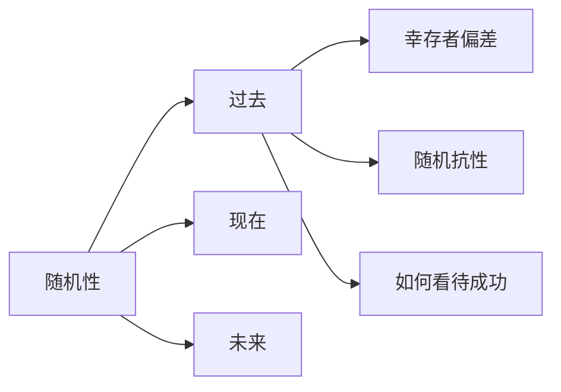

* [ ] [三观加深](https://www.bilibili.com/video/BV155411o7Sz/?spm_id_from=333.337.search-card.all.click&vd_source=351ae22481963e1732be800e8bc59c8a)

多巴胺讨厌画饼, 
# 

# 世界观
> 每个人理解的方式-> 汇聚-> 社会发展的方式, 文明进步的方式, 世界运行的方式
> 对世界到底是如何运行的回答, 对世界本质的探索
> 遇到问题以后得第一个思考模型

冯友兰的[中国哲学简史](中国哲学简史.md)要是不够还可以看冯友兰的[中国哲学史](中国哲学史.md)
需要增加对这个世界的见识和沉淀 

[[正反馈]]

历史, 商业, 社会, 文化, 生物, 宇宙, 科技等种种领域的看法

**过去**
随机性
 > 你的决定其实实在调整人生随机性的上限和下限
 > 想要成功: 学会如何看待[[成功]]

1. 上下限一起波动
![[Pasted image 20241116193320.png]]

大概率只有单一波动
![[Pasted image 20241116193406.png]]

随机性抗性
: 抵抗偏离意愿的随机性? 
应该是随机曲线, 尽可能的和目标重合
![[Pasted image 20241116193746.png|556]]

挺高上限也没必要: 大家觉的有用, 你觉得没啥用, 但放弃了又有点可以的东西浪费时间

**现在** 
**未来**
你

# 价值观

> 觉得痛苦, 但有意义

当你看到所有信息都在支持你做出同一个结论时, 并不说明那个结论毋庸置疑, 而是因为我们视角受到了局限, 或者我们见识太浅

多尝试?  
目的: 适合自己的

由外而内
创造外力, 获得利益, 逼迫自己 

改变 -> 痛苦
被逼无奈 , 山穷水尽, 

拿结果

自尊? ? 想象? ? 

做事, 成事 , 多做事, 做好
内耗 ,

自己 ,了解自己 , 适合自己
别人,  什么人, 爱玩, 有思想, 赚钱
人性,矛盾
好三次-> 看回应
每个人不一样, 

资源,  识人
目标
行动
处理问题: 抗压, 调整, 

代价

## 矫情   
本质 -> 无风险的 -> 升级关系
承担风险
无风险 -> 无升级
依靠预测和做计划规避风险，企图通过预测到所有可能出现的负反馈来规避一切负反馈，而这种脑补的沙盘推演必然会导致预测出的负反馈过多而自我禁锢，以至于放弃。

认知谬误在于国男只想规避负反馈，而不是处理化解负反馈，这又是因为根本不知道如何处理负反馈，
不知道如何处理的原因是因为大多数国男在遭遇负反馈的时候整个人都是崩溃的，来自他人尤其是女人的负反馈是一种巨大的身心打击，被认为是对自身整个存在价值的彻底否定。
在面对负反馈的时候首先要处理的不是负反馈本身，而是由此产生的巨大羞愧感，自卑感，挫败感，强烈的自我否定和负罪感。

关闭由于负反馈触发的羞愧感，自卑感，挫败感，强烈的自我否定和负罪感这些负面情绪反应，负反馈本身只是落在身上的灰尘而已。

[矫情](https://www.bilibili.com/video/BV1Q6421Z7pF/?spm_id_from=333.788&vd_source=351ae22481963e1732be800e8bc59c8a)

**来源**: 无情感-> 压抑情感-> 矫情
剧本自己推动
爱想象
行为->  想象中的反馈 ->  情绪 ->
内耗 , 痛苦 -> 无解
越关键 -> 越想象困难 -> 越恐惧 -> 动弹不得 
暴露需求??
太主观
大量分析细节, 主观, 不可证伪 -> 模糊 -> 判断错误

# 是非观
什么是对的, 什么是错的
工作: 尽心尽力| 应该的, 摸鱼
爱情: 乱搞| 忠诚
沟通, 怎么做

# 金钱观
怎么看待钱
怎么挣钱, 踏踏实实 | 快钱
怎么花钱, 刀刃上| 享乐, 出行酒店, 

[金钱心理学](金钱心理学.md)
过去的经验指导当下的问题: 
未来和现在一样 xxxx
忠于自己的生活
人生是体验的总和

运气和 风险
致富与守富

抗风险能力

线性增长
尾事件, 
什么是财富: 

做喜欢的事: 
好奇心
他是怎么做到的
这个事情赚钱吗? 
我需要哪些步骤和资源

在当前爱好上不断延伸
无聊是你的伙伴
自我欺骗
10次尝试

赚不少钱
有钱的标准是自由
被动收入> 支出
财富是你在睡觉时, 任然能为你赚钱的资产
总资产= 年支出x25
1500000 = 5000x12x25
建立资产
资产: 任何能给自己带来现金流的东西
公司,  股票, 债券, 房地产出租, 票据, 借据, 音乐, 专利, 版税
收费app, 自媒体视频
做生产者(价值), 不是消费者
视频, 笔记模版, 课程, 写作, 录歌, 编程
积累的经验, 系统, 流程, 成果
知识价值, 娱乐价值, 情绪价值
利他, 影响和服务
Plan B, 跨界, 换脑子, 多维度竞争力

良好的人际关系
微笑和倾听
远离否定
相信善良 

# 人生观
> 二者的碰撞, 想做什么什么事, 即使失败也不后悔

追求, 目标
想要什么样的人生: 稳定, 知足常乐,一眼忘到头 | 折腾, 富贵险中求

财富->  
什么最重要: 体验, 享乐| 责任(自己, 亲人)
自己的女儿和她一样?
