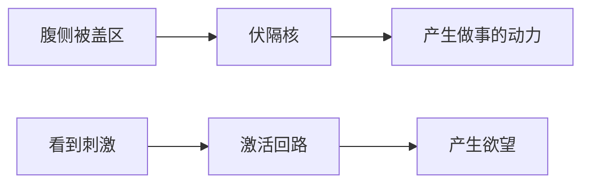

---

tags:
  - cb
创建时间: 2024-11-16 20:04:55
三观: Sad
title: "[[多巴胺]]"
---
最大程度利用周围资源, 让你活的更久
对意外感兴趣(可能有可以利用的资源), 
随机性可以带来大量的分泌
预测 -> 联系(成瘾) -> 消除误差

大数定律

[[贪婪的多巴胺]]
神经递质
运行机制是咋样的
为啥会上瘾
如何戒掉

好处, 竞争优势
缺点: 累赘
和爱情的关系 (会消除误差)
利用外部环境 -> 驱动你了解外部环境 -> 产生幻想, 和魅力
魅力: 不了解的时候, 产生的想象

 
和黄赌毒,游戏的关系

赌博: 多巴胺的异常激发

![[Pasted image 20241116202324.png|354]]

欲望回路

![[Pasted image 20241116201038.png|393]]

解决: 
1. 有规律可循
观察, 总结, 利用规律
1. 不能被戒断, 只能被替代

1. 用回路对抗回路
控制回路
