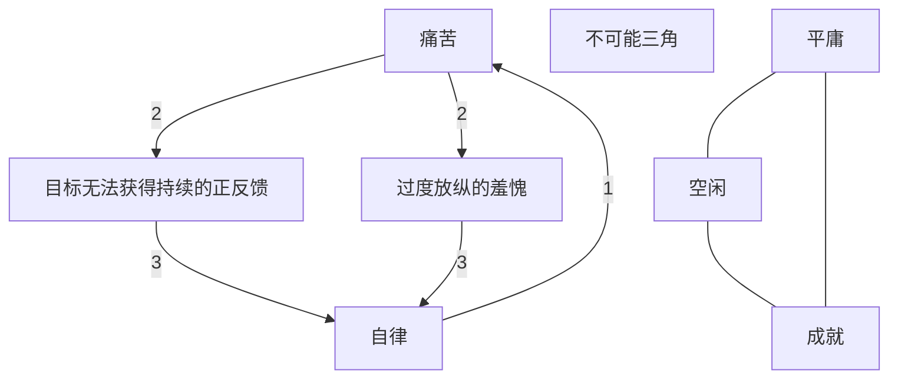

---

tags:
  - cb
创建时间: 2024-11-16 19:56:18
三观: Happy
title: "[[自律]]"
---
> 在当下利益与未来利益发生冲突时, 坚定的选择未来的利益

如果没有外界认可, 一味的自我鼓励, 短期内可能让你更加自律, 但是时间一长你就会开始自我怀疑, 不确定那到底是自我鼓励还是自我安慰, 最终会变成异常精神内耗

难也要做
自己定义快乐, 不断获得自己定义的快乐, 最终按照自己的意愿度过一生

理智脑聪明但弱小，情绪脑强壮但不太灵光，所以用理智脑引导情绪脑狼狈为奸是最为理智而高效的选择

A --- B

想永远是无边美好但是虚无的 做就不一样了 你不一定会成功但一定会有一个答案

让自己的行动, 基于对生命的热爱, 而非恐惧,羞愧, 内疚, 或者义务
践行长期主义的唯一方式, 是反复在你想坚持的事情上获得良好的体验, 除此之外的任何方法, 都是对意志力的生命热情的消耗
时间管理的本质, 是做时间的朋友, 让自己对某件事情, 以及整个生活的热爱, 随着时间的增长愈发饱满, 反之, 是逆水行舟

