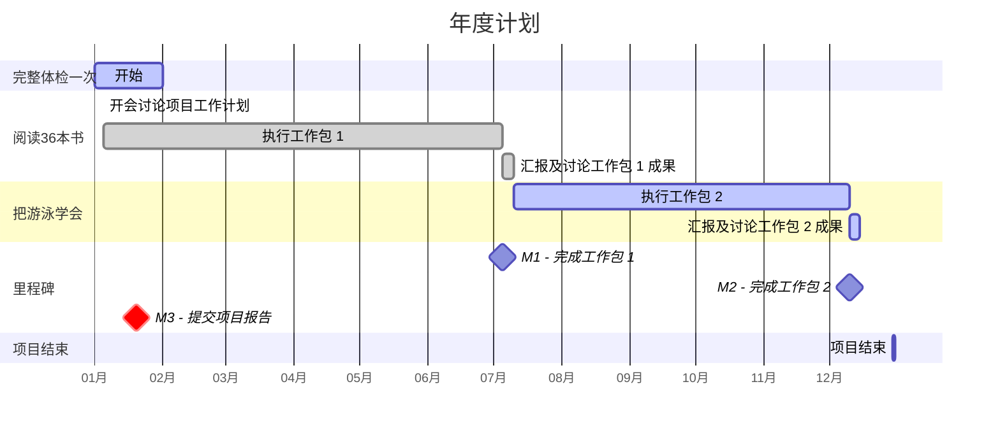
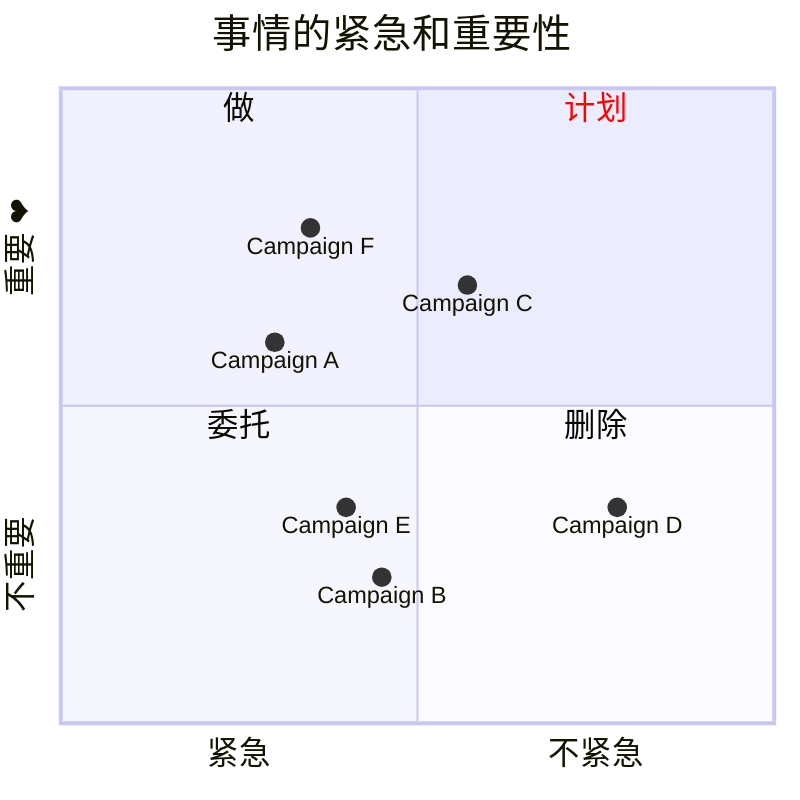

---
tags:
  - cb
创建时间: 2024-10-10 14:14:26
三观: Happy
title: "[[想过的生活]]"
---
财务自由,  150w?
时间自由? 
睡觉? 看剧?  打游戏? 找人陪? 
对未来的期盼

不上班? 不会饿死
提升自己? 
身体
能力
精神? 
赚钱能力? 


想做的事业: 
喜欢的事: 想知道他的一切
擅长的事: 无意识就能做好的事, 天赋, 和才能
先天的?  
重视别人的感受? 观察别人? 
平时自然而然就在做的事, 或者感到充实, 开心
不由自主思考现象背后的事情
洞察,分析, 系统化思考

感到烦躁: 为什么这么简单的事都做不到

有价值的事:


认同
真挚的朋友

| 学习成长        | 体验突破    | 休闲娱乐     |
| ----------- | ------- | -------- |
| 阅读?         | 游泳?     | 游戏<br>看剧 |
| 工作事业        |         | 家庭生活     |
| 跳槽? <br>尝试? |         | 旅游?      |
| 身体健康        | 财务理财    | 人际社群     |
| 体检?<br>变壮?  | 扩大赚钱能力? | 朋友生日?    |


|     | 热情  | 痛苦  | 时机  | 总分  |     |
| --- | --- | --- | --- | --- | --- |
| 锻炼  | 4   | 8   | 8   | 20  |     |
| 学英语 | 4   | 4   | 10  | 18  |     |
| 读书  | 10  | 10  | 10  | 30  |     |








> [!multi-column]
>>[!danger]+  重要紧急
>>```dataview
>>list
>>from 
>>	"Projects"
>>where 
>>	priority = "重要紧急" and
>>	status = "open"
>>sort date asc
>>```
>
>>[!important]+ 重要不紧急
>>```dataview
>>list
>>from 
>>	"Projects"
>>where 
>>	priority = "重要不紧急" and
>>	status = "open"
>>sort date asc
>>```

> [!multi-column]
>>[!warning]+ 紧急不重要
>>```dataview
>>list
>>from 
>>	"Projects"
>>where 
>>	priority = "紧急不重要" and
>>	status = "open"
>>sort date asc
>>```
>
>>[!info]+ 不紧急不重要
>>```dataview
>>list
>>from 
>>	"Projects"
>>where 
>>	priority = "不紧急不重要" and
>>	status = "open"
>>sort date asc
>>```


<progress value="20" max="50"></progress>


具体
可衡量的目标
可达到
存钱的目标
理财的计划
额外的赚钱计划, 扩大赚钱能力
时间想花在哪? 

[做计划](https://www.bilibili.com/video/BV1ra4y1m7H8/?vd_source=351ae22481963e1732be800e8bc59c8a)

困难 -> 具体| 简单
一天中效率最好的时间
工作日志
番茄钟
珍惜时间

## 学习成长
拖延心理学
认知觉醒

## 体验突破
兼职新职业? 
厨艺? 
游泳
## 休闲娱乐
## 家庭生活
## 身体健康
## 财务管理
## 人际社群 
## 工作事业