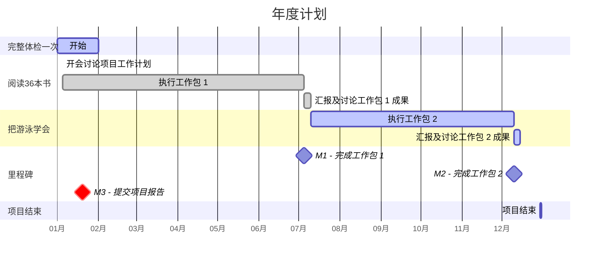
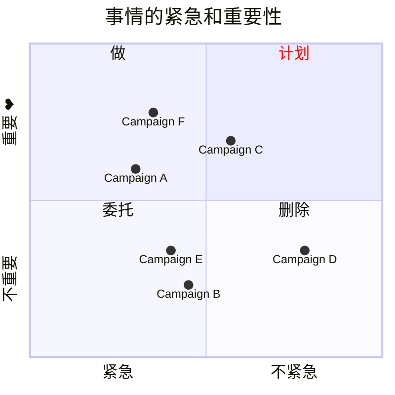

---
tags:
  - cb
创建时间: 2024-10-10 14:14:26
三观: Happy
title: "[[想过的生活]]"
---

对未来的期盼: 
想象力欠缺......
财务自由,  150w?
时间自由? 
睡觉? 看剧?  打游戏? 找人陪? 

[做计划](https://www.bilibili.com/video/BV1ra4y1m7H8/?vd_source=351ae22481963e1732be800e8bc59c8a)

困难 -> 具体| 简单
一天中效率最好的时间
工作日志
番茄钟
珍惜时间

## 学习成长, [[一定要做的事|提升自己]]?
[[拖延心理学]]
[[认知觉醒]]

## 体验突破
[[一定要做的事#改变周围的环境 旅游之类的, 体验|体验list]]
## 休闲娱乐
## 家庭生活
## 身体健康
定期[[体检]]
[[一定要做的事#视觉上的变化 打扮,穿搭, 每隔一段视觉, 有点微小的变化|身体list]]

## 财务管理
## 人际社群 
认同
真挚的朋友
附近? 

## 工作事业
[[正在做的事]]
根源上不满意的点:         发展停滞, 钱不变, 能力不变,  自我创造, 自我肯定,自我满足, 别人认可

想做的事业: 
**喜欢的事**: 想知道他的一切
1. 好像暂时没有........
2. 

**擅长的事**: 无意识就能做好的事, 天赋, 和才能, 先天的?  
重视别人的感受? 观察别人?

**平时自然而然就在做的事**: 或者感到充实, 开心
不由自主思考现象背后的事情
洞察,分析, 系统化思考

**对别人感到烦躁**: 为什么这么简单的事都做不到

**有价值的事**:

