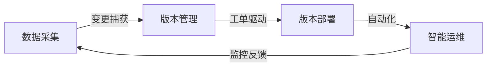
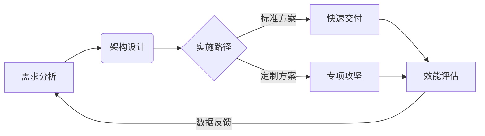
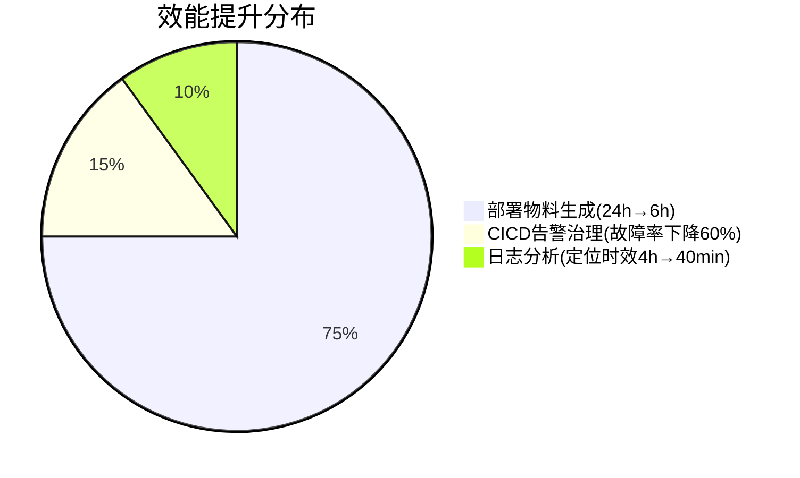

---

tags:
  - cb
创建时间: 2025-02-04 23:07:11
三观: Sad
title: "[[个人履历, 项目说明]]"
---

作为字节跳动ToB核心产品，飞书私有化部署需将500+微服务、40+中间件组件完整迁移至客户本地机房，实现数据完全自主管控。项目需解决5W+资源依赖管理、半年期16000+ SaaS变更同步等业内罕见复杂度，单次升级需协调100+研发与15+交付团队资源。  

飞书私有化版本与saas版本同源同构，客户体验一致。saas版本飞书由研发负责日常升级，私有化由交付同学每半年进行一次升级。

飞书私有化部署的复杂性、难点和挑战  
1. 业务依赖众多：业务复杂，依赖众多，用到的psm500+，mysql，redis，mq，flink等各类组件有四十多种，需要在客户侧进行进行部署及管理。还有一些业务特化的的资源，比如某些二进制工具。整个飞书私有化资源依赖数量在5W+。
1. saas变更处理困难：飞书saas研发侧每天都会有300+线上psm升级，mysql ddl变更，数据迁移等，需要收集这些变更，后续在私有化环境中回放进行升级与迭代。
1. 环境异构问题严重：saas功能在私有化不支持，saas使用到的组件在私有化不支持。需要提前发现及推动业务改造，或者引入相应的组件。fg，tcc，eeconf等配置在每个环境都不一样，需要进行人工修改确认才能制作出一个具体环境的私有化版本，并且这些配置数量众多，有10000+，配置的正确性直接影响整个交付质量及效率，但交付同学在不了解业务场景的前提下要保证质量。
1. 部署升级流程复杂：部署升级流程非常复杂，并且是半年定期升级，半年时间saas各类变更有大概16000多个，私有化升级应用变更同时还需要保证质量，不影响客户使用。行业内无可借鉴的方案，比如阿里专有钉只有80多个服务，db十几个，redis，mq等相关组件10个内。
1. 资源及基建要求高：私有化对于资源的要求，导致无法使用字节云等公司基建，需要提供类似的能力来进行psm,mq,tos等资源部署及日常hotfix变更，日常排查等日常运维功能。飞书业务的复杂性导致私有部署及维护的投入巨大，每个业务需要专门投入2人参与私有化，一次升级研发侧人员投入200人+、交付及QA投入30人+。

* 对客交付
	* 在客户现场进行实施, 处理交付过程中的问题定位及处理, ，并进行流程优化；推动解决用户在使用公司产品和服务过程中遇到的技术问题； 能够快速定位和分析问题，提供有效的解决方案，保障用户的业务正常运行； *

业务服务部署耗时从2小时降至30分钟。

4. **技术创新落地**  
   - 开发规则可视化配置平台，业务人员可自主调整200+风控参数，策略上线周期从2周缩短至4小时 
2. **工程效能提升**  
   - 基于内部低代码框架，快速实现：  
     ▶ 20+标准化数据表格模块（开发周期从3人日/模块压缩至4小时）  
     ▶ 可视化流程配置器（业务人员可自主搭建审批流） 

▶ 技术价值创造
- 主导微服务架构优化等5个技术项目，实现年度运维成本降低37%，近三年累计产生直接经济收益158万元
- 研发流量调度系统，每年减少业务高峰期的资源扩容支出80万元

▶ 工程效能提升
- 设计研发全链路监控体系，关键业务监控覆盖率从65%提升至98%
- 建立代码质量管控体系，推动团队CR通过率从72%提升至93%

## 负责 AI 模型应用开发与优化
- 熟悉大语言模型（如 GPT、LLaMA 等）及其应用开发
- 具备 Prompt Engineering 和 RAG 实践经验
- 熟练掌握 Python，了解主流深度学习框架
- 有 AI 工具产品落地经验优先
- 如何评估一个想法在当前的 AI 下能不能实现，如何进行模型的选型，如何在 PE、Fine-tuning、CoT、RAG、多 Agent 等众多方法中，对不同的问题做选择。以及如何做好上面的事情。而这个过程你一定会对 LLM 有更深入的理解。
- 对大模型感兴趣，自己在主动在学习，并且深入的在用它优化自己的工作和生活
- 不仅能做好自己的职能，也有兴趣了解，甚至参与其他职能的工作
- 有 ownership，因为很可能我们会只给目标，而不是给明确的任务和详细的要求
- Growth mindset，遇到没见过的问题是兴奋的，而不是觉得麻烦的
- 基本功扎实，这一项最直接，对自己的本职工作，还是要能做好的
