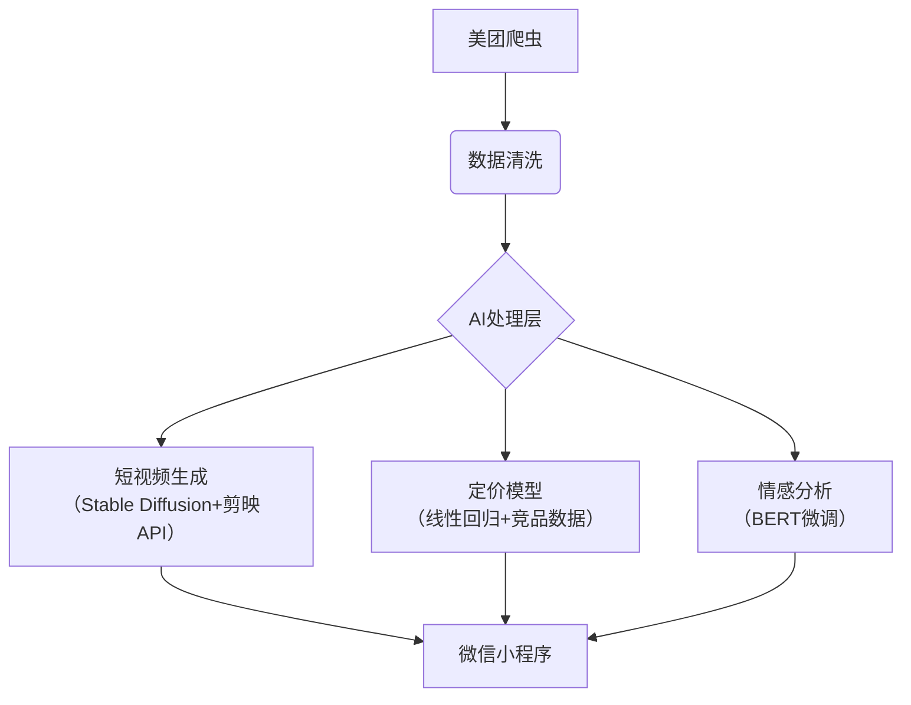

---

tags:
  - cb
创建时间: 2025-02-16 15:27:47
三观: Happy
title: "[[test4]]"
---


```dataviewjs
dv.taskList(dv.current().file.tasks.where(t => t.text.includes("")))
```


根据需求分析，结合本土化、技术可行性和商业变现路径，以下是综合解决方案：

一、优选方案（兼顾论文与创业）

1. 垂直领域AI工具开发者
- 方向：开发基于大模型的细分领域工具（如短视频脚本生成器/本地生活商家智能客服）
- 技术栈：Python+FastAPI+百度文心/讯飞星火API
- 实施路径：
  1. 选择细分场景（如美业/餐饮行业）
  2. 用开源框架搭建基础架构
  3. 结合大模型API开发核心功能
  4. 通过微信小程序/钉钉开放平台快速部署
- 论文选题：《基于大模型的XX行业智能客服系统设计与应用研究》
- 变现模式：SaaS订阅制（199-599元/月）
- 验证指标：1周内完成MVP，2周获取10家试用客户

2. 数据驱动型内容服务商
- 方向：短视频行业数据分析服务（结合视频博主需求）
- 技术方案：
  - 用Python爬虫采集平台数据
  - Go语言开发实时监控系统
  - 数据可视化报表生成
- 论文选题：《基于多源数据融合的短视频内容传播效果预测模型研究》
- 变现方式：
  - 数据分析报告（单份99-299元）
  - 定制化监测服务（月费制）
- 优势：与视频创作方向形成闭环

1. 智能化教育产品开发者
- 方向：编程教学AI助教系统
- 技术实现：
  - 搭建代码自动批改系统
  - 结合LeetCode题库做智能推荐
  - 开发学习轨迹预测功能
- 论文选题：《基于机器学习的编程教育个性化推荐系统研究》
- 商业模式：教育机构B端合作+个人版会员制

二、配套方案矩阵（按可行性排序）

| 序号 | 方向                | 技术难度 | 启动成本 | 变现周期 | 论文结合度 |
|------|-------------------|----------|----------|----------|------------|
| 1    | AI工具开发         | ★★☆      | 1万元内  | 1-3月    | 90%        |
| 2    | 数据服务           | ★★★      | 2万元内  | 2-4月    | 85%        |
| 3    | 智能教育           | ★★★☆     | 3万元    | 3-6月    | 80%        |
| 4    | 低代码平台         | ★★☆      | 1.5万元  | 2-5月    | 75%        |
| 5    | RPA流程自动化      | ★★☆      | 1万元    | 1-2月    | 70%        |

三、风险对冲策略

2. 技术风险：
- 采用模块化开发，核心功能依赖成熟API
- 优先选择有开源替代方案的技术路线

3. 市场风险：
- 采用"免费基础功能+增值服务"模式
- 从区域市场切入（如先做本地商家服务）

4. 政策风险：
- 避开内容审核相关领域
- 选择企业服务等合规赛道

四、未来趋势适配

5. 重点布局方向：
- 产业数字化转型（2025年数字经济占比将超50%）
- 银发经济智能化（适老化改造需求增长）
- ESG相关技术服务（企业可持续发展需求）

6. 技术储备建议：
- 关注多模态大模型应用
- 积累行业know-how数据
- 掌握轻量化部署技术

五、验证路线图

阶段 | 目标 | 关键动作 | 时间 
-----|------|----------|------
0-1  | MVP验证 | 选择3个潜在客户做需求访谈 | 1周 
1-2  | 原型开发 | 用开源框架完成核心功能演示 | 2周 
2-4  | 小规模测试 | 获取10家试用客户收集反馈 | 2周 
4-8  | 商业迭代 | 建立付费转化漏斗 | 1个月 
8-12 | 论文撰写 | 同步整理技术实现与商业数据 | 持续 

六、特别建议

7. 采用"技术产品+内容输出"双轮驱动：
- 开发工具同时运营技术科普账号
- 通过内容获客反向验证产品需求

8. 论文数据采集策略：
- 设计可复用数据埋点系统
- 在商业运营中自然积累研究数据

9. 资源整合技巧：
- 加入阿里云创业者计划获取云资源
- 参与百度飞桨AI Studio获取算力支持

结语：推荐优先实施AI工具开发方向，该方案具有：
- 技术实现度可控（现有API可完成80%功能）
- 商业验证快速（可直接面向中小企业销售）
- 论文价值明确（系统设计+应用效果分析）
- 能力成长闭环（同时提升工程化和商业能力）

注：所有方案均需遵守《生成式人工智能服务管理暂行办法》等法规，建议初期采用私有化部署方案降低合规风险。


