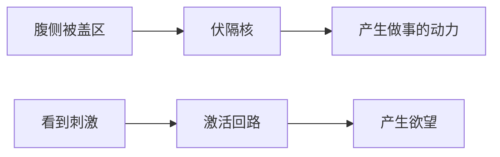

---

tags:
  - cb
创建时间: 2024-11-16 20:04:55
三观: Sad
title: "[[多巴胺]]"
---

## 生理特性

是一种神经递质, 讨厌画饼

 为啥会上瘾
 1. 最大程度利用周围资源, 让你活的更久
2. 对意外感兴趣(可能有可以利用的资源), 
3. 随机性可以带来大量的分泌

### 运行机制 
#### 欲望回路

预测 -> 联系(成瘾) -> 消除误差

![[Pasted image 20241116201038.png|393]]

## 什么情况下需要? (可以利用?)
## 什么情况下要消除影响(控制)?

## 好处, 竞争优势

## 缺点: 累赘

##  和爱情的关系 (会消除误差)
利用外部环境 -> 驱动你了解外部环境 -> 产生幻想, 和魅力
魅力: 不了解的时候, 产生的想象

 
## 和黄赌毒,游戏的关系

* 赌博: 多巴胺的异常激发

![[Pasted image 20241116202324.png|354]]

## 解决如何戒掉: 

### 控制回路
1. 用回路对抗回路
2. 有规律可循
3. 观察, 总结, 利用规律
4. 不能被戒断, 只能被替代

# 内啡肽

# 褪黑素
1. 清除自由基, 抗氧化
2. 调整昼夜戒律
3. 改善性功能

# 皮质醇

# 催产素
1. 增加信任感, 安全感, 知足, 平静, 专一
2. 抑制焦虑
3. 依赖关系

# 催乳素, 泌乳素

# 血清素, 五羟色胺
1. 安定感
2. 掌控感
3. 社会地位, 自尊
4. 危机意识
5. 自尊

# 糖皮质激素
1. 促进焦虑

## 资料

视频: [认清多巴胺](https://www.bilibili.com/video/BV1ZW4y1i7d7/?spm_id_from=333.1387.search.video_card.click&vd_source=351ae22481963e1732be800e8bc59c8a)
相关的书: [[贪婪的多巴胺]]
