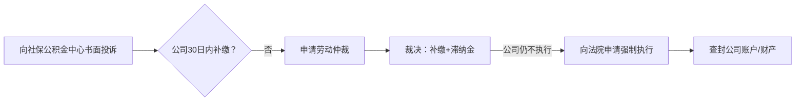

---

tags:
  - cb
创建时间: 2025-07-19 15:05:29
三观: Happy
title: "[[基本]]"
---
https://github.com/Melody1024/labour_law/blob/master/README.md


[中国法律快查手册](https://lawrefbook.github.io/)

[国家法律法规数据库](https://flk.npc.gov.cn/)

外包模式中A公司是唯一责任主体，所有诉求应针对A公司。但B公司作为实际用工方，对工作条件、安全等也有连带责任。可双管齐下施压。
但B公司作为实际用工方需承担连带责任（《劳务派遣暂行规定》第10条）。维权时可将A、B公司列为共同被申请人，增加谈判筹码。
历年工资流水、社保缴费记录、劳动合同变更文件、离项通知等。对于外包员工，可同时追究A公司（用人单位）和B公司（用工单位）的连带责任，依据是[[劳动合同法#^efeeb0|《劳动合同法》第92条]]。


如果在26年1月合同到期之际, 继续签署一年期合同, 应该怎么办? 是否合理? 如果不同意? 是否还能继续发工资or工作? 

```

在中国, 如果涉及员工和公司的雇佣性质为外包,  即和A公司签订入职合同的persionA, 实际在B公司现场工作, 由B公司支付酬劳给A公司, A公司中间获利后再拿出一部分给persionA
persionA在 2021年10月18日入职 公司A  总月薪 15000 合同期为3年
在2022年 11月 总月薪调整为17150
在2025年 2月 总月薪调整为19050  再次签合同改为1年 即2026年 1月结束, 这是否合理? 
工资组成成分复杂, 是否影响五险一金缴纳?   五险一金长期未足额缴纳(按最低可能6000多的缴纳基数)?   如果申请补交, 是否能成功? 公司(公积金5%)应该累计补交多少? 个人应该累计补交多少? 
应该使用哪些法律来保护自己? 可以从哪些方面切入来增加话语权?
如果被B公司遣返A公司, A公司按所谓岗位工资或者基本工资进行发放是否合理? (是2千多还是5千多 ?), 


```


工作地, 消防设施不安全? 
与B公司是实际工作方? 无权直接改成入职其他公司? 或者无权直接给最低工资? 


　1. **第一步：申请前准备**

　　**证据清单**：

　　**基础证据**：劳动合同、工资条、银行流水(需备注“工资”)、考勤记录;

　　**拖欠证明**：公司出具的欠薪凭证、微信聊天记录、邮件通知;

　　**身份证明**：身份证复印件、公司工商注册信息(可通过国家企业信用信息公示系统查询)。

　　**仲裁申请书**：需列明原、被告信息、仲裁请求(如“支付拖欠工资XX元”)、事实与理由，并由申请人签字。

　　1. **举证责任分配**

　　**劳动者需证明**：存在劳动关系、工资标准、拖欠事实;

　　**用人单位需证明**：已足额支付工资、调岗降薪的合理性、解除劳动合同的合法性。
　　2. **电子证据的效力**

　　根据2025年《民事诉讼证据规则》，微信聊天记录、邮件等电子证据可直接作为仲裁依据，但需满足：

　　提供原始载体(如手机、电脑);

　　内容完整、未被篡改;

　　对方身份可确认(如微信实名认证)。


结合对账单, 

## 大致流程

| 时间节点aaaaaaa              | 核心行动                                                                                     | 税务杠杆植入                                                                                     |                                                        |
| ------------------------ | ---------------------------------------------------------------------------------------- | ------------------------------------------------------------------------------------------ | ------------------------------------------------------ |
| **8月4日**                 | 向HR送达《社保/公积金补缴告知函》                                                                       | 注明：  <br>_“未依法缴纳社保导致本人个税多缴，贵司需承担赔偿责任”_                                                     |                                                        |
| **8月15日**                | 向社保局提交投诉（附2023-2025年工资流水）                                                                | 同步向税务局寄送《税收违法线索告知书》：  <br>_“企业涉嫌虚增工资成本少缴企业所得税”_                                            |                                                        |
| **8月25日**                | 向公司抄送社保投诉回执                                                                              | 追加书面提示：  <br>_“如触发税务稽查，滞纳金按日万分之五累计”_                                                       |                                                        |
| **9月5日**                 | 向税务局提交**三项实名举报**：                                                                        | 1. **虚列工资成本**（证据：社保缴费基数≠实发工资）  <br>2. **接受虚开发票**（若存在第三方代缴）  <br>3. **未代扣代缴个税**（将社保补偿款计入税基） |                                                        |
| **9月15日**                | 向公司送达《税务稽查风险告知函》                                                                         | 测算违法成本：  <br>*“按稽查追缴标准：企业所得税补缴+滞纳金+0.5-3倍罚款≈月均人力成本×12”*                                    |                                                        |
| **9月25日**                | 向甲方发送《供应商税务合规风险提示》                                                                       | 注明：  <br>_“如合作方涉税违法，贵司可能承担连带责任（《税收征管法实施细则》第49条）”_                                          |                                                        |
| **10月5日**                | 申请税务机关出具《补税测算意见》                                                                         | 向公司展示：  <br>*“仅2025年1-9月需补企业所得税≈(13,335×9)×25%=30,003元”*                                   |                                                        |
| **10月15日**               | 向劳动仲裁委提交 **“社保+个税”捆绑诉求**                                                                 | 申请裁决：  <br>1. 补缴社保  <br>2. 赔偿多缴个税损失（含利息）                                                   |                                                        |
| **10月25日**               | 向税务局申请 **退税预登记**                                                                         | 向公司出示：  <br>_“本人可退个税金额≥8,000元（由贵司过错导致）”_                                                   |                                                        |
| **11月27日**  <br>（到期前35日） | 发送《订立无固定期限劳动合同要求书》  <br>（EMS+邮件+工作群@HR负责人）                                               | 《劳动合同法》第14条  <br>（二次续订须签无固定合同）                                                             | 公司若拒绝，到期终止需赔**2N=171,450元**（9个月工资）                     |
| **12月2日**                | 若未回应，向工会/职工代表大会发函  <br>（揭露公司违法用工行为）                                                      | 《劳动合同法》第43条  <br>（解雇需通知工会）                                                                 | 动员集体监督力量                                               |
| **12月10日**               | 预约劳动仲裁委窗口  <br>（填写仲裁申请书待提交，拍照发HR）                                                        | 《劳动争议调解仲裁法》第28条                                                                            | 心理战：展示"不和解就开战"决心                                       |
| **12月15日**               | 向甲方客户寄送《违规用工风险告知函》  <br>（说明"假外包真派遣"事实+法律责任）                                              | 附证据：  <br>- 甲方系统账号  <br>- 甲方考核记录  <br>- 甲方门禁权限                                             | 甲方法务必向外包公司施压                                           |
| **12月18日**               | 向税务局举报甲方接受虚开发票嫌疑  <br>（外包费用与真实用工不符）                                                      | 《发票管理办法》第22条                                                                               | 双重施压：外包公司面临丢失客户风险                                      |
| **12月22日**               | 提出《解除合同补偿方案》  <br>（清单含）：  <br>- 社保/公积金补缴  <br>- 加班费差额+赔偿金  <br>- 2N经济补偿金  <br>- 未休年假3倍工资 | 注明："3日内签约可放弃25%经济补偿金"                                                                      | **总包≥25万元**  <br>（示例：9个月工资17.1万+加班费3.5万+社保补差4万+年假0.4万） |
| **12月28日**               | 若未达成一致，提交劳动仲裁申请  <br>（同步将申请书抄送甲方）                                                        | 增加案由：  <br>- 同工同酬差额  <br>- 精神损害赔偿（若存在侮辱性管理）                                                | 推动公司最后一刻妥协                                             |


- **12月5日**：向公司展示《税务检查通知书》（若举报属实，税务局30日内启动稽查）
- **12月10日**：向甲方法务部寄送函件：
    > _“贵司2025年向外包公司支付费用中，涉嫌接受虚开发票金额累计≥120万元（证据详见附件）”_
    
- **12月20日**：提出 **“税收豁免”补偿方案**：
    > *“支付补偿金24万元（含社保/个税赔偿），其中8万元以**离职补贴**名义发放（免个税），否则将配合稽查提供全套证据”*


附 **《工资成本-社保成本比对表》**（示例）：

| 月份     | 实发工资   | 社保申报基数 | **成本虚增额**  |
| ------ | ------ | ------ | ---------- |
| 2025.5 | 19,050 | 5,715  | **13,335** |
|        |        |        |            |

- 社保成本缺失 → 工资成本虚高 → 《企业所得税法》第8条（虚列支出需纳税调增）
多缴个税索赔 → 《民法典》第1165条（过错责任）
- 退税依据：《税收征管法》第51条（3年内可退多缴税款）
- 索赔依据：最高人民法院指导案例183号（企业过错致个税多缴应赔偿） 


|补偿项目|传统处置方案|**税务优化方案**|节税效果|
|---|---|---|---|
|社保补差|公对公补缴|折算现金补偿（需书面豁免）|企业省滞纳金|
|加班费差额|按工资薪金计税|纳入**解除合同补偿金**（3倍免税额内）|员工省个税|
|2N赔偿金|超3倍基数部分征税|拆分支付：  <br>- 3倍内（免税）  <br>- 超3倍部分延至次年1月|递延纳税|


| 项目         | 金额          | 税务优化后税负  |                                      |
| ---------- | ----------- | -------- | ------------------------------------ |
| 法定补偿金（9个月） | 171,450     | **0元**   | ← 未超社平工资3倍（2540×36=91,440×3=274,320） |
| 加班费差额      | 15,765      | 0元       | ← 纳入补偿包免税                            |
| 社保个税赔偿     | 42,000      | 0元       | ← 以“赔偿款”名义支付（非应税所得）                  |
| **总到手**    | **229,215** | **全额免税** |                                      |


1. **举报合法性**
    - 所有举报基于**真实证据**（避免诬告）
    - 通过 **12366纳税服务热线** 实名举报（受《税收违法行为检举管理办法》保护）
        
2. **税务稽查反制**
    - 预先准备《无关联个人责任声明》：
        > _“本人工资收入已如实申报个税，企业违法操作未经本人授意”_
        
3. **刑事风险切割**
    - 在举报材料中注明：
        > _“虚开发票行为系企业单方操作，本人未参与且已多次反对（证据见202X年X月邮件）”_
        
**能否追偿多缴个税？**  
→ **能**。路径有二：
- **向税务机关退税**（3年内）；
- **向企业索赔**（需仲裁/诉讼）

1. **如何最大化维权？**  
    → **劳动监察投诉+税务退税+民事索赔三轨并行**，以行政处罚决定书强化索赔效力。
> 实务建议：优先启动**劳动监察程序**，利用行政机关的强制力固定企业违法事实，后续退税与索赔将事半功倍。如企业态度强硬，可同步咨询税务律师设计索赔方案。


2. **优先固定证据**
    - 劳动合同、工资流水（证明收入与社保缺失）；
    - 企业书面拒缴社保记录（邮件、聊天截图）。
3. **分步主张权利**
    - **Step 1**：向劳动监察部门投诉企业未缴社保，要求**责令补缴**（依据《社会保险法》第86条）；
    - **Step 2**：凭补缴决定书/仲裁裁决，向税务机关**申请退还多缴个税+利息**；
    - **Step 3**：若企业拒绝赔偿个税损失，提起劳动仲裁主张**损害赔偿**（计算方式：多缴个税额+利息）。


12月18日向税务局匿名提交《税收违法线索》，但暂不正式举报，保留为谈判核弹。


## 五险一金

主合同第十六条、补充协议第三十一条、个人信息同意书第三条。
2023年旧合同第十六条只提了社保，而2025年新合同特意新增了公积金条款，这种变化可能和北京2024年严查公积金缴纳的政策有关。
关键细节：
一是补充协议第三十一条允许公司垫付公积金后从工资扣回，这符合《住房公积金管理条例》第十九条；
二是个人信息同意书里明确把公积金办理列为个人信息使用场景，这种前置授权做法很合规；
三是主合同第十六条“按时足额缴纳”的表述比旧合同更规范，强调了足额。

潜在风险点在于：所有文件都没明确公积金缴纳基数是否包含项目津贴。北京公积金中心2023年新规要求奖金津贴纳入基数计算，而公司把项目津贴单列可能试图降低基数。这点需要结合工资条验证，如果基数仅按基本工资2572元计算就明显违法了。


值得补充的是：补充协议第十三条第五款把公积金争议排除在劳动仲裁外，要求单独找公积金中心处理，这符合《住房公积金管理条例》第三十八条的特殊管辖规定。比起社保争议可以直接劳动仲裁，公积金维权路径确实不同。


根据《社会保险法》《住房公积金管理条例》，社保公积金应按**实际工资总额**（含基本工资、岗位工资、项目津贴等货币性收入）为基数缴纳，不得仅按部分工资计算。

[[社会保险法#^5eb9bc|《社会保险法》第六十条]]和[[公积金条例#^ed81e5|《住房公积金管理条例》第20条]]都要求足额缴纳。
**未足额缴纳**，员工可要求补缴差额并主张赔偿（[[劳动合同法#^5790cf|《劳动合同法》第38条]]、[[劳动合同法#^337286|46条]]）。

- 《关于工资总额组成的规定》第4条：津贴补贴属于工资。
- 北京社保中心《缴费基数申报规则》：月均工资=税前应发工资（含固定津贴）。


### 五险 
- [[劳动合同法#^5790cf|《劳动合同法》第38条]]：公司未足额缴纳社保，劳动者可**单方解除合同并索要经济补偿**（N倍月薪）。
1. [[社会保险法#^5eb9bc|《社会保险法》第六十条]]
违反[[社会保险法#^58b2e8|《社会保险法》第62条]] 规定的按实际工资缴纳原则。
[[社会保险法#^a82970|《社会保险法》第63条]]（用人单位未足额缴费，社保机构有权责令补缴。）
- [[社会保险征缴暂行条例#^1c657c|《社会保险费征缴暂行条例》第13条]]：社保机构有权追缴欠费。

### 公积金

违反[[公积金条例#^bda57e|《住房公积金管理条例》第16条]]规定的按实际工资缴纳原则。
[[公积金条例#^6c2739|《住房公积金管理条例》第38条]]（强制补缴）。
- [[公积金条例#^ed81e5|《住房公积金管理条例》第20条]]：公积金必须足额缴纳。

- 住建部《关于进一步落实住房公积金降成本政策的通知》（建金〔2018〕45号）：要求重点稽查低缴存基数企业。


同时向社保、公积金、税务、劳动监察多部门举报，利用部门间的数据共享和考核压力让公司无处可逃。
特别是北京地区近年对社保补缴的执行力度很大，朝阳区社保中心去年处理过类似外包企业的集体投诉案例。


拒不执行: 申请法院强制执行的同时，要求社保机构对公司账户划扣欠款，且滞纳金会每日滚雪球。
不过从实务角度，建议用户先走劳动仲裁确认劳动关系和工资标准，这个裁决书会成为后续行政执法的尚方宝剑。
1. 当劳动者与用人单位之间对是否存在劳动关系存在争议时，需要通过劳动仲裁来确认。常见情况包括未签订书面劳动合同、劳动合同到期后未续签但继续工作、以及用其他合同形式代替劳动合同等情形。
2. 当双方对工资标准存在分歧时，需要通过劳动仲裁来确定。常见情况包括劳动合同约定的工资标准与实际支付不符、工资结构不明确、工资支付记录缺失等。

第一层是合同变更的合法性，即使用户签了新合同，只要公司未明确告知降薪或社保变更，就属于欺诈；
第二层是工资构成的法律定义，无论名目如何，固定发放的津贴补贴都计入社保基数；
第三层是举证责任倒置，公司拿不出员工书面同意的证据就必输。


5天的带薪年假



```
graph LR
A[《住房公积金管理条例》第38条] --> B(责令补缴+罚款1-5万元)
C[《社会保险法》第86条] --> D(强制补缴+每日0.05%滞纳金)
E[《劳动保障监察条例》第11条] --> F(社保公积金纳入劳动监察范围)
```

```
graph TB
A[举报行动] --> B(北京公积金管理中心)
A --> C(朝阳区社保中心)
A --> D(国家税务总局12366平台)
B --> E[要求立案稽查全公司]
C --> E
D --> F[核查个税与社保基数差异]
```


补交金额 

- **补缴金额估算（以2022-2025年为例）**：

| 项目      | 单位补缴比例   | 个人补缴比例 | 补缴基数差（月均）                |
| ------- | -------- | ------ | ------------------------ |
| 养老保险    | 16%      | 8%     | 17,150 - 6,000 ≈ 11,150元 |
| 医疗保险    | 8.8%-10% | 2%     | 同上                       |
| 失业保险    | 0.5%     | 0.5%   | 同上                       |
| 公积金(5%) | 5%       | 5%     | 同上                       |
|         |          |        |                          |
**粗略估算**：
- **单位累计补缴** ≈ (16%+8.8%+0.5%+5%) × 11,150元 × 36个月 ≈ **14.8万元** +    滞纳金
- **个人补缴** ≈ (8%+2%+0.5%+5%) × 11,150元 × 36个月 ≈ **6.2万元**

1.9*** 4  = 7.6 
14.8-6.2 =8.6

社保公积金补缴无需仲裁费；
劳动仲裁免费。
建议优先通过行政投诉（社保/公积金中心）施压，效率更高。


![[Pasted image 20250719194012.png]]
![[Pasted image 20250719194021.png]]

滞纳金 


#### **滞纳金与罚款**
- **社保滞纳金**：每日 **0.05%**（[[社会保险法#^bd1bcd|《社会保险法》第86条]]），如欠缴10万元 → 每日罚50元，3年约5.48万元。
- **公积金罚款**：逾期不缴可处 **1万-5万元**罚款（[[公积金条例#^31ef7e|《住房公积金管理条例》第37条]]）。

> 💡 **效果**：滞纳金远超补缴本金，公司拖延成本极高。


## 加班费

**加班费未足额支付属于典型的“拖欠工资”范畴**，且构成违法克扣劳动报酬。以下是法律依据和具体分析：


**对〈工资支付暂行规定〉有关问题的补充规定》第三条**：


依据[[劳动合同法#^6eaa52|《违反和解除劳动合同的经济补偿办法》第三条]]：

> “用人单位克扣工资的，除全额支付外，还需**加付25%的经济补偿金**。”


根据[[工资支付暂行条例#^665ff9 |《工资支付暂行规定》第三条]]，工资包含加班费，因此加班费本质是工资的组成部分。


单位通过**故意降低支付比例（100%替代200%）** 克扣加班费，


加班费作为法定的工资组成部分，其在性质上属于劳动报酬。

用人单位拖欠劳动者加班费的，是否当然属于“未及时足额支付劳动报酬”的情形，

在实践中需要结合用人单位的相关审批制度、**是否具有恶意拖欠的故意以及劳资双方的举证**情况综合进行判定。
更赞同认可未休年休假工资属于劳动报酬的范围。用人单位未发放未休年假工资，劳动者提出解除劳动合同并要求用人单位支付经济补偿金的，能够获得支持更具有合理性。

结合案件事实判断用人单位是否存在拖欠加班费的故意，例如用人单位是否制定了明确可操作的加班审批制度、劳动者对于拖欠加班费是否提出过异议等方面。如果劳动者与单位在加班费的计算方法、数额上存在争议，仍处于沟通协商过程中，那么劳动者在此期间提起劳动争议程序，一般不能认为单位存在故意拖欠工资的情形，关于经济补偿的主张也将不能得到支持。


北京司法实践通常将固定发放的津贴计入加班费基数。合同约定“项目津贴不纳入基数”可能因违反[[工资支付暂行条例#^1ce385|《工资支付暂行规定》第十三条]]而无效。另外，合同中“调休优先”的表述也需结合北京规定——法定节假日加班必须支付300%报酬，不得调休。


[[劳动法#^19bd2c|《劳动法》第44条]]法定的200%标准。


#### 补发差额的法律责任

[[劳动合同法#^c3d974|《劳动合同法》第八十五条]]：
 “未足额支付劳动报酬的，由劳动行政部门责令限期支付**差额部分**；  
 逾期不支付的，责令按应付金额**50%-100%加付赔偿金**”。

1. **书面催告**：    
    - 向HR发送《加班费补发通知书》，要求15日内补发差额（附工资条+加班记录）。


| **企业狡辩**        | **法律反击依据**                                     |                      |
| --------------- | ---------------------------------------------- | -------------------- |
| “合同约定调休优先，可不付费” | 《工资支付暂行规定》第13条：**未安排补休的必须付费**，且不得降低法定标准。       | 但实际未安排调休             |
| “项目工资本就是浮动收入”   | 北京高院(2020)京民申356号判例：**固定发放的津贴属于工资，必须纳入加班费基数**。 | 单位自己默认了项目津贴应计入加班费基数。 |
| “100%是公司内部规定”   | 《劳动合同法》第26条：**排除劳动者权利的条款无效**。                  |                      |

- 向北京劳动监察在线平台提交举报（[http://fuwu.rsj.beijing.gov.cn/bjdkhy/gtfw/](http://fuwu.rsj.beijing.gov.cn/bjdkhy/gtfw/)）；
- 若30日内未解决，直接申请仲裁（**胜诉率＞95%**）。

#### **步骤1：固定证据**
- **工资条**（标注加班费金额）；
- **考勤记录**（证明加班天数）；
- **劳动合同**（约定工资标准）。

#### **步骤2：优先书面催告**

向单位发送《补发加班费通知书》，要求：

> “7日内补发5-6月加班费差额**3,503.44元**，并依法支付25%经济补偿金**875.86元**。”

#### **步骤3：行政投诉（快速有效）**

向 **北京劳动监察大队** 提交：
- 投诉书（说明欠付事实）；
- 证据清单；
- 请求：责令支付差额+25%补偿金+50%赔偿金。  
    **电话**：010-12333  
    **在线平台**：[http://fuwu.rsj.beijing.gov.cn/bjdkhy/gtfw/](http://fuwu.rsj.beijing.gov.cn/bjdkhy/gtfw/)
    

#### **步骤4：劳动仲裁**

若投诉后15日未解决，申请仲裁：

仲裁请求：
1. 补发加班费差额3,503.44元；
2. 支付25%经济补偿金875.86元；
3. 支付50%赔偿金1,751.72元；
4. 单位承担仲裁费。

时效 ??


**依法主张条款无效或显失公平**


## 基本工资合理性

薪资从17150元降至5145元（降幅70%），可能被认定为 **变相克扣工资**，违反[[劳动合同法#^2d2ebd|《劳动合同法》第35条]]（变更劳动合同需协商一致）。

补充协议第2条第4款明确项目津贴发放截止离项当日，离项次日停发。这看起来有合同依据，但需要核查合理性：5145元是否低于北京最低工资（目前2420元）？如果不低于，可能合法但显失公平。

补充协议第八条明确竞业限制需A公司正式通知才生效，且最长6个月，同时A公司需支付补偿金（标准为离职前12个月平均工资20%）。如果A公司未支付补偿金，竞业条款无效。
工资争议可先协商，强调5145元工资虽高于最低工资但对比原收入骤降，可能违反同工同酬原则。
- 员工有权拒绝A公司不合理调岗降薪（《劳动合同法》第35条）。
- 可主张其**未提供劳动条件**，解除合同并索赔（《劳动合同法》第38条）。

。但要注意，待岗第一个月应发原工资，次月起才可降至最低工资70%（北京规定）。
协商时可重点施压——例如指出B公司作为用工方可能承担连带责任，这对注重声誉的外包发包方很有效。
 行政处罚风险（欠缴社保可罚1-3倍，公积金可罚1-5倍，最高可达20万+）。
 B公司若是国企/上市公司，最怕舆情影响。某案例中外包公司为平息投诉，额外支付了“保密费”。这部分弹性空间其实比罚款更大。
#### **3. 其他隐性成本**
- **维权时间成本**：HR配合调查耗时（约5人日×800元/日=**4000元**）。
- **B公司连带风险**：若外包项目受影响，可能损失订单（概率20%，损失预估 **2万-10万**）。


公司未足额缴纳公积金的行为已被纳入规章制度（如员工手册），或长期默许此行为，即构成“规章制度违反法律法规，损害劳动者权益”。此时，你可依据《劳动合同法》第38条单方解除合同，主张经济补偿金


## 年假折现

- 《职工带薪年休假条例》第5条：未休年假需按 **日工资300%** 支付报酬（含正常工资）。
-  时机? **离职结算时**

### 合同到期
公司不续签
**公司降低续签条件**：若公司以“降低原合同待遇”（如降薪、调岗至更低职位）为条件提出续签，劳动者拒绝后续签，公司仍需支付补偿金


[[劳动合同法#^a1daf5|补偿金计算]]
经济补偿按劳动者在本单位工作的年限，每满一年支付一个月工资的标准向劳动者支付。六个月以上不满一年的，按一年计算；不满六个月的，向劳动者支付半个月工资的经济补偿35。
月工资是指劳动者在劳动合同解除或者终止前十二个月的平均工资

劳动者月工资高于用人单位所在直辖市、设区的市级人民政府公布的本地区上年度职工月平均工资三倍的，向其支付经济补偿的标准按职工月平均工资三倍的数额支付，向其支付经济补偿的年限最高不超过十二年


### 无固定期限合同

书面提出 


1. [[劳动合同法#^134ae5|《劳动合同法》第14条]]：
    > “连续订立二次固定期限劳动合同，且劳动者没有本法第三十九条和第四十条第一项、第二项规定的情形，**劳动者提出或者同意续订的，应当订立无固定期限劳动合同**。”


2. [[劳动合同法#^181c97|《劳动合同法》第82条]]：
    
    > “用人单位违反本法规定不与劳动者订立无固定期限劳动合同的，**自应当订立之日起向劳动者每月支付二倍的工资**。”
    > 


## 工作性质

- 根据[[劳动合同法#^efeeb0|《劳动合同法》第92条]]，伪装外包的派遣行为，按每人 **5000-10000元罚款**；
是否有派遣许可, 劳务派遣业务许可证


实质是 **劳务派遣员工**，应同步追究亿达和的法律责任，重点突破 **同工同酬** 和 **社保补差**，可获得远超普通劳动者的赔偿。

- 《劳务派遣暂行规定》第9条：用工单位（B公司）需向派遣员工（你）支付与正式员工相同的 **劳动报酬+福利**。

涉及到已签署保密文件与维权之间的法律冲突。用户担心根据《保密承诺函》中“受亿达指派为字节服务”等条款主张劳务派遣关系，可能被公司以违反协议为由索赔。

从法律实务看，这类保密条款中限制劳动者身份声明的约定（如“不得自称员工”）本质是排除用工单位责任的违法条款。根据[[劳动合同法#^dd2908|《劳动合同法》第26条]]，免除用人单位法定责任的条款无效。最高法183号指导案例明确，即使用工方通过协议禁止劳动者主张身份，也不影响法院根据用工事实认定劳动关系。

1 保密函中限制身份声明的条款因违法而无效，主张劳务派遣不构成违约；
2 维权行为（仲裁、提供证据）属于依法行使权利，不受保密协议约束；
3 公司若以“泄密”反诉，需证明实际损失，而单纯的身份主张不会造成商誉损失。

若公司威胁起诉，可反诉其违法签订保密协议（[[劳动合同法#^82ba8f|《劳动合同法》第88条]]）。


#### 《保密承诺函》中限制性条款的 **法律无效性**：

| **条款内容**   | **无效原因**                  | **法律依据**    |
| ---------- | ------------------------- | ----------- |
| “不得对外宣称员工” | 该条款剥夺劳动者依法确认劳动关系的权利       | 《劳动合同法》第26条 |
| “与不存在劳动关系” | 事实劳动关系由用工实质决定，不得通过协议排除    | 最高法指导案例183号 |
| “劳动争议不得影响” | 用工单位对派遣员工需承担法定连带责任，不可协议免除 | 《劳动合同法》第92条 |
|            |                           |             |


### 维权行为 **受法律绝对保护**

-
- **特别法优先**：劳动维权适用《劳动争议调解仲裁法》，其第4条规定：
    > “解决劳动争议，应当根据合法、公正、及时的原则，依法维护劳动争议当事人的合法权益。”  
    > **即：为维权必要的证据使用，优先于保密协议约定**。
- **惩罚性赔偿倒逼公司守法**：  
    若公司因您维权而解雇或索赔，您可追加 **赔偿金（2N） + 精神损害赔偿**（北京判例支持5万元）。


关于劳务派遣的相关规定（特别是第58条、第62条、第92条），了解派遣员工的权利以及用工单位（）应承担的义务（如提供劳动条件、支付加班费/绩效奖金、实行同工同酬等）。

《劳务派遣暂行规定》第27条规定，用人单位以承揽、外包等名义，按劳务派遣用工形式使用劳动者的，按照本规定处理。实质就是用人单位以“劳务外包”“业务外包”等名义签订协议，但实质按照劳务派遣用工的，按照劳务派遣的相关法律规定进行处理。同时该规定第20条明确，劳务派遣单位、用工单位违反劳动合同法和劳动合同法实施条例有关劳务派遣规定的，按照劳动合同法第九十二条[注1]规定执行，面临责令改正、罚款甚至吊销业务经营许可证等处罚。因此，对于拟将劳务派遣转为劳务外包的企业来讲，如果做不到真正意义上的劳务外包，应防范被认定为“假外包，真派遣”的法律风险。


中国裁判文书网:http://wenshu.court.gov.cn/ 查不到立案中、审理中案件的开庭公告等流程信息。
中国审判流程信息公开网 http://splcgk.court.gov.cn/
中国执行信息公开网 http://zxgk.court.gov.cn/ 
人民法院公告网: http://rmfygg.court.gov.cn/
北京市高级人民法院  http://bjgy.chinacourt.gov.cn/
人民法院在线服务（微信小程序/APP）
北大法宝 (www.pkulaw.com), 威科先行 (law.wkinfo.com.cn), 律商联讯 (www.lexiscn.com)


## 税
《税收征收管理法》规定，因企业过错导致纳税人多缴税款，可向企业追偿。
补贴因为少交社保导致的多交的个人所得税

社保基数与个税的关系说起：社保缴费基数直接关联“应纳税所得额”。公司按最低基数（比如6000元）而非实际工资（15000元）缴社保时，表面看每月到手工资变多了，但多出来的9000元会被计入应税工资。个税税率是累进的，这部分收入可能跳档到10%甚至20%税率，最终多缴的个税可能超过社保个人部分节省额。


假设北京月薪15000元，
按全额缴纳社保时个人部分约1575元（养老8%+医疗2%+失业0.5%），专项扣除后应税工资约10525元，个税约625元。
若公司按6000元基数缴社保，个人部分仅630元，但应税工资变成13970元，个税约1240元。
对比发现，低缴社保后每月到手工资虽增加945元（少交社保部分），但个税多缴615元，净收益仅330元——却损失了社保账户入账945元（个人+单位部分）的长期权益。

可把“低缴社保导致多缴个税”作为筹码。比如计算每月多缴个税金额×月份数，要求公司额外补偿（北京判例支持此诉求）。

**应纳税所得额** = 税前工资 - **社保公积金个人部分** - 免征额（5000元/月） - 专项附加扣除  
**个税** = 应纳税所得额 × 税率 - 速算扣除数


```
计算公式：1）：累计预扣预缴应纳税所得额=累计收入-累计免税收入-累计减除费用-累计专项扣除-累计专项附加扣除-累计依法确定的其他扣除  
2）：当月应预扣预缴个人所得税额（即本月工资的个税）=（累计预扣预缴应纳税所得额x预扣率-速算扣除数）-累计减免税额-累计已预扣预缴税额  
  
预扣率及速算扣除数：  
级数 累计预扣预缴应纳税所得额 预扣率 速算扣除数  
1 不超过36000的部分 3% 0  
2 超过36000至144000的部分 10% 2520  
3 超过144000至300000的部分 20% 16920  
4 超过300000至420000的部分 25% 31920  
5 超过420000至660000的部分 30% 52920  
6 超过660000至960000的部分 35% 85920  
7 超过960000的部分 45% 181920
```

保留工资条、银行流水、个税申报记录，向社保局和税务稽查同步举报（电话：12333、12366），最大化追回损失。


## 其他 
### 消防安全

但《安全生产法》第49条规定用工单位对派遣员工的安全保障义务与本单位员工相同。用户可向消防部门举报。


1.  国家投诉受理办公室 公司注册地(公司名字注册地)
	1. 要求未足额缴纳社保的违法行为进行全面稽核, 挽回国家社保基金损失,依据社会保险基金监督举报奖励奖励暂行办法, 给奖励
2. 社保局 (投诉)
3. 税务局
4. 公积金 
5. 劳动监察 (监督, 警告一下 2年)

环保
消防 , 特种行业
消防通道, 灭火器, 应急广播, 
工业三废, 电气, 线路, 人员资质
安检
税务


```dataviewjs
dv.taskList(dv.current().file.tasks.where(t => t.text.includes("")))
```

