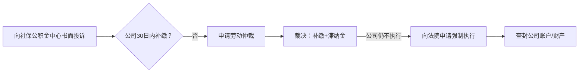

---

tags:
  - cb
创建时间: 2025-07-19 15:05:29
三观: Happy
title: "[[基本]]"
---


[中国法律快查手册](https://lawrefbook.github.io/)

[国家法律法规数据库](https://flk.npc.gov.cn/)

外包模式中A公司是唯一责任主体，所有诉求应针对A公司。但B公司作为实际用工方，对工作条件、安全等也有连带责任。可双管齐下施压。
但B公司作为实际用工方需承担连带责任（《劳务派遣暂行规定》第10条）。维权时可将A、B公司列为共同被申请人，增加谈判筹码。
历年工资流水、社保缴费记录、劳动合同变更文件、离项通知等。对于外包员工，可同时追究A公司（用人单位）和B公司（用工单位）的连带责任，依据是《劳动合同法》第92条。


如果在26年1月合同到期之际, 继续签署一年期合同, 应该怎么办? 是否合理? 如果不同意? 是否还能继续发工资or工作? 

```

在中国, 如果涉及员工和公司的雇佣性质为外包,  即和A公司签订入职合同的persionA, 实际在B公司现场工作, 由B公司支付酬劳给A公司, A公司中间获利后再拿出一部分给persionA
persionA在 2021年10月18日入职 公司A  总月薪 15000 合同期为3年
在2022年 11月 总月薪调整为17150
在2025年 2月 总月薪调整为19050  再次签合同改为1年 即2026年 1月结束, 这是否合理? 
工资组成成分复杂, 是否影响五险一金缴纳?   五险一金长期未足额缴纳(按最低可能6000多的缴纳基数)?   如果申请补交, 是否能成功? 公司(公积金5%)应该累计补交多少? 个人应该累计补交多少? 
应该使用哪些法律来保护自己? 可以从哪些方面切入来增加话语权?
如果被B公司遣返A公司, A公司按所谓岗位工资或者基本工资进行发放是否合理? (是2千多还是5千多 ?), 


```


工作地, 消防设施不安全? 
与B公司是实际工作方? 无权直接改成入职其他公司? 或者无权直接给最低工资? 


结合对账单, 

### 五险一金
根据《社会保险法》《住房公积金管理条例》，社保公积金应按**实际工资总额**（含基本工资、岗位工资、项目津贴等货币性收入）为基数缴纳，不得仅按部分工资计算。

《社会保险法》第60条和《住房公积金管理条例》第20条都要求足额缴纳。
属于**未足额缴纳**，员工可要求补缴差额并主张赔偿（《劳动合同法》第38条、46条）。
《社会保险法》第63条（补缴责任）、《住房公积金管理条例》第38条（强制补缴）。
这明显违反《社会保险法》第62条和《住房公积金管理条例》第16条规定的按实际工资缴纳原则。可以要求A公司补足差额，且不受时效限制（依据《劳动保障监察条例》第20条）。

- 住建部《关于进一步落实住房公积金降成本政策的通知》（建金〔2018〕45号）：要求重点稽查低缴存基数企业。

- 北京公积金中心《关于开展住房公积金缴存专项执法检查的通知》（2025）：明确将“未足额缴存”列为重点检查项。


属于典型的 **未足额缴纳**，违反：
1. 《社会保险法》第60条
2. 《住房公积金管理条例》第16条
- 《社会保险法》第63条：用人单位未足额缴费，社保机构有权责令补缴。
- 《住房公积金管理条例》第38条：公积金中心可强制补缴。

- 《劳动合同法》第38条：公司未足额缴纳社保，劳动者可**单方解除合同并索要经济补偿**（N倍月薪）。
- 《社会保险费征缴暂行条例》第13条：社保机构有权追缴欠费。
- 《住房公积金管理条例》第20条：公积金必须足额缴纳。


同时向社保、公积金、税务、劳动监察多部门举报，利用部门间的数据共享和考核压力让公司无处可逃。
特别是北京地区近年对社保补缴的执行力度很大，朝阳区社保中心去年处理过类似外包企业的集体投诉案例。


拒不执行: 申请法院强制执行的同时，要求社保机构对公司账户划扣欠款，且滞纳金会每日滚雪球。不过从实务角度，建议用户先走劳动仲裁确认劳动关系和工资标准，这个裁决书会成为后续行政执法的尚方宝剑。

- 📌 **新旧劳动合同对比**：证明新合同未明确约定降低社保基数（如无相关条款）。
- 📌 **沟通记录**：微信/邮件等证明公司未就社保变更进行协商（如公司仅说“续签合同”未提细节）。
- 📌 **签字说明**：若合同签名页无社保条款重点提示，主张“未引起注意”（《民法典》第496条格式条款提示义务）。

- 《关于工资总额组成的规定》第4条：津贴补贴属于工资。
- 北京社保中心《缴费基数申报规则》：月均工资=税前应发工资（含固定津贴）。

第一层是合同变更的合法性，即使用户签了新合同，只要公司未明确告知降薪或社保变更，就属于欺诈；
第二层是工资构成的法律定义，无论名目如何，固定发放的津贴补贴都计入社保基数；
第三层是举证责任倒置，公司拿不出员工书面同意的证据就必输。


补贴因为少交社保导致的多交的个人所得税

5天的带薪年假



```
graph LR
A[《住房公积金管理条例》第38条] --> B(责令补缴+罚款1-5万元)
C[《社会保险法》第86条] --> D(强制补缴+每日0.05%滞纳金)
E[《劳动保障监察条例》第11条] --> F(社保公积金纳入劳动监察范围)
```

```
graph TB
A[举报行动] --> B(北京公积金管理中心)
A --> C(朝阳区社保中心)
A --> D(国家税务总局12366平台)
B --> E[要求立案稽查全公司]
C --> E
D --> F[核查个税与社保基数差异]
```


补交金额 

- **补缴金额估算（以2022-2025年为例）**：

| 项目      | 单位补缴比例   | 个人补缴比例 | 补缴基数差（月均）                |
| ------- | -------- | ------ | ------------------------ |
| 养老保险    | 16%      | 8%     | 17,150 - 6,000 ≈ 11,150元 |
| 医疗保险    | 8.8%-10% | 2%     | 同上                       |
| 失业保险    | 0.5%     | 0.5%   | 同上                       |
| 公积金(5%) | 5%       | 5%     | 同上                       |
|         |          |        |                          |
**粗略估算**：
- **单位累计补缴** ≈ (16%+8.8%+0.5%+5%) × 11,150元 × 36个月 ≈ **14.8万元** +    滞纳金
- **个人补缴** ≈ (8%+2%+0.5%+5%) × 11,150元 × 36个月 ≈ **6.2万元**

1.9*** 4  = 7.6 
14.8-6.2 =8.6

社保公积金补缴无需仲裁费；
劳动仲裁免费。
建议优先通过行政投诉（社保/公积金中心）施压，效率更高。


![[Pasted image 20250719194012.png]]
![[Pasted image 20250719194021.png]]

滞纳金 


#### **滞纳金与罚款**
- **社保滞纳金**：每日 **0.05%**（《社会保险法》第86条），如欠缴10万元 → 每日罚50元，3年约5.48万元。
- **公积金罚款**：逾期不缴可处 **1万-5万元**罚款（《住房公积金管理条例》第37条）。

> 💡 **效果**：滞纳金远超补缴本金，公司拖延成本极高。


### 税


### 基本工资合理性

薪资从17150元降至5145元（降幅70%），可能被认定为 **变相克扣工资**，违反《劳动合同法》第35条（变更劳动合同需协商一致）。

补充协议第2条第4款明确项目津贴发放截止离项当日，离项次日停发。这看起来有合同依据，但需要核查合理性：5145元是否低于北京最低工资（目前2420元）？如果不低于，可能合法但显失公平。

补充协议第八条明确竞业限制需A公司正式通知才生效，且最长6个月，同时A公司需支付补偿金（标准为离职前12个月平均工资20%）。如果A公司未支付补偿金，竞业条款无效。
工资争议可先协商，强调5145元工资虽高于最低工资但对比原收入骤降，可能违反同工同酬原则。
- 员工有权拒绝A公司不合理调岗降薪（《劳动合同法》第35条）。
- 可主张其**未提供劳动条件**，解除合同并索赔（《劳动合同法》第38条）。

。但要注意，待岗第一个月应发原工资，次月起才可降至最低工资70%（北京规定）。
协商时可重点施压——例如指出B公司作为用工方可能承担连带责任，这对注重声誉的外包发包方很有效。
 行政处罚风险（欠缴社保可罚1-3倍，公积金可罚1-5倍，最高可达20万+）。
 B公司若是国企/上市公司，最怕舆情影响。某案例中外包公司为平息投诉，额外支付了“保密费”。这部分弹性空间其实比罚款更大。
#### **3. 其他隐性成本**
- **维权时间成本**：HR配合调查耗时（约5人日×800元/日=**4000元**）。
- **B公司连带风险**：若外包项目受影响，可能损失订单（概率20%，损失预估 **2万-10万**）。


公司未足额缴纳公积金的行为已被纳入规章制度（如员工手册），或长期默许此行为，即构成“规章制度违反法律法规，损害劳动者权益”。此时，你可依据《劳动合同法》第38条单方解除合同，主张经济补偿金


### 消防安全

但《安全生产法》第49条规定用工单位对派遣员工的安全保障义务与本单位员工相同。用户可向消防部门举报。


1.  国家投诉受理办公室 公司注册地(公司名字注册地)
	1. 要求未足额缴纳社保的违法行为进行全面稽核, 挽回国家社保基金损失,依据社会保险基金监督举报奖励奖励暂行办法, 给奖励
2. 社保局 (投诉)
3. 税务局
4. 公积金 
5. 劳动监察 (监督, 警告一下 2年)

环保
消防 , 特种行业
消防通道, 灭火器, 应急广播, 
工业三废, 电气, 线路, 人员资质
安检
税务


```dataviewjs
dv.taskList(dv.current().file.tasks.where(t => t.text.includes("")))
```

