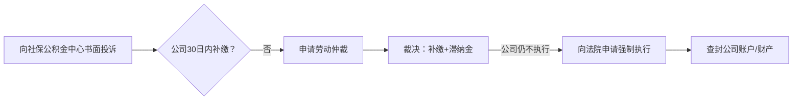

---

tags:
  - cb
创建时间: 2025-07-19 15:05:29
三观: Happy
title: "[[基本]]"
---
https://github.com/Melody1024/labour_law/blob/master/README.md


[中国法律快查手册](https://lawrefbook.github.io/)

[国家法律法规数据库](https://flk.npc.gov.cn/)

外包模式中A公司是唯一责任主体，所有诉求应针对A公司。但B公司作为实际用工方，对工作条件、安全等也有连带责任。可双管齐下施压。
但B公司作为实际用工方需承担连带责任（《劳务派遣暂行规定》第10条）。维权时可将A、B公司列为共同被申请人，增加谈判筹码。
历年工资流水、社保缴费记录、劳动合同变更文件、离项通知等。对于外包员工，可同时追究A公司（用人单位）和B公司（用工单位）的连带责任，依据是[[劳动合同法#^efeeb0|《劳动合同法》第92条]]。


如果在26年1月合同到期之际, 继续签署一年期合同, 应该怎么办? 是否合理? 如果不同意? 是否还能继续发工资or工作? 

```

在中国, 如果涉及员工和公司的雇佣性质为外包,  即和A公司签订入职合同的persionA, 实际在B公司现场工作, 由B公司支付酬劳给A公司, A公司中间获利后再拿出一部分给persionA
persionA在 2021年10月18日入职 公司A  总月薪 15000 合同期为3年
在2022年 11月 总月薪调整为17150
在2025年 2月 总月薪调整为19050  再次签合同改为1年 即2026年 1月结束, 这是否合理? 
工资组成成分复杂, 是否影响五险一金缴纳?   五险一金长期未足额缴纳(按最低可能6000多的缴纳基数)?   如果申请补交, 是否能成功? 公司(公积金5%)应该累计补交多少? 个人应该累计补交多少? 
应该使用哪些法律来保护自己? 可以从哪些方面切入来增加话语权?
如果被B公司遣返A公司, A公司按所谓岗位工资或者基本工资进行发放是否合理? (是2千多还是5千多 ?), 


```


工作地, 消防设施不安全? 
与B公司是实际工作方? 无权直接改成入职其他公司? 或者无权直接给最低工资? 


　1. **第一步：申请前准备**

　　**证据清单**：

　　**基础证据**：劳动合同、工资条、银行流水(需备注“工资”)、考勤记录;

　　**拖欠证明**：公司出具的欠薪凭证、微信聊天记录、邮件通知;

　　**身份证明**：身份证复印件、公司工商注册信息(可通过国家企业信用信息公示系统查询)。

　　**仲裁申请书**：需列明原、被告信息、仲裁请求(如“支付拖欠工资XX元”)、事实与理由，并由申请人签字。

　　1. **举证责任分配**

　　**劳动者需证明**：存在劳动关系、工资标准、拖欠事实;

　　**用人单位需证明**：已足额支付工资、调岗降薪的合理性、解除劳动合同的合法性。
　　2. **电子证据的效力**

　　根据2025年《民事诉讼证据规则》，微信聊天记录、邮件等电子证据可直接作为仲裁依据，但需满足：

　　提供原始载体(如手机、电脑);

　　内容完整、未被篡改;

　　对方身份可确认(如微信实名认证)。


结合对账单, 

## 五险一金

主合同第十六条、补充协议第三十一条、个人信息同意书第三条。
2023年旧合同第十六条只提了社保，而2025年新合同特意新增了公积金条款，这种变化可能和北京2024年严查公积金缴纳的政策有关。
关键细节：
一是补充协议第三十一条允许公司垫付公积金后从工资扣回，这符合《住房公积金管理条例》第十九条；
二是个人信息同意书里明确把公积金办理列为个人信息使用场景，这种前置授权做法很合规；
三是主合同第十六条“按时足额缴纳”的表述比旧合同更规范，强调了足额。

潜在风险点在于：所有文件都没明确公积金缴纳基数是否包含项目津贴。北京公积金中心2023年新规要求奖金津贴纳入基数计算，而公司把项目津贴单列可能试图降低基数。这点需要结合工资条验证，如果基数仅按基本工资2572元计算就明显违法了。


值得补充的是：补充协议第十三条第五款把公积金争议排除在劳动仲裁外，要求单独找公积金中心处理，这符合《住房公积金管理条例》第三十八条的特殊管辖规定。比起社保争议可以直接劳动仲裁，公积金维权路径确实不同。


根据《社会保险法》《住房公积金管理条例》，社保公积金应按**实际工资总额**（含基本工资、岗位工资、项目津贴等货币性收入）为基数缴纳，不得仅按部分工资计算。

[[社会保险法#^5eb9bc|《社会保险法》第六十条]]和[[公积金条例#^ed81e5|《住房公积金管理条例》第20条]]都要求足额缴纳。
**未足额缴纳**，员工可要求补缴差额并主张赔偿（[[劳动合同法#^5790cf|《劳动合同法》第38条]]、[[劳动合同法#^337286|46条]]）。

- 《关于工资总额组成的规定》第4条：津贴补贴属于工资。
- 北京社保中心《缴费基数申报规则》：月均工资=税前应发工资（含固定津贴）。


### 五险 
- [[劳动合同法#^5790cf|《劳动合同法》第38条]]：公司未足额缴纳社保，劳动者可**单方解除合同并索要经济补偿**（N倍月薪）。
1. [[社会保险法#^5eb9bc|《社会保险法》第六十条]]
违反[[社会保险法#^58b2e8|《社会保险法》第62条]] 规定的按实际工资缴纳原则。
[[社会保险法#^a82970|《社会保险法》第63条]]（用人单位未足额缴费，社保机构有权责令补缴。）
- [[社会保险征缴暂行条例#^1c657c|《社会保险费征缴暂行条例》第13条]]：社保机构有权追缴欠费。


### 公积金

违反[[公积金条例#^bda57e|《住房公积金管理条例》第16条]]规定的按实际工资缴纳原则。
[[公积金条例#^6c2739|《住房公积金管理条例》第38条]]（强制补缴）。
- [[公积金条例#^ed81e5|《住房公积金管理条例》第20条]]：公积金必须足额缴纳。

- 住建部《关于进一步落实住房公积金降成本政策的通知》（建金〔2018〕45号）：要求重点稽查低缴存基数企业。


同时向社保、公积金、税务、劳动监察多部门举报，利用部门间的数据共享和考核压力让公司无处可逃。
特别是北京地区近年对社保补缴的执行力度很大，朝阳区社保中心去年处理过类似外包企业的集体投诉案例。


拒不执行: 申请法院强制执行的同时，要求社保机构对公司账户划扣欠款，且滞纳金会每日滚雪球。
不过从实务角度，建议用户先走劳动仲裁确认劳动关系和工资标准，这个裁决书会成为后续行政执法的尚方宝剑。
1. 当劳动者与用人单位之间对是否存在劳动关系存在争议时，需要通过劳动仲裁来确认。常见情况包括未签订书面劳动合同、劳动合同到期后未续签但继续工作、以及用其他合同形式代替劳动合同等情形。
2. 当双方对工资标准存在分歧时，需要通过劳动仲裁来确定。常见情况包括劳动合同约定的工资标准与实际支付不符、工资结构不明确、工资支付记录缺失等。


第一层是合同变更的合法性，即使用户签了新合同，只要公司未明确告知降薪或社保变更，就属于欺诈；
第二层是工资构成的法律定义，无论名目如何，固定发放的津贴补贴都计入社保基数；
第三层是举证责任倒置，公司拿不出员工书面同意的证据就必输。


5天的带薪年假



```
graph LR
A[《住房公积金管理条例》第38条] --> B(责令补缴+罚款1-5万元)
C[《社会保险法》第86条] --> D(强制补缴+每日0.05%滞纳金)
E[《劳动保障监察条例》第11条] --> F(社保公积金纳入劳动监察范围)
```

```
graph TB
A[举报行动] --> B(北京公积金管理中心)
A --> C(朝阳区社保中心)
A --> D(国家税务总局12366平台)
B --> E[要求立案稽查全公司]
C --> E
D --> F[核查个税与社保基数差异]
```


补交金额 

- **补缴金额估算（以2022-2025年为例）**：

| 项目      | 单位补缴比例   | 个人补缴比例 | 补缴基数差（月均）                |
| ------- | -------- | ------ | ------------------------ |
| 养老保险    | 16%      | 8%     | 17,150 - 6,000 ≈ 11,150元 |
| 医疗保险    | 8.8%-10% | 2%     | 同上                       |
| 失业保险    | 0.5%     | 0.5%   | 同上                       |
| 公积金(5%) | 5%       | 5%     | 同上                       |
|         |          |        |                          |
**粗略估算**：
- **单位累计补缴** ≈ (16%+8.8%+0.5%+5%) × 11,150元 × 36个月 ≈ **14.8万元** +    滞纳金
- **个人补缴** ≈ (8%+2%+0.5%+5%) × 11,150元 × 36个月 ≈ **6.2万元**

1.9*** 4  = 7.6 
14.8-6.2 =8.6

社保公积金补缴无需仲裁费；
劳动仲裁免费。
建议优先通过行政投诉（社保/公积金中心）施压，效率更高。


![[Pasted image 20250719194012.png]]
![[Pasted image 20250719194021.png]]

滞纳金 


#### **滞纳金与罚款**
- **社保滞纳金**：每日 **0.05%**（[[社会保险法#^bd1bcd|《社会保险法》第86条]]），如欠缴10万元 → 每日罚50元，3年约5.48万元。
- **公积金罚款**：逾期不缴可处 **1万-5万元**罚款（[[公积金条例#^31ef7e|《住房公积金管理条例》第37条]]）。

> 💡 **效果**：滞纳金远超补缴本金，公司拖延成本极高。


## 加班费

**加班费未足额支付属于典型的“拖欠工资”范畴**，且构成违法克扣劳动报酬。以下是法律依据和具体分析：


**对〈工资支付暂行规定〉有关问题的补充规定》第三条**：


依据[[劳动合同法#^6eaa52|《违反和解除劳动合同的经济补偿办法》第三条]]：

> “用人单位克扣工资的，除全额支付外，还需**加付25%的经济补偿金**。”


根据[[工资支付暂行条例#^665ff9 |《工资支付暂行规定》第三条]]，工资包含加班费，因此加班费本质是工资的组成部分。


单位通过**故意降低支付比例（100%替代200%）** 克扣加班费，


加班费作为法定的工资组成部分，其在性质上属于劳动报酬。

用人单位拖欠劳动者加班费的，是否当然属于“未及时足额支付劳动报酬”的情形，

在实践中需要结合用人单位的相关审批制度、**是否具有恶意拖欠的故意以及劳资双方的举证**情况综合进行判定。
更赞同认可未休年休假工资属于劳动报酬的范围。用人单位未发放未休年假工资，劳动者提出解除劳动合同并要求用人单位支付经济补偿金的，能够获得支持更具有合理性。

结合案件事实判断用人单位是否存在拖欠加班费的故意，例如用人单位是否制定了明确可操作的加班审批制度、劳动者对于拖欠加班费是否提出过异议等方面。如果劳动者与单位在加班费的计算方法、数额上存在争议，仍处于沟通协商过程中，那么劳动者在此期间提起劳动争议程序，一般不能认为单位存在故意拖欠工资的情形，关于经济补偿的主张也将不能得到支持。


北京司法实践通常将固定发放的津贴计入加班费基数。合同约定“项目津贴不纳入基数”可能因违反[[工资支付暂行条例#^1ce385|《工资支付暂行规定》第十三条]]而无效。另外，合同中“调休优先”的表述也需结合北京规定——法定节假日加班必须支付300%报酬，不得调休。


[[劳动法#^19bd2c|《劳动法》第44条]]法定的200%标准。


#### 补发差额的法律责任

[[劳动合同法#^c3d974|《劳动合同法》第八十五条]]：
 “未足额支付劳动报酬的，由劳动行政部门责令限期支付**差额部分**；  
 逾期不支付的，责令按应付金额**50%-100%加付赔偿金**”。

1. **书面催告**：    
    - 向HR发送《加班费补发通知书》，要求15日内补发差额（附工资条+加班记录）。


| **企业狡辩**        | **法律反击依据**                                     |                      |
| --------------- | ---------------------------------------------- | -------------------- |
| “合同约定调休优先，可不付费” | 《工资支付暂行规定》第13条：**未安排补休的必须付费**，且不得降低法定标准。       | 但实际未安排调休             |
| “项目工资本就是浮动收入”   | 北京高院(2020)京民申356号判例：**固定发放的津贴属于工资，必须纳入加班费基数**。 | 单位自己默认了项目津贴应计入加班费基数。 |
| “100%是公司内部规定”   | 《劳动合同法》第26条：**排除劳动者权利的条款无效**。                  |                      |

- 向北京劳动监察在线平台提交举报（[http://fuwu.rsj.beijing.gov.cn/bjdkhy/gtfw/](http://fuwu.rsj.beijing.gov.cn/bjdkhy/gtfw/)）；
- 若30日内未解决，直接申请仲裁（**胜诉率＞95%**）。

#### **步骤1：固定证据**
- **工资条**（标注加班费金额）；
- **考勤记录**（证明加班天数）；
- **劳动合同**（约定工资标准）。

#### **步骤2：优先书面催告**

向单位发送《补发加班费通知书》，要求：

> “7日内补发5-6月加班费差额**3,503.44元**，并依法支付25%经济补偿金**875.86元**。”

#### **步骤3：行政投诉（快速有效）**

向 **北京劳动监察大队** 提交：
- 投诉书（说明欠付事实）；
- 证据清单；
- 请求：责令支付差额+25%补偿金+50%赔偿金。  
    **电话**：010-12333  
    **在线平台**：[http://fuwu.rsj.beijing.gov.cn/bjdkhy/gtfw/](http://fuwu.rsj.beijing.gov.cn/bjdkhy/gtfw/)
    

#### **步骤4：劳动仲裁**

若投诉后15日未解决，申请仲裁：

仲裁请求：
1. 补发加班费差额3,503.44元；
2. 支付25%经济补偿金875.86元；
3. 支付50%赔偿金1,751.72元；
4. 单位承担仲裁费。

时效 ??


**依法主张条款无效或显失公平**


## 基本工资合理性

薪资从17150元降至5145元（降幅70%），可能被认定为 **变相克扣工资**，违反[[劳动合同法#^2d2ebd|《劳动合同法》第35条]]（变更劳动合同需协商一致）。

补充协议第2条第4款明确项目津贴发放截止离项当日，离项次日停发。这看起来有合同依据，但需要核查合理性：5145元是否低于北京最低工资（目前2420元）？如果不低于，可能合法但显失公平。

补充协议第八条明确竞业限制需A公司正式通知才生效，且最长6个月，同时A公司需支付补偿金（标准为离职前12个月平均工资20%）。如果A公司未支付补偿金，竞业条款无效。
工资争议可先协商，强调5145元工资虽高于最低工资但对比原收入骤降，可能违反同工同酬原则。
- 员工有权拒绝A公司不合理调岗降薪（《劳动合同法》第35条）。
- 可主张其**未提供劳动条件**，解除合同并索赔（《劳动合同法》第38条）。

。但要注意，待岗第一个月应发原工资，次月起才可降至最低工资70%（北京规定）。
协商时可重点施压——例如指出B公司作为用工方可能承担连带责任，这对注重声誉的外包发包方很有效。
 行政处罚风险（欠缴社保可罚1-3倍，公积金可罚1-5倍，最高可达20万+）。
 B公司若是国企/上市公司，最怕舆情影响。某案例中外包公司为平息投诉，额外支付了“保密费”。这部分弹性空间其实比罚款更大。
#### **3. 其他隐性成本**
- **维权时间成本**：HR配合调查耗时（约5人日×800元/日=**4000元**）。
- **B公司连带风险**：若外包项目受影响，可能损失订单（概率20%，损失预估 **2万-10万**）。


公司未足额缴纳公积金的行为已被纳入规章制度（如员工手册），或长期默许此行为，即构成“规章制度违反法律法规，损害劳动者权益”。此时，你可依据《劳动合同法》第38条单方解除合同，主张经济补偿金


## 年假折现

- 《职工带薪年休假条例》第5条：未休年假需按 **日工资300%** 支付报酬（含正常工资）。
- 

## 税
《税收征收管理法》规定，因企业过错导致纳税人多缴税款，可向企业追偿。
补贴因为少交社保导致的多交的个人所得税

社保基数与个税的关系说起：社保缴费基数直接关联“应纳税所得额”。公司按最低基数（比如6000元）而非实际工资（15000元）缴社保时，表面看每月到手工资变多了，但多出来的9000元会被计入应税工资。个税税率是累进的，这部分收入可能跳档到10%甚至20%税率，最终多缴的个税可能超过社保个人部分节省额。


假设北京月薪15000元，
按全额缴纳社保时个人部分约1575元（养老8%+医疗2%+失业0.5%），专项扣除后应税工资约10525元，个税约625元。
若公司按6000元基数缴社保，个人部分仅630元，但应税工资变成13970元，个税约1240元。
对比发现，低缴社保后每月到手工资虽增加945元（少交社保部分），但个税多缴615元，净收益仅330元——却损失了社保账户入账945元（个人+单位部分）的长期权益。

可把“低缴社保导致多缴个税”作为筹码。比如计算每月多缴个税金额×月份数，要求公司额外补偿（北京判例支持此诉求）。

**应纳税所得额** = 税前工资 - **社保公积金个人部分** - 免征额（5000元/月） - 专项附加扣除  
**个税** = 应纳税所得额 × 税率 - 速算扣除数


```
计算公式：1）：累计预扣预缴应纳税所得额=累计收入-累计免税收入-累计减除费用-累计专项扣除-累计专项附加扣除-累计依法确定的其他扣除  
2）：当月应预扣预缴个人所得税额（即本月工资的个税）=（累计预扣预缴应纳税所得额x预扣率-速算扣除数）-累计减免税额-累计已预扣预缴税额  
  
预扣率及速算扣除数：  
级数 累计预扣预缴应纳税所得额 预扣率 速算扣除数  
1 不超过36000的部分 3% 0  
2 超过36000至144000的部分 10% 2520  
3 超过144000至300000的部分 20% 16920  
4 超过300000至420000的部分 25% 31920  
5 超过420000至660000的部分 30% 52920  
6 超过660000至960000的部分 35% 85920  
7 超过960000的部分 45% 181920
```

保留工资条、银行流水、个税申报记录，向社保局和税务稽查同步举报（电话：12333、12366），最大化追回损失。


## 其他 
### 消防安全

但《安全生产法》第49条规定用工单位对派遣员工的安全保障义务与本单位员工相同。用户可向消防部门举报。


1.  国家投诉受理办公室 公司注册地(公司名字注册地)
	1. 要求未足额缴纳社保的违法行为进行全面稽核, 挽回国家社保基金损失,依据社会保险基金监督举报奖励奖励暂行办法, 给奖励
2. 社保局 (投诉)
3. 税务局
4. 公积金 
5. 劳动监察 (监督, 警告一下 2年)

环保
消防 , 特种行业
消防通道, 灭火器, 应急广播, 
工业三废, 电气, 线路, 人员资质
安检
税务


```dataviewjs
dv.taskList(dv.current().file.tasks.where(t => t.text.includes("")))
```

