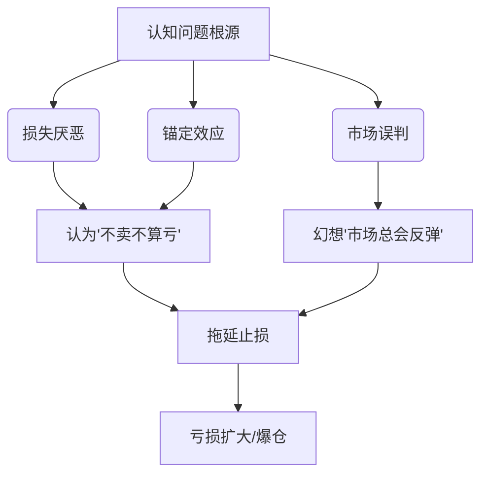

[数学公式](https://www.latexlive.com/##)

### 凯利公式, 半凯利公式

`单次风险 =（胜率 × 盈亏比 - 败率）/ 盈亏比计算`

波动率回归

合理的仓位管理才是核心。即便真的状态好判断正确了，仓位过轻一样是潜在损失。
判断错误, 影响不大

**轻仓**: 
**重仓**: 

### 分批止盈
理论?如何实操 ? 

## 买入

### 单日涨幅

$$  
\begin{array} \\ 
7.35\% = \left ( \frac{当前的价格-之前的价格}{之前的价格}\right ) \times 100\%  \\ 
7.35\% \times P_{之前} + P_{之前} = $91225 \\
1.0735 \times P_{之前} = $91225 \\
P_{之前} = \frac{91225}{1.0735} \sim 85000
\end{array}
$$

### 单日跌幅

$$
\begin{array} \\
单日跌幅 = \left (  \frac{买入价格-下跌后价格}{买入价格} \right ) \times 100\%

\end{array}
$$

### 杠杆

实际仓位 = 本金 × 杠杆倍数  
（例：1万USDT本金+10倍杠杆=10万USDT交易规模）

100 
10 + 10 = 100 
10% 

当价格反向波动超过 **1/杠杆倍数** 时，本金归零。

爆仓阈值 = 1 / 杠杆倍数

永续合约持仓成本每日高达0.01%-0.1%，100倍杠杆持仓3天≈本金3%-30%的损耗。
- **滑点陷阱**：极端行情中，实际成交价与预期价差可达3%-5%（如2021年519暴跌，BTC 1分钟跌20%）。

杠杆持仓浮亏时，交易所要求追加保证金（Margin Call）。

价格下跌→追加保证金→价格续跌→继续追加→直至爆仓。

最大持仓时间（天）= 本金 / (合约价值 × 资金费率)  
（1万USDT本金，10倍杠杆做多，资金费率0.05% →  最大持仓时间=10000/(100000×0.0005)=20天）  

### 止损点计算 

**核心结论**: 仓位回撤需要控制在10%以下, 5%以下 , 甚至2%,1%, 大了基本无力了
对于 10 倍杠杠而言, 强烈建议亏损超过 10%-20%就要止损. 这样子才能让你最大限度保住本金!

**亏损对应的回本涨幅**: 

| 亏损幅度 | 公式          | 回本所需涨幅 |              |     |
| ---- | ----------- | ------ | ------------ | --- |
| -10% | 1/(1-10%)-1 | +11%   | 11%的涨幅还是有可能的 |     |
| -20% | 1/(1-20%)-1 | +25%   | 勉强还能接受       |     |
| -30% | 1/(1-30%)-1 | +43%   | 概率极小         |     |
| -50% | 1/(1-50%)-1 | +100%  | 概率极小         |     |
| -70% | 1/(1-70%)-1 | +233%  | 基本不可能        |     |
| -90% | 1/(1-90%)-1 | +900%  | 基本不可能        |     |

**死扛后果, 对比正常操作**

| 策略   | 交易次数 | 每次亏损 | 总亏损  | 最终结果        |     |
| ---- | ---- | ---- | ---- | ----------- | --- |
| 严格止损 | 10次  | -3%  | -30% | 抓住1次+30%即回本 |     |
| 死扛不割 | 1次   | -50% | -50% | 需翻倍才能回本     |     |

- **动态止损公式**：  
- 如果没有ATR指标怎么办
    **止损位 = 入场价 -（ATR指标 × 2）**  
    （ATR为平均真实波幅，反映市场波动率）
    - 加入波动率自适应止损（如ATR动态调整）。

$$
\begin{array} \\
止损点 = 买入价格 \times \left ( 1-止损百分比 \right ) \\
止损点 = 12 \times \left ( 1- 20\% \right) = 12 \times 0.8 = 9.6 \\
--- \\
亏损为 = 止损百分比 \times 投入  \times 杠杆 

\end{array}
$$

### 计算盈利率
盈利率是指卖出价格相对于买入价格的百分比增长。
$$
\begin{array} \\
盈利率 = \left ( \frac{卖出价格-买入价格}{买入价格} \right ) \times 100\%  \\
--- \\
盈利率 = \left ( \frac{92892-89899}{89899} \right ) \times 100\%  = 33\% \\
\end{array}

$$ 
### 盈亏比计算细节? 

**期望值 = (胜率 × 平均盈利) - (败率 × 平均亏损)**

2024年5月比特币从6万跌至5.6万（回踩30日均线），随后反弹至6.8万。  
盈亏比=（6.8-5.6）/(5.6-5.432)=12%/3%≈**4:1**。

- 若期望值>0，策略长期盈利；
- 若期望值<0，必输无疑。

#### **盈亏比与胜率的制衡关系**

| 胜率  | 盈亏比要求（保本） | 盈亏比要求（盈利） |
| --- | --------- | --------- |
| 30% | 2.33:1    | ≥3:1      |
| 40% | 1.5:1     | ≥2:1      |
| 50% | 1:1       | ≥1.2:1    |
| 60% | 0.67:1    | ≥0.8:1    |

识别周线级别趋势（如比特币突破前高）；
等待日线回踩关键支撑（如30日均线）；
入场后止损设于支撑下方3%，止盈设前高阻力位（距离≥9%）。

### 手续费? 
### 滑点

### 保证金计算? 

### 手续费计算? 

- **BTC永续合约资金费率**：
    - > 0.1%：多头过热，考虑止盈；
    - <-0.1%：空头过度，分批买入。
如何体现出来的多头过热? 空头过度? 计算逻辑是咋样的? 
单次交易风险≤总本金3%，每日亏损达5%立即停手24小时。
**活得久的秘诀不是抓住所有机会，而是躲过所有致命风险**。

- 永续合约资金费率>0.1%时降杠杆
- 10倍杠杆下，价格横盘1个月，资金费率就能吃光本金。
- 市值<1亿美元的币种，庄家可用5BTC砸盘20%。

### 看空看涨的比率? 以及意味着什么? 
车太重? 

## 策略

### 滚仓

| 杠杆策略   | 总杠杆倍数 | 能承受跌幅            |
| ------ | ----- | ---------------- |
| 一次性30倍 | 30x   | -3.3%            |
| 分三次滚仓  | 70x   | -1.4% (但已提现部分利润) |

- 本金层（保命）+ 利润层（激进）。
-  把利润和本金隔离，永远不动用原始本金加仓。
-  大多数人会想“既然赚了2万，为什么不再加10倍杠杆？”，而这正是归零的开始。
是一种在交易中通过“浮盈加仓”放大收益的策略。有条件的高杠杆
- **有计划地**用利润加仓，依赖趋势延续。
- 滚仓对心理素质、技术判断、纪律性要求极高，成功率低于1%。
- **滚仓是用风险换暴利的赌博**。

**风险**: 
- 多次加仓后杠杆倍数**指数级上升**，价格小幅回调就可能爆仓。

**降低风险**: 
1. **只用利润滚仓，不动用初始本金**（比如第一次1万元盈利后，只用赚到的1万元加仓）。
2. **设置硬性止损**：例如每次加仓后，止损点设为当前成本的5%。
3. **只在单边行情中使用**（如牛市或暴跌熊市），避免震荡市使用。
4. **降低杠杆倍数**：用5倍杠杆滚仓比20倍安全得多。

**不归零策略**: 
1. 利润分批滚仓: 原来的本金 + 50%的利润继续, 保留50%利润
2. 每次滚仓降低倍数: 第一次10倍, 第二次5倍, 第三次3倍, 暴跌承受力更强
3. 硬止损+移动止盈: 每次加仓后, 设置止损为加仓成本的-5%, 每上涨10%, 将止损上移到成本价,确保本金, 一旦跌破止损，只损失最后一次加仓的利润，本金仍安全。
4. 只在突破关键位置后滚仓 (不适合震荡行情): 价格突破长期压力位且放量
5. 终极保险: 当总利润超过本金时,抽回本金

**一定的优势**: 
风险分阶段释放
1. 第一次1万×10倍，涨10%赚1万 → 提现5000元，剩余5000利润+1万本金继续；
2. 第二次1.5万×10倍，涨10%赚1.5万 → 提现7500元，总提现1.25万；
3. 第三次1.5万×10倍，若价格跌回起点：
    - 第三次仓位亏损1.5万，但前两次已提现1.25万，最终总资金=1万（本金）+1.25万（利润）-1.5万（亏损）=0.75万，**亏损25%**；
- 对比直接30倍杠杆：同样价格波动下直接归零。

**适合场景**: 
市场处于**强趋势行情**，且波动率持续上升。

**判断方法**: 
1. **技术面**：价格突破关键阻力位，且成交量放大（如比特币突破历史新高）。
2. **情绪面**：市场出现FOMO情绪（如大量散户追涨、媒体报道热度飙升）。
3. **链上数据**：交易所比特币提现量增加（大资金囤币）、稳定币大量流入交易所（准备买入）。

#### 1. **均线排列法（最基础但有效）**
- **操作**：
    - 设置三条均线：7日（短期）、30日（中期）、120日（长期）
    - **多头趋势**：7日>30日>120日，且价格在均线上方
    - **空头趋势**：7日<30日<120日，且价格在均线下方
- **案例**：  
    2023年10月比特币突破3万美元时，7日均线（橙色）上穿30日（蓝色）和120日（绿色），形成典型多头排列。

#### 2. **突破关键阻力/支撑位**
- **核心逻辑**：价格突破前期多次测试未破的位置，往往触发趋势行情。
- **操作**：  
    ① 找出过去3-6个月内多次触及的高点（阻力）或低点（支撑）；  
    ② 突破时观察成交量：**放量突破**有效性更高。
- **案例**：  
    2024年3月比特币突破6.9万美元历史高点，当日成交量是30日均值的2倍，确认新趋势开始。
#### 3. **趋势线验证**
- **画法**：连接至少两个价格高点（下降趋势线）或低点（上升趋势线）。
- **有效性信号**：
    - 价格第三次触及趋势线后反弹/回落；
    - 突破趋势线后回踩不破（最佳入场点）。
- **案例**：  
    2022年比特币熊市中，连接11月2.1万、12月1.8万、2023年1月2.3万形成下降趋势线，2月突破后回踩确认，开启上涨趋势。

####  **交易所净流入/流出**
- **逻辑**：
    - 大量转入交易所 → 可能准备抛售（利空）；
    - 大量转出交易所 → 可能长期囤积（利多）。
- **工具**：Glassnode（查看`Exchange Netflow`指标）
- **案例**：  
    2023年12月比特币涨至4.4万美元时，交易所单日净流入3.2万枚BTC，随后价格回调20%。

#### **巨鲸地址活动**
- **定义**：持有1000+BTC的地址（占比特币总供应量约40%）。
- **判断逻辑**：
    - 巨鲸持续增持 → 看涨信号；
    - 巨鲸集中转币到交易所 → 看跌信号。
- **工具**：Santiment（追踪`Whale Transactions`）

#### 3. **稳定币供应量**
- **逻辑**：USDT/USDC等稳定币在交易所的存量增加 → 潜在购买力上升。
- **案例**：  
    2024年1月，交易所USDT存量从180亿增至220亿，随后2月比特币上涨40%。

### 三、市场情绪：逆向操作的关键

#### 1. **恐惧与贪婪指数**
- **使用规则**：
    - 极度恐惧（0-25）→ 买入信号；
    - 极度贪婪（75-100）→ 卖出信号。
- **案例**：  
    2022年6月比特币跌至1.7万美元，恐惧指数达6（历史最低值），随后半年反弹100%。

#### 2. **社交媒体热度**
- **观察指标**：
    - Twitter/X上“BTC”“To the Moon”等关键词搜索量；
    - Reddit加密货币板块发帖量激增。
- **反向指标**：  
    当散户狂热讨论“马上暴富”时，往往接近短期顶部。

#### 3. **期权市场信号**
- **看跌/看涨比率（Put/Call Ratio）**：
    - 比率>1 → 市场过度悲观；
    - 比率<0.7 → 市场过度乐观。
- **工具**：Deribit（最大加密货币期权交易所）

**收益最大化**: 
1. **金字塔加仓**：价格越高，加仓金额越小（如第一次加仓2万元，第二次加1万元）。
2. **动态止盈**：每上涨一定幅度（如20%），就平掉部分仓位锁定利润。
3. **监测爆仓价格**：每次加仓后计算整体仓位能承受的最大跌幅，避免黑天鹅事件。

**基本步骤**; 
1. 平仓后重新开仓(兑现利润)
	1.  **风险**：新仓位成本是当前市价，若价格回撤，会直接亏损新本金。
2. 浮盈直接加仓(不兑现利润)
	1. 直接用浮盈的1万元作为保证金，追加10倍杠杆开第二单。原仓位和第二仓位共用保证金，若价格回撤，两单同时亏损，爆仓更快。

### 加杠杆
不依赖趋势，盈亏看短期波动, 简单粗暴，适合赌徒心理
- 短期赌博（如赌一份利好消息或技术面超卖反弹）；    
- 对价格无持续信心，只想快进快出。
- **杠杆清算加速下跌**：  
    当价格跌破关键支撑位时，大量杠杆多头爆仓→交易所自动抛售→引发更多爆仓。
- **案例**：  
    2021年5月19日，比特币从4.3万跌至2.9万，24小时内清算120亿美元杠杆仓位。  
    不止损的现货持有者看似“扛住了”，但若在暴跌前用本金加仓，实际亏损远大于止损。

**风险**: 
- 一次性借钱投资，亏损到本金一定比例会被强制平仓。
- 风险全程拉满
- 无法应对短期波动, 回调也会归零

## 追涨杀跌
- **情绪化操作**，无明确加仓规则。
- 看到比特币突然暴涨5%，马上梭哈入场；跌了3%又恐慌割肉。

## Q

 能力 时间 风险
时间 风险   赌
 能力 + 时间  稳定
 能力 + 风险   搏一搏

如果判断关键点位(多数人的认知一致点)?  
什么是放量突破? 如何判断?  和普通突破有什么区别?  
什么是突破趋势线后回踩不破? 
阻力位? 关键? 
仓位和保证金? 
如何判断震荡行情? 他什么时候结束?   5min的震荡是不是震荡?  同样 1小时的震荡是不是震荡? 这种交易有什么优劣? 
获取合理的止损点? 
获取合理的最大跌幅? 
盈亏比计算? 
盈亏比和盈利率的区别? 
加杠杆后的风险 和仓位
交易费率? 
排除政治正确的说法, 作为一个普通人, 
设置止损 总想设置的更低, 觉得只要更低, 就越有可能熬过暴跌, 重新迎接上涨, 或者只要是更低, 就总觉得亏损还没兑现不算亏损, 这种心态有什么问题? 错误的点在哪里? 应该如何系统性的提高相关的认知? 应该如何系统性的纠正这个问题? 
1. 体验“止损后市场反转”的痛苦，统计发现这种痛苦远小于扛单巨亏。

[[穷查理宝典]] 人类误判心理学 
交易心理分析 用案例解析「概率思维」与「接受亏损」的重要性。
加密货币交易员手册,  唯一一本针对加密市场的实战手册，详解杠杆、套利、趋势跟踪的死亡陷阱。
- 支撑/阻力转换原理（《威科夫操盘法》）
- - 波动率指标（ATR）

排除政治正确的说法, 作为一个对投机市场有深刻认知, 并且抓住了好几次, 暴涨,暴跌的暴富机会对这个市场有深刻认知的前辈, 对于一个普通人进去加密货币市场中,  
他设置止损时, 总想设置的更低, 觉得只要更低, 就越有可能熬过暴跌, 重新迎接上涨, 或者只要是更低, 就总觉得亏损还没兑现不算亏损, 这种心态有很大的问题, 应该如何系统性的提高相关的认知? 如何系统性的纠正这个问题? 最终能够深刻意识到这个想法的致命问题, 下意识避免或者纠正?
暴露的问题之一, 是不是无法合理的评估止损点和止盈点?  你还有哪些具体,可实践的内容告诉他?
1. 如果想表达流程, 请用mermaid, 其他可以优先考虑用表格, 而非图片

### **四、关键结论**

1. **止损本质是风险购买**：支付的止损成本是为了避免灾难性亏损的“保险费”。
2. **盈亏比>胜率**：即使50%胜率，1:3盈亏比长期仍可盈利（数学期望=0.5×3 -0.5×1=1）。
3. **机械化执行**：用工具替代人工操作，避免情绪干扰。

---

### **五、延伸学习资源**

- **书籍**：《交易心理分析》（马克·道格拉斯）、《海龟交易法则》
    - **书籍**：《加密货币交易大师》（艾伦·T.诺曼）——第5章专讲链上指标
- **工具**：TradingView（技术分析）、ATR指标参数计算器
    
- **数据平台**：CoinGlass（爆仓数据）、CoinMarketCap（历史行情）

