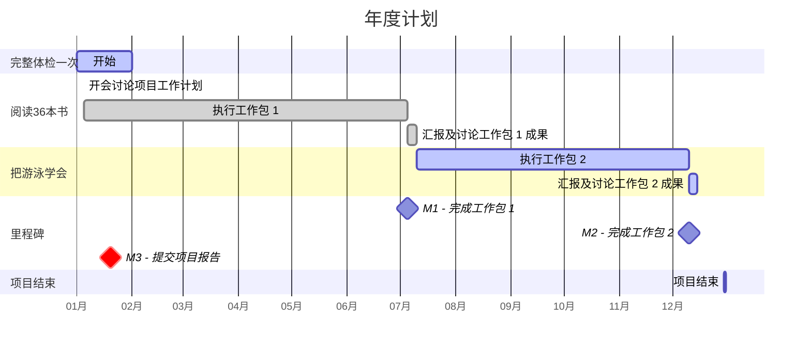
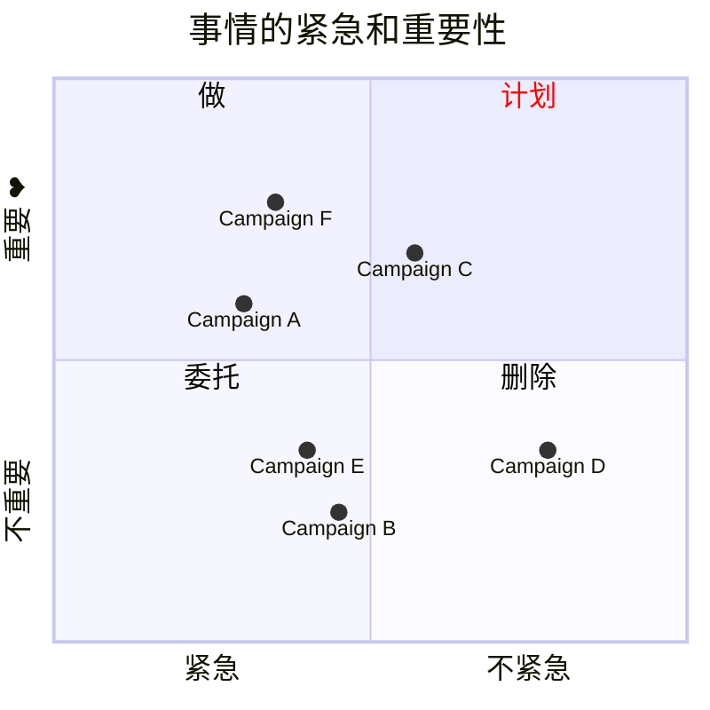

---
tags:
  - cb
创建时间: 2024-11-10 23:23:50
三观: Happy
title: "[[具体的计划]]"
---

> [!tip] 
> 具体
> 可衡量的目标
> 可达到
> 时间想花在哪? 
> 结合正反馈

> 存钱的目标
> 理财的计划
> 额外的赚钱计划, 扩大赚钱能力
## 身体健康

体检:   一年? 几次? 几号? 
**健身**:  周几次? 多长? 多数? 

每周2个小时:  17/7  24/5 , 40/3
组合1 : 仰卧起坐, 骑车, 俯卧撑or哑铃
组合2 : 仰卧起坐, 深蹲, 俯卧撑or哑铃

执行细节: 

|            | 反馈  | 优先级 | 7      | 5      | 3      |     |
| ---------- | --- | --- | ------ | ------ | ------ | --- |
| 仰卧起坐(腹肌)   |     | 高   | 20/140 | 30/150 | 50/150 |     |
| 俯卧撑(手臂, 胸) |     | 中   | 20/140 | 30/150 | 50/150 |     |
| 哑铃(手臂, 胸 ) |     | 低   | 20/140 | 30/150 | 50/150 |     |
| 骑车(心肺, 下肢) |     | 高   | 20min  | 30min  | 30min  |     |
| 深蹲(核心, 下肢) |     | 高   | 20/140 | 30/150 | 50/150 |     |

短期目标: 3个月? 衡量? 
俯卧撑: 50 一次性? 
仰卧起坐: 50一次性? 
深蹲: 50一次性?
骑车: 30min/ 9 一次性? 
哑铃: 弯举: 20一次性? 

长期相关性 ✅

## 人际
长期相关性? 有啥用? 合哪个目标? 
5次 2个
线上?   
附近? 
微信? 

线下? 
吃饭? 
活动? 
参加生日? 
加入某个团体(虚拟团体? 工会? )??
朋友生日? 
## 休闲娱乐
长期相关性? 未知身体(精神平衡)
每周? 2x5 14x2

一部分可以结合健身同时(骑车)

电视? 几部? 
游戏几个? 什么成就? 
其他? 玩? 去哪? 什么时候? 

## 工作? 
什么时候准备? 
现在? 
什么程度开始面试? 
准备2周后? 累计8小时后?

咋样算结束? 满意的offer? 
或者面试次数达到100次算短期结束? 
一周2次面试? 少?  100次一年.......
软考? 要?

## 赚钱? ?????

收入(被动最好)多少, 1000/月? 
副业??  
技术副业?  同时远离技术人(卷)
自媒体?   -> (前期: 输出)
电商之类的?  -> ()
小产品? (发现需求, 小而美, 一次性收入)
咨询 
边学边分享     

兼职? ? 干啥去? 
一般工: 好找, 工资低, 大概率无其他价值
特殊工: 有体检? 有其他价值?  不好找
自己创建: ? 
如何实现? 

其他? 
股票? 币? 

## 看书? 
看什么书? /book中的选, 或者加入
1个月 1本  ?
收获怎么输出?  写记录和读后感
输出在哪?  obsidian中

## 愿望清单, 体验突破? 
不枉此生, 
每月/ 每周
买: 促进智能化

| ~~学习成~~长        | 体验突破    | 休闲娱乐     |
| ----------- | ------- | -------- |
| 阅读?         | 游泳?     | 游戏 看剧 |
| 工作事业        |         | 家庭生活     |
| 跳槽?  尝试? |         | 旅游?      |
| ~~身体健康~~    | 财务理财    | ~~人际社群~~ |
| 体检? 变壮?  | 扩大赚钱能力? | 朋友生日?    |

|     | 热情  | 痛苦  | 时机  | 总分  |     |
| --- | --- | --- | --- | --- | --- |
| 锻炼  | 4   | 8   | 8   | 20  |     |
| 学英语 | 4   | 4   | 10  | 18  |     |
| 读书  | 10  | 10  | 10  | 30  |     |

![[Pasted image 20241016001653.png]]

[做计划](https://www.bilibili.com/video/BV1ra4y1m7H8/?vd_source=351ae22481963e1732be800e8bc59c8a)

困难 -> 具体| 简单
一天中效率最好的时间
工作日志
番茄钟
珍惜时间

## 学习成长, [[一定要做的事|提升自己]]?
[[拖延心理学]]
[[认知觉醒]]

## 体验突破
[[一定要做的事#改变周围的环境 旅游之类的, 体验|体验list]]
## 休闲娱乐
## 家庭生活
## 身体健康
定期[[体检]]
[[一定要做的事#视觉上的变化 打扮,穿搭, 每隔一段视觉, 有点微小的变化|身体list]]

## 财务管理
## 人际社群 
认同
真挚的朋友
附近? 

## 工作事业
[[正在做的事]]
根源上不满意的点:         发展停滞, 钱不变, 能力不变,  自我创造, 自我肯定,自我满足, 别人认可

想做的事业: 
**喜欢的事**: 想知道他的一切
1. 好像暂时没有........
2. 

**擅长的事**: 无意识就能做好的事, 天赋, 和才能, 先天的?  
重视别人的感受? 观察别人?

**平时自然而然就在做的事**: 或者感到充实, 开心
不由自主思考现象背后的事情
洞察,分析, 系统化思考

**对别人感到烦躁**: 为什么这么简单的事都做不到

**有价值的事**:
1. 给别人提供价值, 并且得到认可和反馈(社会的[[正反馈]]?)

体验演唱会