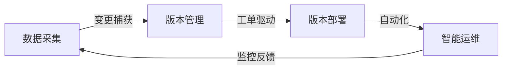
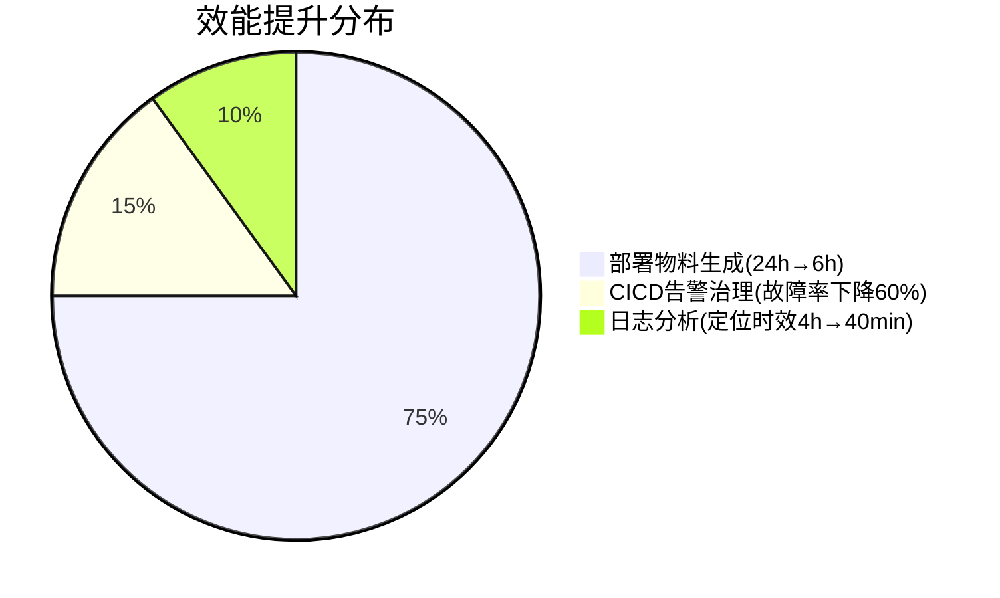

---

tags:
  - cb
创建时间: 2025-02-03 16:09:09
三观: Sad
title: "[[个人履历]]"
---


```dataviewjs
dv.taskList(dv.current().file.tasks.where(t => t.text.includes("")))
```


### 基本信息
- **姓名**: 郭凯凯  
- **求职意向**: 高级开发工程师（云原生方向）  
- **工作年限**: 5 年（3年云服务领域深耕经验）  
- **学历**: 本科（计算机科学与技术）  
- **年龄**: 28 岁  
- **现住址**: 北京昌平  
- **邮箱**: uppself@qq.com  
- **手机**: 17835706945  
- **技术认证**: CKA（Kubernetes管理员认证，2024年）


### 工作经验  
#### **亿达科技公司** · 交付开发工程师 *2021.10 – 至今*  
**部门**: 飞书基建交付  
**核心成果**:  
- **云原生技术落地**:  
  - 设计并优化基于K8s的容器化部署流程，标准化Helm模板，减少配置错误率90%，部署效率提升40%。  
  - 构建CICD全链路监控体系（Prometheus+AlertManager），告警响应时效提升60%，环境稳定性达99.99%。  
- **复杂问题处理**:  
  - 主导解决5W+资源依赖的私有化部署难题，制定分级管控策略，客户侧部署周期从3周压缩至5天。  
  - 设计自动化变更回放工具，实现半年期16000+ SaaS变更的精准同步，版本升级成功率提升至98%。  
- **跨团队协作**:  
  - 推动研发、QA、交付团队协作机制，沟通效率提升200%，客户投诉率下降65%。  
  - 编写《私有化部署标准手册》，培养3名新人独立承担交付任务。  
  - 负责私有化部署过程中的 PaaS 层和服务层的容器化部署、流程优化及环境维护。
  - 提供技术文档，负责实施过程中的资源协调、问题处理，对项目实施进度及结果负责。
  - 参与私有化环境相关的需求分析、软件的模块实现开发。处理日常
  - 处理日常 bug 和在生产中重要问题


#### **时光漫步科技有限公司** · Java 开发工程师 *2020.03 – 2021.09*  
**部门**: 产品研发  
**核心成果**:  
- 从0到1搭建XX全流程测试系统，支持日均100+在线考试并发，系统稳定性达99.9%。  
- 基于WebSocket实现实时白板系统，支持50+用户同时在线协作。  
- 开发自动化报表工具，数据统计效率提升70%，减少人工操作耗时50%。  
* 负责公司应用软件的模块实现开发。
* 处理日常 bug 和在生产中重要问题。
* 文档编写 ，参与与其业务相关的需求变更评审，编写文档 ppt 、excel 等项目内容产出。
* 负责项目从 0 到 1 到交付的完整流程。

---


### 项目经验  
#### **飞书私有化交付**
项目描述: 
飞书是大型的企业协作和管理平台, 整合各种功能, 为企业提供协作解决方案, 在一处实现高效的沟通
和流畅的协作, 提升企业效率。
而私有化是飞书业务的一种产品形态, 是把飞书部署到客户机房的一种交付形式, 飞书的服务, 数据都在客户机房, 客户侧的客户端/web 直接接入客户网络。飞书私有化版本与saas版本同源同构，客户体验一致。saas版本飞书由研发负责日常升级，私有化由交付同学每半年进行一次升级。

作为字节跳动ToB核心产品，飞书私有化部署需将500+微服务、40+中间件组件完整迁移至客户本地机房，实现数据完全自主管控。项目需解决5W+资源依赖管理、半年期16000+ SaaS变更同步等业内罕见复杂度，单次升级需协调100+研发与15+交付团队资源。  


飞书私有化部署的复杂性、难点和挑战  
1. 业务依赖众多：飞书业务复杂，依赖众多，用到的psm500+，mysql，redis，mq，flink等各类组件有四十多种，需要在客户侧进行进行部署及管理。还有一些业务特化的的资源，比如某些二进制工具。整个飞书私有化资源依赖数量在5W+。
1. saas变更处理困难：飞书saas研发侧每天都会有300+线上psm升级，mysql ddl变更，数据迁移等，需要收集这些变更，后续在私有化环境中回放进行升级与迭代。
1. 环境异构问题严重：saas功能在私有化不支持，saas使用到的组件在私有化不支持。需要提前发现及推动业务改造，或者引入相应的组件。fg，tcc，eeconf等配置在每个环境都不一样，需要进行人工修改确认才能制作出一个具体环境的私有化版本，并且这些配置数量众多，有10000+，配置的正确性直接影响整个交付质量及效率，但交付同学在不了解业务场景的前提下要保证质量。
1. 部署升级流程复杂：部署升级流程非常复杂，并且是半年定期升级，半年时间saas各类变更有大概16000多个，私有化升级应用变更同时还需要保证质量，不影响客户使用。行业内无可借鉴的方案，比如阿里专有钉只有80多个服务，db十几个，redis，mq等相关组件10个内。
1. 资源及基建要求高：私有化对于资源的要求，导致无法使用字节云等公司基建，需要提供类似的能力来进行psm,mq,tos等资源部署及日常hotfix变更，日常排查等日常运维功能。飞书业务的复杂性导致私有部署及维护的投入巨大，每个业务需要专门投入2人参与私有化，一次升级研发侧人员投入200人+、交付及QA投入30人+。

**技术栈**: Go + Kubernetes + Docker + SaltStack + MySQL 5.7 + Python + [[nginx]]
**突破性贡献**:  
- 首创“原子任务”交付模式，支持20+组件并行部署，整体部署时效提升3倍。  
- 开发智能诊断工具，通过日志聚类分析，问题定位效率提升80%。  
- 构建资源预检系统，拦截85%硬件兼容性问题，减少部署失败风险。  

**核心职责与突破**:  
1. **云原生架构设计**  
   - 参与开发基于K8s的"原子任务"交付模式，支持20+组件并行部署，整体部署时效提升3倍 
   - 开发iaas性能检查预检系统，提前拦截85%硬件兼容性问题，减少现场部署失败风险  
   - 设计基于K8s的标准化部署架构，容器化部署成功率从70%提升至98%，业务服务部署耗时从2小时降至30分钟。 
   - 适配自动化测试系统部署, 能在部署后及时发现业务p0问题 100%,交付后缺陷率降低60%。

2. **工程效能革命**  
   - 构建"交付流水线"自动化工具链（Go开发），提高工作效率和质量：  
     ▶ 部署物料自动生成（耗时从24h→6h）  
     ▶ 开发交付平台原子任务, 长期优化整个交付过程的流程协作 提升交付质量和效率  整体部署时效提升3倍。 
     ▶ 变更影响范围可视化（准确率95%）  
     减少人工干预错误率90%，支持20+客户环境快速适配。  
     优化节省年人力成本30W+  
     一键部署工具, 交付平台原子任务, 交付助手等相关部署工具的开发工作。

3. **长尾问题持续攻坚**  
   * 负责字节 ToB 产品(飞书)的私有化部署物料的制作、演练,部署/升级/增值服务； 持续发现问题, 版本升级成功率从82%提升至98.5%
   * 进行产品标准版本品的制作与部署, 整体部署质量和效率较大缩短。
   * 负责对客交付: 处理交付过程中的问题定位及处理, 横向推进到相关责任方、做持续优化,为客户提供系统集成方案，并确保解决方案的落地，并进行流程优化；推动解决用户在使用公司产品和服务过程中遇到的技术问题； 能够快速定位和分析问题，提供有效的解决方案，保障用户的业务正常运行； 
   - 攻克某央企万级vCPU资源调度难题，通过Binpacking算法优化，资源利用率提升40%  
   - 有后端开发实践经验，能够独立完成高质量的交付，包括技术设计、开发、部署、线上问题追查；
   - 解决跨国客户数据同步时延问题，设计边缘缓存方案，API响应延迟降低65%  
   - CICD 环境稳定性治理, 对 CICD 环境的告警进行治理, 提高产品稳定性。
   - 配置根据算法进行一轮优化, 二轮交给人工确认, 最终部署配置错误率降低95%

5. **生态体系构建**  
   - 编制《私有化部署标准手册》（300+页），培养5名高级交付工程师  
   - 建立跨部门协作SOP，推动研发/QA/交付团队协同效率提升200%  
   - 主导开发客户自助管理平台，实现90%日常运维操作自动化  
   - 协调研发团队建立变更白名单机制，关键变更回放准确率提升至95%。  
   - 推动QA团队建立私有化专项测试用例库，覆盖率达85%，交付后缺陷率降低60%。
   - 能够主动学习新的技术和知识，能够面对复杂和挑战性的问题；







#### **XX 全流程测试考核系统**
项目描述:
项目给是 XX 所委托进行开发的培训考核系统，该系统的普及性较高，包含课程展示模块
课程智能推荐，下发培训计划，使用白板进行在线授课。进行实操考试，进行在线理论考试。进行随机组卷，组成电子考场。实现从课程管理、智能推荐、在线考试到实时授课的全流程数字化，日均承载100+考生并发。

技术栈: JDK1.8 + Spring + Hibernate + Vue.js + WebSocket
**核心职责与成果**:  
1. **核心功能开发**  
   - 设计题型/难度/知识点多维度控制，组卷耗时从3分钟优化至500ms
   - 题目批量导入
	  ▶ 设计选择题, 多选题, 判断题, 客观题, 主观题, 5大类型, 并实现 excel 批量录入考试题目,支持2000+题量题库。  
   - 开发白板协作引擎：  
     ▶ 实现画笔轨迹实时同步（延迟<200ms)。
     ▶ 支持简单的在线聊天室进行群聊。支持100人同时在线授课
   * 实现在线理论考试, 学员可以收到考试信息然后进行在线考试。
	  ▶ 随机出题, 每个学员的题都不一样, 杜绝相互抄袭的可能
	  ▶ 设计题型/难度/知识点多维度控制，组卷耗时从3分钟优化至500ms 
   - 创建自动化阅卷体系：  
     ▶ 选择题, 判断题等题型实时出结果 （准确率100%）  
     ▶ 客观题正则表达式匹配（准确率70%+）  
     ▶ 主观题由老师进行手动阅卷以后出成绩。
1. **性能与体验优化**  
   - 引入Redis缓存课程元数据与考生状态，数据库查询压力下降70%  
   - 设计异步任务队列，Excel试题批量导入耗时从30分钟压缩至3分钟  


#### **金科君创投资管理系统**
项目描述: 投资公司内部的流程优化统计，相当于公司内部的投资流程的数字化转型，员工对公
司的访谈，交流，前景的调查，以及内部开会结果的统计，意见的汇总。实现从项目立项、尽职调查、投资决策到投后管理的全流程线上化, 日均处理50+业务流程。
主要分为登录模块，首页模块，统计汇总模块，企业信息展示模块等
技术栈: JDK1.8 + SpringMVC + Hibernate + MySQL + Docker

**核心职责与成果**:  
1. **核心功能开发**  
   - 设计多维度统计聚合算法，通过Redis缓存+预计算策略，关键报表生成耗时从15分钟降至45秒（效率提升2000%）
   - 开发智能邮件调度系统，支持动态模板引擎，实现：  
     ▶ 周/月/季报自动生成与发送（100%准时率,日均执行5+定时任务）  
     ▶ 汇总正确率100%, 输出效率 100%
     ▶ 紧急事项实时预警（响应延迟<30秒）  
2. **工程效能提升**  
   - 基于内部低代码框架，快速实现：  
     ▶ 20+标准化数据表格模块（开发周期从3人日/模块压缩至4小时）  
     ▶ 可视化流程配置器（业务人员可自主搭建审批流）  
4. **架构优化**  
   - 重构MySQL索引策略，复杂联合查询性能提升8倍  
   - 负责项目质量把控与交付, 项目整体质量把控, 测试, 完成交付。

#### 反洗钱系统
**项目说明**:
中信证券所委托进行开发的内部反洗钱系统，目标是对内部现有的系统进行新一轮迭代完善。重点完善用户画像建模、审核流程自动化和可疑交易识别三大核心模块。

**技术栈:** JDK1.8+Spring + MyBatis + SpringMVC + Oracle +Tomcat

**核心职责与成果**:
项目功能梳理, 数据表梳理并对接产品, 开发, UI, 测试等角色, 协调资源并进行风险管理评估。
梳理开发进度, 进行项目排期, 对项目整体进度的把控, 共同推进项目。
根据甲方需求进行软件开发, 保证需求成功落地。
- 对接甲方需求与接口开发, 与甲方沟通, 对接需求, 功能以及接口。
- 协调产品、UI、测试资源  
- 把控项目整体进度
* 优化Oracle索引策略，复杂聚合查询耗时从15s优化至1.2s。

**核心职责与成果**:  
1. **需求对接与架构设计**  
   - 参与10+次客户需求研讨会，梳理42项核心功能点，输出《业务-技术映射表》  
   - 设计分层式规则引擎架构，支持动态加载风控策略（XML+Groovy双模式）  
   - 制定Oracle分库分表方案，单表数据量从5000万行降至800万行  

2. **性能突破与稳定性提升**  
   - **查询优化**: 重构13个核心SQL语句，通过复合索引+物化视图技术，将可疑交易聚合查询耗时从15秒降至1.2秒  

3. **跨团队协作与过程管理**  
   - 建立"需求-开发-测试"三级评审机制，关键需求交付准确率提升至98%  
   - 协调6个跨职能团队（含3家外包商），制定《多方协作SOP》，需求响应周期压缩35%  

4. **技术创新落地**  
   - 开发规则可视化配置平台，业务人员可自主调整200+风控参数，策略上线周期从2周缩短至4小时  


### 专业技能

#### 容器化与云原生
1. **熟悉 Docker 和 Kubernetes 容器化技术**，具备集群部署、服务编排和自动化运维经验  
2. **熟悉 Service Mesh、Ingress 等云原生组件**，掌握容器网络配置与存储方案  
3. **具有 PaaS 中间件容器化部署经验**，熟悉灰度发布、滚动更新等运维场景  

#### 二、中间件与数据库
##### 1. 数据库
- **熟悉 MySQL 数据库运维**，掌握索引优化、事务隔离（MVCC）、SQL 性能调优  
- **熟悉 Redis 高可用架构**，了解持久化机制与集群模式  
- **具备 Elasticsearch 集群搭建和性能优化经验**  

##### 2. 中间件
- **熟练 Nginx 配置管理**，包括反向代理、负载均衡及安全加固  
- **熟悉 Activiti 工作流引擎集成与二次开发**  
- **掌握常见消息队列、API 网关等中间件的容器化部署**  

#### 三、编程开发
##### 1. 语言基础
- **精通 Java/Go 服务端开发**，具备良好的代码规范和设计能力  
- **掌握 Shell/Python 运维脚本编写**  

##### 2. 开发框架
- **精通 Spring 全家桶（SSM/Spring Boot/Spring Cloud）微服务架构**  
- **熟悉 MVC 模式与 Restful API 开发规范**  
- **实践领域驱动设计**，熟练运用工厂、策略等设计模式提升代码可维护性  

#### 四、系统与网络
##### 1. Linux 系统
- **熟练使用 find/grep/awk 等文本处理工具**  
- **掌握性能诊断工具链（top/strace/iotop 等）**  
- **具备高负载/IO 瓶颈排查经验**，熟悉系统调优方法  

##### 2. 网络协议
- **深入理解 HTTP/TCP/UDP 协议栈**  
- **熟练使用 tcpdump/Wireshark 进行抓包分析**  
- **掌握网络故障排查方法（telnet/netstat/curl 等）**  

#### 五、前端技术栈
1. **掌握前端基础技术（HTML/JS/CSS）**  
2. **熟悉 Vue 框架与 Websocket 实时通信**  
3. **具备 JSP/JQuery/AJAX 开发经验**，了解 JSONP 跨域解决方案  

#### 六、运维与监控
1. **熟练配置 Crontab 定时任务与日志轮转**  
2. **掌握 Prometheus+Grafana 监控方案**  
3. **具备全链路日志收集与分析经验**  

熟悉Docker、 k8s 容器化技术，了解常用PaaS中间件部署和运维；
熟悉常用中间件 Redis、Mysql 的原理和组件运维，熟悉Docker、 k8s 容器化技术；
掌握 Java,GO 基础, 具有良好的编程习惯。
掌握 SSM 以及 Spring Boot 等开源框架，精通 MVC 编程模式。
了解微服务，能快速搭建 Spring Cloud 全家桶架构和生态体系。
熟练 Restful 风格开发。熟悉 Activiti 工作流进行工作。
熟悉常见的设计模式, 并在项目中深入实践减少代码的耦合性增加代码的可维护性
熟悉 Linux 常用命令、docker, K8S,Nginx 服务器的反向代理、负载均衡。
熟悉计算机网络，了解HTTP协议/TCP协议以及DNS协议，能够完成基础的网络问题排查，能够熟练掌握telnet/ping/curl/tcpdump/netstat等命令
有mysql/abase/redis/ingress/nginx组件运维经验的优先
熟悉Linux操作系统，能够熟练掌握find、cp、mv、vim、grep、vimdiff、awk、scp、crontab等命令
能够独立完成高负载、io类问题排查，熟练掌握top/free/vmstat/iotop/strace等排查命令
熟练 MySQL 数据库，MVCC, 并且对 Sql 优化方面有一定的经验。
熟练 Redis 非关系型内存数据库。
熟练 ES 的搭建,使用。
熟悉 HTML、JQ、JSP、Vue、Websocket 掌握 AJAX 异步交互技术，jsonp 跨域请求。
熟悉操作系统和网络基础，了解 Shell/Python/Go 至少一种语言；

### 教育经历
- **本科** · 计算机科学与技术 · XX大学 *2016-2020*  
  - GPA：3.7/4.0（专业前10%）  
  - 荣誉：全国大学生软件设计大赛二等奖

### 自我评价
工作之余主动学习提高工作技能,有较强的学习能力,勇于接受新事物、新技术、新挑战力所能及主动帮助同事完成工作,态度端正,
积极性强。持续学习的能力  
开发不留坑,不推卸责任,不得过且过。
有耐心,协作能力强、有强烈的责任意识。
责任心强，具备良好的问题总结抽象能力、团队沟通与协作能力；
- 持续学习云原生技术，2024年通过CKA认证，主导团队Serverless架构试点。  
- 擅长复杂系统问题定位与解决，曾处理3+次P0级生产故障，平均恢复时间<30分钟。  
- 具备跨部门推动能力，协调5人团队完成国家级金融系统升级，交付满意度100%。


### 求职意向
期望职位: 软件工程师
城市: 北京
月薪: 面议
状态: 看机会
到岗时间: 最多30天


