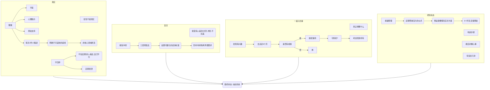
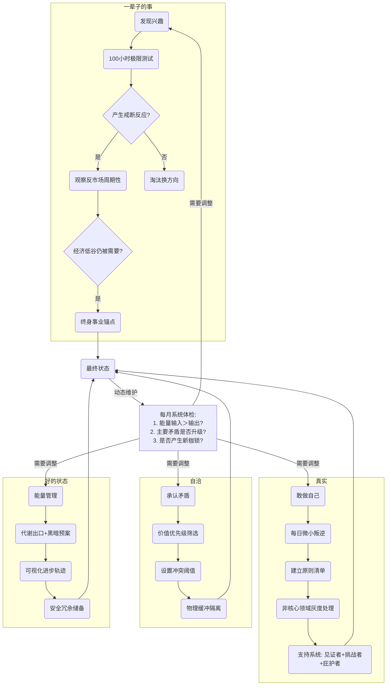

---
tags:
  - cb
创建时间: 2024-10-10 14:14:26
三观: Happy
title: "[[想过的生活]]"
---
目标: 

## 人生目标, 最终状态

什么是人生目标? 
>寻找
>兴奋
>满足
>有成就感的

什么是自我认同? 
什么是自我认知? 
什么是自己? 
什么是真实? 
什么是[[三观#价值观]], 明确? 
愿意过一辈子的状态，可能指向持续满足感和意义感。
明确核心价值? 
安全感?  什么是安全感?  安全感的作用是什么? 

---

### 真实, 不压抑, 敢做自己
什么真实的人? 如何做一个真实的人? 真实需求?  
如何才能不在压抑自己?  为什么要压抑自己?  未知? 恐惧? 
什么叫敢做你自己? 如何能才能做到敢做自己? 
人应该如何活着?  或者说自洽的活着? 

**问题:** 怕后果, 怕别人看法, 怕自己不行
**改变:** 
小范围试错: 
设定发泄口
问自己: 最坏能咋样, 我能不能承受 (通常不可怕)

敢做自己: 接受有人喜欢你, 有人讨厌你
从小事开始: 不装,每天必须完成1件「微小叛逆」（如拒绝无意义的加班）
建立支持系统: 找几个能懂你的朋友
心理暗示: 我又不是rmb 

**自洽**: 接受冲突的存在, 接受不完美, 持续调整?
7. 不纠结不该不该这样, 不追求100%正确, 只要选自己能承受的后果

### 愿意做一辈子的事, 过一辈子的状态
如何找到愿意自己做一辈子的事情?   
什么是一个好的状态, 什么是一个愿意过一辈子的状态? 

**靠做和淘汰**  发现真实需求? 
1. 先试试, 对什么感兴趣就去试试
2. 看反馈: 痛苦还是享受, 想继续还是不想碰,记录过程中「痛苦-愉悦」曲线变化
3. 3个月煎熬, 换一个,用「100小时极限测试」高强度体验某个领域
4. 留下长期能做的, 做起来不累的, 甚至能忘记时间的,观察结束后是否产生戒断反应 
5. 每周做3件突破常规的小事（如向陌生人表达真实观点），记录事后感受，6个月后反向推导真实需求
6. 选择那些能增强自身可选性的路径（如掌握可迁移技能比追求固定职位更接近自由）
 **警惕「自我叙事绑架」**：当你说"这才是真正的我"时，可能是用标签限制可能性。建议改用「阶段性身份实验」（如用3个月时间扮演"冒险者"角色）
搞清楚真正在乎什么? 
7. 明天要死了, 后悔没做什么? 
8. 财务自由了, 想干啥

好的状态 **能量正向循环系统**= 不累+ 有盼头+ 能抗事 
- **能量管理**：不会天天累得像狗，有办法恢复（比如运动、发呆、和朋友扯淡）。定期释放压力, 拳击, 写作, 运动
- **有进步感**：不一定是升职加薪，哪怕是学会做一道新菜、读完一本书。成长反馈: 实体进度墙展示技能树
- **能应对糟心事**：遇到烂人烂事，不会直接崩掉，能快速调整回来。
- 安全冗余: 6个月生活费  (2w/ 1w)

### 终极状态
没有最终状态 
什么是最终状态? 
什么是活出自己? 如何活出自己?  

**不是静态终点，而是形成「动态纠偏系统」**：
- 每月进行「系统健康度检查」：  
    ▶ 能量输入＞输出？  
    ▶ 主要矛盾是否升级迭代？  
    ▶ 现有模式是否产生新枷锁？
真正的自由，是拥有持续打破现有模式的能力。保持20%的「不稳定因子」（如定期接触颠覆认知的信息源），比追求完美平衡更重要。
知道自己要什么, 能承受代价, 然后该干嘛干嘛

现在这样也挺好
1. 有目标, 但不被目标绑架
2. 有努力, 也能接受失败
3. 感尝试, 也敢放弃

痛苦往往源于消除所有矛盾? 
价值的优先级? 
如何活着? 探索如何在复杂世界中建立稳定的内在秩序

不要盲目去做他人期待的事
**别想太多，先动起来，在试错中找到适合自己的活法，然后脸皮厚点，坚持下去。**

发展3类人际关系——见证者（知道你黑历史的人）、挑战者（直言不讳的诤友）、庇护者（无条件接纳的亲友）

建立原则清单 
不能妥协的原则(7)
1. 永不承诺做不到事 

2.  先成为一个真实, 值得信任的人
3. 你敢做你自己,找最真实的自己
4. 一种不再分裂, 不在压抑的活法
5.  压抑, 焦虑的, 想逃避的, 避开
6. 怎么样更不容易后悔
7. 解决自己的问题

8. 想过什么样的生活?
9.  愿意做一辈子的事情
10. 怎么活出一个你愿意过一辈子状态
11. 活出自己

12. 你需要成为那个曾经的你渴望遇见的人
13. 打造一种最适合自己的活法
14. 造一种人生
15. 你的成长在运营你的人生, 选最有生命力的路
16. 事业应该是你身份的延伸,选择以自己喜欢的方式赚钱
17. 我对什么东西, 有源源不断的表达冲动, 你的冲动就是你的路标
18. 表达你自己的时候最有力量, 最容易打动人, 共振

依赖伪装成的感情
19. 自由不是结果, 自由是一开始就要捍卫的选择
20. 努力让哪些你尊敬, 渴望成为的人成为你的朋友
21. 和志同道合的人一起走人生的路
22. 靠近哪些让你佩服, 让你松弛, 让你想变好的人

---

> 基于价值观, 兴趣爱好, 人生目标等因素而在内心构建的理想的生活状态, 主观的
> 涉及居住环境, 工作内容, 人际关系, 家庭关系, 休闲方式, 兴趣爱好等

和人生目标, 未来的关系? 

理论上会带来[[满足感]]?

想要自由, 幸福生活的基础应该是最少**有300w**

### 居住环境人生目标
**300W**

有小院子?  生活遍历, 周边有一定的生活气息, 可以养小动物(猫, 狗)
有庭院: 可以晒太阳, 聚餐, 集体活动
有书房: 各种好书, 历史精华
有健身房: 想什么时候练就什么时候练
有游戏房: 有时间打游戏
有工具房(做手工): 搞搞手工 -> 3d打印, 日常
有车库 放个车: 
有歌房唱歌, 弹钢琴: 可以嚎几嗓子
要智能化, 自动化
市区,还是海边? 还是都要
咋地也得200mX2  -> 带装修300w最少
有个草坪, 种苹果树

### 家庭生活人生目标

需要一定的金钱支撑 (100w)
* **身体健康的(个人最好健壮)**
* 幸福的
* 无话不说的
* 快乐的
* 稳定的
* 知足的
* 温馨的
* 和睦的
每周最少2天在一起, 一起分享, 陪伴, 关心, 一起做活动 (出去玩, 旅游, 做饭...)

### 个人成长人生目标

* 知识获取
* 技能提升
* 性格塑造

如一个人想要精通多种语言，或者培养坚韧不拔的意志品质。

### 职业人生目标
没有? 不希望上班, 不想上班

### 人际关系
**200w**
拥有一群真挚的朋友，在彼此的陪伴下度过充实的一生。
能有一定解决问题的能力 
生病, 升学, 各种问题
有固定的小团体:   一起行动, 或者分享
* 阅读
* 游戏
* 手工
* 健身, 户外运动

兴趣是生活的调味剂，如果你喜欢绘画，那么可以设想自己有一个专门的绘画工作室，每天都能抽出一定的时间来进行创作，并且能够参加一些绘画展览或者和其他画家交流的活动。
设想自己周围的朋友和社交圈子。你可能希望有一群志同道合的朋友，经常一起聚会、分享生活经验和兴趣爱好。

### 工作? 
不工作, 或者不为别人工作
一名成功的企业家，创立具有全球影响力的公司。?
一名顶尖的外科医生，拯救无数患者的生命? 

人生目标。这可能包括职业目标、个人成长目标等。如果你的职业目标是成为一名资深的软件工程师，那么你可以设想自己在一家知名的科技公司工作，参与重要的项目开发，不断学习新的技术，并且获得相应的职业成就和经济回报。

小林计划成为自由撰稿人后，每天早上可以在自己的书房里开始工作，根据自己的兴趣和客户需求撰写各种文案，比如旅游攻略、美食评论或者文化散文。她可以自由安排工作时间，有时为了赶稿可能会忙碌几天，但也可以在完成任务后给自己放一个小假。她会和不同的杂志、网站等媒体合作，通过网络和客户沟通，这样她就有更多的时间呆在家里享受生活。

### 休闲娱乐
自己在闲暇时间会做什么
50w
* 某种手工? 
* 游戏
* 阅读
* 分享??? 
* 做新饭? 
* 健身? 
* 长途旅行, 探索不同的文化和风景

---

## 我的人生目标

1. **什么是人生目标**

内心深处期望在一生中达成的、具有深远意义的方向或成就。它是一种宏观的愿景，涵盖了生活的多个方面，如职业、个人成长、社会贡献等。
可以是长期的 -> 可以分解为中期和短期目标相配合

2. **如何找到自己的人生目标**

- **自我反思**
    - **[[1. 陈述过去]]**：回顾自己的成长历程，寻找那些让自己感到兴奋、满足或者有成就感的时刻。
    - 例如，如果你在学校组织的志愿者活动中帮助贫困儿童时，内心充满喜悦和满足感，这可能暗示你对社会公益事业有潜在的兴趣，社会贡献可能是你人生目标的一部分。
    - **分析兴趣爱好**：仔细思考自己的兴趣所在。兴趣是发现人生目标的重要线索。如果你热爱绘画，那么在艺术领域追求职业发展或者通过绘画为他人带来美的享受可能是你的目标。例如，梵高对绘画的热爱驱使他不断创作，尽管生前未得到广泛认可，但他的画作如今为无数人带来美的震撼，绘画成为他人生目标的核心体现。
    - **挖掘价值观**：价值观会引导你的人生目标方向。如果公平正义是你最看重的价值观，那么你可能会选择从事法律相关工作，为维护公平正义而奋斗，这就可能成为你的人生目标。
- **探索外部世界**
    - **接触不同领域**：
    - 尝试参加各种不同类型的活动、讲座、培训等。
    - 例如，你可以参加科技研讨会、艺术展览、户外运动俱乐部活动等。
    - 通过这些接触，你可能会发现新的兴趣点或者受到启发，从而确定自己的人生目标。
    - 比如，你原本对计算机编程没有概念，但在参加一次科技创业分享会后，对软件开发产生了浓厚的兴趣，这可能开启你在科技领域设定人生目标的旅程。
    - **与他人交流**：和不同的人交谈，包括家人、朋友、导师、行业前辈等。
    - 他们可能会从不同的角度给你提供建议或者分享他们自己的人生经验，帮助你发现自己的目标。
    - 比如，和一位资深的旅行家交流后，你可能会被激发起对世界探索的欲望，进而将环球旅行或者成为旅行博主作为自己的人生目标之一。
- **尝试与实验**
    - **小步实践**：一旦有了一些潜在的目标想法，就可以进行小规模的尝试。例如，如果你对写作有兴趣，想把成为一名作家作为人生目标，可以先在业余时间开始写一些短文、博客，看看自己是否享受这个过程并且有持续的动力。
    - **接受反馈并调整**：在尝试的过程中，收集他人的反馈。比如，你把自己写的文章给朋友或者专业人士看，听取他们的意见。根据反馈来判断自己是否适合这个目标方向，如果不适合，就及时调整，寻找更符合自己的目标。

潜在的想法
1. 炒币
2. 观察变现
3. 信息差

### 兴趣爱好

[[兴趣爱好]] 是一个长期伴随的过程, 应该在各种事件的过程中发现, 放大
讨厌的: 
* 重复的
* 没成长的
* 浮夸的
* 一个人的引人注目的
* 特立独行的

感兴趣的: 
* 创造? 
* 数码产品: 科技结晶, 新鲜感? 
* 手工: 一定程度的创造? 
* 唱歌: 偶尔, 艺术的价值, 精神的共鸣
* 跳舞: 偶尔, 释放压力? 
* 绘画: 创造?  天马行空? 
* 写作: 创造?  天马行空? 
* 运动: 竞技的乐趣? 进步的快乐? 
* 收藏: 仓鼠癖?  安全?  拥有? 归属?  占有? 
* 阅读: 进步? 新鲜? 共鸣? 开开眼界? 
* 旅游: 开开眼界? 体验? 
* 做饭: 一般般 

### 社会贡献人生目标
力所能及吧, 目前没有大愿望
~~像致力于环境保护，减少碳排放；或者投身慈善事业，帮助贫困地区的人们改善生活条件等。~~

---

我想活成什么样 -> 设计一个支撑这种活法的表达与产品路径

真实中发光, 表达中成长, 创造中获得自由的方式

有人让你做一些你根本不想做的事, 那就不要在一起

坏事总会发生, 这是不可避免的

盯住哪些美好的东西, : 值得的人, 有意思的事, 让人欣慰的瞬间

产品力
内容力
认知力
决策力

掌握主动权的小系统, 更能给你真正的自由
深度关系, 不要浅社交, 能一起安静坐着的人
深聊, 低谷期依然支持你的人, 有限的能量, 真正值得的人

目标维度
个人成长
学习体验

写出来的那一刻我是轻松的, 自由的  -> 过程当奖励的 -> 享受表达的

表达思考, 
用服务陪伴
用产品承载理念

用内容建立信任, 用服务建立现金流, 用产品放大影响力, 用成长持续反馈生命能量
80% 主线表达, 20%分享生活与观点

