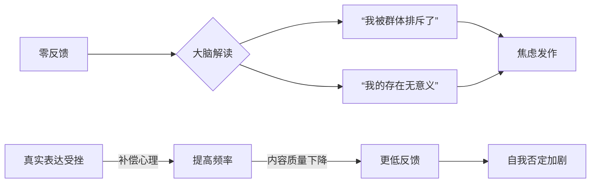
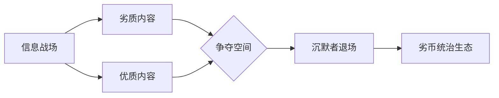

---
tags:
  - cb
创建时间: 2024-12-07 21:33:34
三观: Happy
title: "[[1. 陈述过去]]"
---

陈述自己的作用?  
1. 看清自己? 从而帮助当下? 达成未来?

还有现状? 

### 缺陷有哪些? 
丑, 穷

### 价值在哪? 
社会干电池

### 思维变化? 

## 客观经历
开始
0~6? 
幼儿园
2005~2006?
比别人优秀? 比别人独立? 

小学
2006~2011
特立独行? 
固执
贫穷
打游戏

初中
2011~2014
贫穷
胆小
懦弱  -> 没想着改变
起晚了
看小说
打游戏
贪玩

高中
2014~20117
贫穷
买手机 -> 省吃俭用
看小说
打游戏
贪玩
暑假工

大学
2017~2020
过生日 -> 像个笑话
兼职
懦弱
没有自我认可 ->> 没有社会认可
带我赚钱 -> 小磊

工作
2020~至今
鸡血
安逸
不安

现在
结束

用户可能是个对自我要求较高的人,
深层需求其实是想获得更轻松的社交体验，但又无法违背自己的本性。
ta的羞耻感特别值得关注——这通常与早期严厉的评价环境有关。

认知层面存在完美主义倾向，
情感层面存在表现焦虑，
行为层面则是过度监控。这可能说明ta的自我监控机制已经内化，即使没有外部监督也会自动启动。
用户描述的“事后后悔”特别符合“行动后反刍”的特征。

解决方案，需要兼顾行为调整和认知重构。
短期可以建议ta从低风险平台开始练习，比如用Tumblr这类半匿名平台。
长期则需要挑战ta内心“必须完美呈现”的核心信念。社交心理学中的“聚光灯效应”——其实别人远没有我们想象的那么关注我们。

1.  **高度自我意识与反思能力：**
    *   你不是“随便发”的人，说明你对自我呈现有要求，具备深度思考习惯。你意识到网络内容可能带来的潜在影响（即使是陌生人之间），这本质上是一种**责任感**和**对真实的尊重**。
    *   事后觉得“傻逼”、“羞耻”，证明你有较强的**自省能力**和**成长意愿**。你在用现在的眼光审视过去的行为，这其实是心智成熟的表现。

2.  **内在的高标准与完美主义倾向：**
    *   你希望自己呈现的内容是“好”的、有价值的、经得起推敲的，甚至是完美的。你害怕发出“不够好”的东西，担心它代表不了你真实的水平或形象。
    *   这种高标准可能源于：
        *   **对自我价值的紧密绑定**：潜意识里认为“我发的东西=我的价值”，如果内容“差”，就意味着“我差”。
        *   **对负面评价的深层恐惧**：虽然知道“网上谁都不认识谁”，但你内心可能依然**渴望被认可、被欣赏**，或者极度**害怕被嘲笑、被贬低**（即使陌生人也不行）。这种恐惧可能源于过去的经历或内在的敏感。

3.  **对“真实性”和“意义”的追求：**
    *   你无法像一些人那样“造假发”，说明你内心抵触虚假和无意义的噪音。你希望自己的表达是**真诚、有意义、有分量**的。这种随意和虚假的环境，反而让你更谨慎，因为你不想成为其中的一部分。

4.  **社交焦虑的延伸：**
    *   即使在匿名的网络环境，你依然感到“被注视”，害怕反馈（尤其是没有反馈或负反馈）。这可能是现实社交焦虑在网络空间的投射，或者说是**对“他者目光”的敏感**，即使这个“他者”是模糊的、虚拟的。

5.  **“拧巴”的本质：**
    *   **理想自我与现实行为的冲突：** 你内心可能有一个“理想自我”的形象（成熟、睿智、有趣、深刻），你希望网络上的言行能符合这个形象。当现实行为（发出的内容）达不到这个标准时，就产生了强烈的认知失调和羞耻感。
    *   **对网络环境认知的矛盾：** 你理性上知道网络是“随意”、“无约束”的，但感性上/价值观上**无法真正认同或融入这种随意性**。这种认知冲突让你感到无所适从。

## 🔍 为什么你在网上也做不到“随意”？

*   **“随意”不是你的本性：** 你本身就是一个**思考型、内省型、对质量有要求**的人。这种特质不会因为换了个环境（从线下到线上）就突然消失。要求你在网上“随意”，就像让一个天生谨慎的人突然变得大大咧咧一样困难。
*   **网络并非真正的“真空”：**
    *   **数字足迹：** 发布的内容会留下痕迹，即使陌生人看不到，你自己也能看到。这些内容构成了你自己的“数字记忆”，回头看时，自然会用当下的标准去衡量。
    *   **潜在的观众：** 即使当下是陌生人，未来呢？会不会有认识的人偶然看到？或者这个账号未来会不会有更多关联？这种不确定性也带来压力。
    *   **内在观众：** 最严厉的观众往往是自己。你内心的“批评者”一直在审视你的一言一行。
*   **“随意”可能违背你的价值观：** 对你来说，“深思熟虑”、“真实表达”可能比“随意发泄”或“制造虚假”更重要、更让你内心安宁。强迫自己“随意”反而会造成更大的心理负担。

## 🌈 解决方案：拥抱你的特质，找到平衡点

1.  **重新定义“包袱”：它是你的特质，而非缺陷。**
    *   **停止自责“拧巴”：** 认识到谨慎、反思、追求质量是你的特点，甚至是优点（尤其是在信息泛滥的时代）。这不是病态，只是你的风格。接纳“我就是这样一个人”。
    *   **区分“高要求”和“完美主义”：** 追求高质量是好的，但要求自己每次发言都完美无缺、万无一失、永不后悔，这就是束缚了。允许自己有时发点“不完美”但真实的东西。

2.  **调整对“反馈”的预期和态度：**
    *   **接受“零反馈”是常态：** 社交媒体信息过载，没有反馈是大概率事件。这**绝不等于你的内容没价值或你这个人不被喜欢**。
    *   **解绑“内容”与“自我价值”：** 一次发的内容“傻”，不代表你这个人傻。它只是你在那个时间点、那个状态下的一个想法或记录。人是流动的、成长的。
    *   **关注表达本身的价值：** 把分享看作**整理自己思想、记录生活瞬间、寻找同好**的过程，而不是为了获得某种特定的、量化的反馈（点赞、评论）。**表达本身就是意义。**

3.  **建立适合自己的“分享原则”：**
    *   **明确目的：** 我发这条是为了什么？（记录心情？分享有趣事物？寻求建议？纯粹吐槽？）目的清晰能减少无谓的纠结。
    *   **设定边界：** 想清楚哪些话题/情绪/细节是你愿意公开分享的，哪些是更愿意保留在私人空间或仅限密友的。**不分享也是一种权利和智慧。**
    *   **降低“真实性”压力：** 不要求每句话都惊天动地、深刻无比。允许分享日常的琐碎、即时的想法、甚至一点点无伤大雅的“废话”或小情绪。**真实也包括“平凡”和“不完美”。**
    *   **利用“仅自己可见”或“密友分组”：** 对于不确定是否适合公开，但又想记录下来的内容，可以先设置为“仅自己可见”或只分享给非常信任的小圈子。这满足了表达欲，又降低了暴露焦虑。

4.  **处理“事后羞耻感”：**
    *   **“后悔”是成长的证明：** 回头看觉得幼稚，说明你在进步！用现在的眼光批判过去的自己是不公平的。
    *   **练习自我同情：** 当羞耻感袭来时，像对待好朋友一样对自己说：“嗯，当时那个状态下，我就是那样想的/感受的。有点傻，但很正常，谁没有过这种时候呢？它代表不了现在的我。”
    *   **赋予旧内容新意义：** 把那些让你觉得“傻”的动态看作**成长的足迹**或**特定时刻的切片**，而不是需要抹去的污点。它们构成了你完整的生命历程。
    *   **实在难受，可以删除或存档：** 如果某条内容确实让你长期不适，**你有权删除它或设为私密**。网络空间也是你的个人空间，你有权管理。

5.  **选择性使用平台/功能：**
    *   **寻找更契合的平台：** 如果主流社交平台（如朋友圈、微博）让你压力大，可以尝试氛围更轻松、更侧重兴趣而非个人生活的平台（如豆瓣小组、小红书兴趣社区、或者更匿形的论坛）。或者干脆**减少使用频率**。
    *   **善用“草稿”和“延时发送”：** 写完后不急着发，存为草稿或设置稍后发送。过几小时甚至一两天再看，如果依然觉得想发，再发；如果觉得没必要或感觉变了，就删掉或修改。这能有效过滤冲动。
    *   **尝试“阅后即焚”或私密日记类应用：** 如果主要是想宣泄情绪或记录瞬间感受，不追求留存和互动，这类应用可能更适合。

6.  **在现实生活中夯实自我价值感：**
    *   网络上的表现焦虑往往根植于现实中的不安全感。**在现实世界中找到让你感到自信、有价值感的事情**（工作/学习成就、兴趣爱好、良好的人际关系、帮助他人等）。当你的根基稳固了，对网络上陌生人可能的评价就会看淡很多。

缺乏多元价值支持, 网络反馈成为成就感来源
1. 不依赖网络反馈的点
网络身份成为现实人格的延伸, 如何剥离?
与其创造新人格, 不如放大某个侧面, "深夜思想家" 增加时限
- 步骤：
    1. 列出你**真实存在的隐性特质**（例：其实有幽默感但平时克制/有倾诉欲但怕打扰人）
    2. 选定1个特质放大20%作为「角色种子」
    3. 创建新账号命名为「本我名_特质名」（如「李明_观察者模式」）
- 操作要点：每天仅在此账号发**1条**放大特质的内容（如放大幽默感：给楼下流浪猫起无厘头名字）

发前调整预期
2. 0是常态, 直接庆祝, 调整预期
3. 1. 是奖励
4. 再多是惊喜
我的动态是行为, 不是人格
发帖动机, 发后实际效果
5. 有情绪
6. 有思考
故意发, 测试焦虑变化

  历史行为, 没有对错, 

非垃圾, 而是认知代谢
吸引同类, 如何一直没有同类呢? 
加免责声明
零反馈是存在危机? 为啥会这样
记录羞耻反应
沉默者承担着被劣币驱逐的风险 而是说当虚假信息充斥时，真实信息如果缺席就等同纵容。就像用户提到“分享思考比较重”，这种珍贵的思想火花若永远封存，反而是对世界的损失。
呼吸不需要理由? 

表达具象化, 破除混沌自我, 对白纸黑字负责

| 时间      | 操作                  | 认知重构     |
| ------- | ------------------- | -------- |
| 晨间7：00  | 对窗外喊：「今日允许浪费他人0.3秒」 | 破除表达神圣感  |
| 午间12：00 | 发带错别字的动态（故意制造瑕疵）    | 打破完美主义封印 |
| 睡前22：00 | 截图当日「最废动态」设为手机壁纸    | 建立表达免疫力  |
	 绿灯区：即时感受/错误认知（直接发）
    黄灯区：需验证信息（存草稿24h）
    红灯区：涉及价值观（永久私密）
产生冲动时立即：
- 手机录制15秒视频（黑屏+口述关键词）
- 上传网盘生成分享链接（不发布）  
    _完成即视为「已表达」_

	1. **冲动延期券**  
    创建待发动态的「候诊室」：
    
    - 填写电子表格：
        
        markdown
        
        复制
        
        下载
        
        | 冲动内容 | 保鲜程度 | 处置方式 |
        |----------|---------|----------|
        | 同事蠢得像AI | 87%    | 转为段子 |
        
    - 每周日批量处理：升级发布/私密存档/删除

---

### 核心问题：**「救赎依赖症」的本质是自我存在的崩坏**

这种心态背后是三重致命逻辑的坍塌：
1. **自我价值破产**  
    → 内心法庭已宣判：“凭我自身存在不值得被爱/成功/幸福，必须依附他者赋予价值”
2. **责任恐惧症**  
    → 把人生方向盘交给别人时，翻车的责任自然由对方承担
3. **痛苦获益成瘾**  无? 
    → 扮演受害者可获得关注、豁免竞争、降低外界期待，形成隐秘的舒适区

而是**存在性价值感崩裂**与**生存根基动摇**的复合型危机

→ 当想喊“帮帮我”时，立刻写下：
- 此刻逃避的具体挑战______
- 幻想他人解决的魔法______
- 实际对方可能搞砸的后果______

1. |恐惧类型|恐惧值(F)|转化行动(T)|
    每日深蹲至力竭+冷水浴|
    街头卖艺/垃圾回收变现|

- **“救赎”的诱惑：** 它提供了一个虚假的“控制感”——幻想有一个强大的力量能为你兜底，抵消你对未知和无能的恐惧。这是一种逃避直面生命荒诞性的心理策略。
1. - **“救赎幻想”的本质：** 幻想一个“更高力量”（不一定是神，可能是智者、导师、甚至抽象的“机遇”）能“看见”你未被世俗认可的价值，赋予你存在的正当性。这是一种对**外部确认的终极渴望**。
2. - 你否认“没人懂我的痛苦”，但渴望救赎本身暗含了**深刻的孤独**——一种“无人真正理解我存在的核心困境，无人能为我指明方向”的孤独。这种孤独不是关于情感倾诉，而是关于**存在性共鸣**的缺失。

- [ ]  自我价值, 证明自我价值, 为什么要自我价值? 存在? 
- [ ] 我如何证明自己不是废物? 我为何要证明自己是不是 ?
- [ ]  1. - 它巧妙地将“我不想/不敢承担自己生命全部重量”的责任，包装成“等待命运恩赐”的被动姿态。  ? 什么是? 

 是突然获得巨额财富？被高人赏识平步青云？面对重大决策？遭遇挫折？
是否本质上是渴望快速达成这套标准的捷径？还是渴望彻底摆脱这套标准的枷锁？
真实概率有多大？你现有能力/资源真的无法应对吗？
什么能让我觉得这一天没白活？什么样的人是我内心真正尊敬的（无关地位财富）？我的哪些特质/行为让我对自己感觉良好？建立只属于你的价值坐标。
设定极小但确定的目标（如：每天专注工作/学习25分钟；主动和一个陌生人进行有实质内容的交流；学会做一道新菜；坚持一周早起）。
“此刻，我能为自己做的最小的一件积极的事是什么？” 
幻想中的“救赎者”类型：他们拥有什么可习得的特质/知识/技能？列出清单，制定可操作的学习/实践计划（哪怕只是读一本相关的书）。将虚幻的渴望，落地为具体的自我提升行动。
深度阅读： 寻找跨越时空的共鸣（哲学、文学、传记）。
写作： 向自己倾诉，梳理思绪，自我对话。
接触真实世界： 投入自然、观察市井生活、参与有共同目标的活动（非闲聊社交）。在更广阔的“存在”中，感受连接而非期待被“救赎”。
对**自我选择终极责任**的恐惧。

- **行动建议**：  
    🔹 **制作“意义出血点”地图**：记录一天中哪些时刻感到“空虚/烦躁/渴望被拯救”（如：刷社交媒体后/看到同龄人成就/深夜独处），这些就是你的伤口位置。  
    🔹 **对每个“出血点”注入微量意义**：若刷手机后空虚，改为刷前自问：“我想从中获得什么？”；若见他人成就焦虑，立刻写下自己当天做成的1件小事。

（“此处安息着社会对我的期待，死于我对自由的觉醒”）。  但是家庭责任呢

- 善于理性分析（如精准排除依赖症状）的人，常把**思维游戏当作行动代餐**。分析自身问题带来的掌控感，可能正麻痹你真正的改变。
    
- **破解法**：  
    ⚠️ **设定“从脑到手”转化规则**：每次思考“我为什么这样”超过10分钟，必须立刻做一个5分钟的体力动作（深蹲/整理桌面/撕纸重组句子）。切断思维反刍，让身体领先大脑。

当旧思维反扑时，用具体行动反击（焦虑时立刻做20个俯卧撑）。

恐惧
指定的人
有什么事, 我有没有处理能力,  如果没有, 没办法说, 不想让看到脆弱, 可能会有指责
为什么受不了指责? 受不了某些人的指责? 因为他们清楚我的过去? 见过我的脆弱?  想一直保持脆弱?  可能就不会苛责?  想当个小透明? 安全?  破坏现在的安逸 ?
无法承担责任?
等死了,就能自由?还是逃避? 别的什么? 

为什么害怕冲突?  如何解决
什么是软弱? 是什么问题导致? 如何察觉和改变? 
对自己无法解决问题的焦虑
不是选择最优, 而是不留遗憾